# Autonomous Kubernetes Self-Healing Platform — Complete Software Architecture Document

**Document status:** Implementation-ready architecture specification  
**Primary language:** Go  
**Primary deployment method:** Single Helm chart  
**Target runtime:** Any conformant Kubernetes cluster  
**Install command:**

```bash
helm install selfheal ./charts/selfheal
```


> **Reference basis.** This architecture uses Kubernetes-native extension patterns such as CustomResourceDefinitions and controllers; Kubernetes CRDs register new RESTful API resources and can be namespaced or cluster-scoped, and custom resources are typically reconciled by controllers/operators. Key reference: Kubernetes CRD documentation citeturn1search3. Kubernetes observability is modeled around metrics, logs, and traces, with Prometheus-format metrics, node logs, and traces as first-class signals. Key reference: Kubernetes observability documentation citeturn1search22. OpenTelemetry provides Kubernetes collectors, an operator, and workload auto-instrumentation support. Key reference: OpenTelemetry Kubernetes documentation citeturn1search19turn1search21. NATS JetStream provides persistence, replay, acknowledgements, replication, and durable consumers for event-driven systems. Key reference: NATS JetStream documentation citeturn1search8. ClickHouse is recommended for high-scale observability workloads because it is column-oriented, compresses aggressively, and is used for logs, metrics, and traces at large scale. Key reference: ClickHouse observability documentation citeturn1search13turn1search14. controller-runtime leader election uses Kubernetes Lease-based APIs to coordinate active-passive controller managers. Key reference: controller-runtime leader election package documentation citeturn1search27turn1search29.


---

## Table of Contents

1. Executive Summary
2. Functional Requirements
3. Non Functional Requirements
4. High Level Architecture
5. Overall System Architecture
6. Component Architecture
7. Collector Architecture
8. Telemetry Pipeline
9. Topology Discovery
10. Correlation Engine
11. Anomaly Detection
12. Root Cause Analysis
13. AI Engine
14. Decision Engine
15. Action Engine
16. Verification Engine
17. Knowledge Base
18. Event Driven Architecture
19. Storage Architecture
20. Kubernetes Operator Design
21. Custom Resource Definitions
22. REST API
23. Dashboard
24. Security
25. Helm Chart
26. Repository Structure
27. Plugin System
28. Deployment
29. Scalability
30. Failure Scenarios
31. Sequence Diagrams
32. Technology Stack
33. Development Roadmap
34. Future Roadmap
35. Testing Strategy
36. CI/CD Architecture
37. Observability of the Platform
38. Appendices

---


# 1. Executive Summary

## 1.1 Vision

The Autonomous Kubernetes Self-Healing Platform is a Kubernetes-native autonomous SRE system packaged as a single Helm chart. Once installed into a cluster, the platform discovers workloads, builds topology, observes metrics/logs/traces/events, detects anomalies, performs root-cause analysis, selects safe remediation actions, executes those actions through Kubernetes APIs and provider-specific plugins, verifies recovery against SLOs, and learns from incidents.

The platform is intentionally designed as an **operator-first** system. Kubernetes is the control plane not only for applications but also for the self-healing lifecycle. Incidents, analysis results, remediation plans, policies, and knowledge entries are represented as Kubernetes Custom Resources. This lets platform teams manage healing behavior declaratively with GitOps, kubectl, RBAC, audit logging, admission control, and namespace boundaries.

## 1.2 Goals

- Install as a single Helm chart into existing Kubernetes clusters.
- Require minimal configuration for baseline operation.
- Discover workloads automatically without developers changing application code.
- Observe the cluster through OpenTelemetry-compatible pipelines.
- Correlate logs, metrics, traces, Kubernetes events, and topology.
- Convert signal anomalies into structured incidents.
- Execute safe and auditable remediation.
- Support deterministic rule/policy execution as the default path.
- Use AI only where probabilistic assistance is useful and guardrailed.
- Provide a dashboard, APIs, CRDs, CLI, and integration points.
- Support single-cluster, HA, multi-cluster, edge, and air-gapped deployments.

## 1.3 Scope

In scope:

- Workload discovery and classification.
- Kubernetes object watchers.
- Metrics, logs, traces, events, and metadata collection.
- Dependency and topology graph construction.
- Anomaly detection and alert correlation.
- Incident lifecycle management.
- RCA scoring and incident timeline generation.
- Policy-driven decisioning.
- Action execution and rollback.
- Verification against health, metrics, SLO, and synthetic probes.
- Knowledge base and retrieval-augmented incident reasoning.
- Dashboard and REST APIs.
- Helm chart, CRDs, service accounts, roles, network policies, and storage.

Out of scope for v1:

- Replacing Prometheus/Grafana enterprise deployments.
- Replacing cloud-provider incident management products.
- Making irreversible infrastructure changes without policy approval.
- Autonomous destructive actions on persistent data by default.
- Unrestricted LLM command execution.

## 1.4 Why This Platform Exists

Kubernetes provides primitives for self-healing, but teams still spend significant effort diagnosing complex failures. Pods restart, but applications can remain degraded due to dependency failures, bad rollout configuration, exhausted quotas, DNS issues, expired certificates, broken network policies, insufficient resources, crash loops, storage attach failures, and noisy neighbor pressure. Traditional monitoring detects symptoms; humans still correlate signals and execute runbooks.

This platform closes the gap between observability and operations by encoding SRE behavior into controllers, policies, runbooks, and verified automation.

## 1.5 Problems It Solves

- Alert fatigue and symptom-only alerts.
- Slow mean time to detect and repair.
- Manual runbook execution.
- Lack of workload topology context.
- Inconsistent remediation practices across teams.
- Poor incident memory and repeated failures.
- Unsafe ad hoc automation without audit or approval.
- Fragmented telemetry pipelines.

## 1.6 Design Philosophy

1. **Kubernetes-native first.** Use CRDs, controllers, declarative specs, RBAC, leases, finalizers, events, and status conditions.
2. **Deterministic before probabilistic.** Policies, rules, and state machines decide safety-critical actions; AI suggests, summarizes, and retrieves context.
3. **Observe, decide, act, verify.** No action is complete until verified.
4. **Least privilege by default.** Each action class maps to narrow RBAC.
5. **Progressive autonomy.** Start in observe-only mode, move to suggested mode, then automatic safe actions, then higher-autonomy tiers.
6. **Incident memory.** Every incident becomes structured data for future correlation.
7. **Extensibility.** Detectors, actions, collectors, policy providers, and knowledge sources are plugins.
8. **Failure isolation.** A failed self-healing component must not worsen application availability.


# 2. Functional Requirements

## 2.1 Capability Matrix

| Capability | Requirement | Default State | Notes |
|---|---|---:|---|
| Automatic Discovery | Discover Kubernetes workloads, services, nodes, namespaces, PV/PVC, ingress, network policies, HPAs, PodDisruptionBudgets, service mesh objects where supported | Enabled | Uses informers/watchers |
| Metrics Collection | Scrape Kubernetes and application metrics | Enabled | Prometheus/OpenTelemetry compatible |
| Log Collection | Collect pod logs and component logs | Optional | DaemonSet collector |
| Tracing | Accept OTLP traces and correlate spans | Optional | Gateway collector |
| Topology Discovery | Build dependency graph from Kubernetes resources, DNS, endpoints, service mesh telemetry, traces, and network observations | Enabled | Graph persisted |
| Dependency Mapping | Map upstream/downstream relationships | Enabled | Used by RCA |
| Anomaly Detection | Detect abnormal metrics/events/log patterns | Enabled | Multiple algorithms |
| Root Cause Analysis | Rank candidate causes using graph, timing, evidence, and history | Enabled | Confidence scored |
| Decision Engine | Select remediation based on policies, risk, priority, SLO, and incident context | Enabled | Deterministic |
| AI Agent | Summarize incidents, propose actions, retrieve historical knowledge | Optional | Guardrailed |
| Rule Engine | Evaluate declarative rule expressions | Enabled | CEL/Rego-like model |
| Policy Engine | Enforce safety, RBAC, approval, blast-radius, deny lists | Enabled | Mandatory |
| Action Executor | Execute remediations | Enabled | Policy-gated |
| Verification Engine | Verify recovery and rollback if necessary | Enabled | SLO/health probes |
| Incident Database | Persist incident timeline and evidence | Enabled | PostgreSQL |
| Knowledge Base | Store runbooks, incident learnings, embeddings | Optional | Postgres/vector DB |
| Dashboard | Provide UI for incidents, topology, actions, policies | Enabled | React/Web UI |
| API | REST API for automation and dashboard | Enabled | OpenAPI |
| RBAC | Fine-grained Kubernetes and application authorization | Enabled | Least privilege |
| Authentication | OIDC, Kubernetes auth proxy, local dev mode | Configurable | OIDC recommended |
| Plugins | Add collectors, detectors, action handlers | Enabled | gRPC/WASM |
| Multi Cluster | Central control-plane plus member agents | Optional | Phase 3 |
| Canary Rollback | Detect bad canary and rollback/traffic-shift | Optional | Requires rollout integration |
| Autoscaling | Recommend/execute HPA/VPA changes | Optional | Policy-controlled |
| Certificate Rotation | Detect expiry and rotate using cert-manager or native secrets | Optional | Needs scoped access |
| Node Healing | Cordon, drain, reboot hook, cloud replacement | Optional | High-risk action class |
| Network Healing | Diagnose DNS, CNI, NetworkPolicy, ingress faults | Optional | Plugin extensible |
| Storage Healing | Detect PVC attach/mount/capacity issues and recover safe cases | Optional | Requires storage plugin |
| Application Healing | Restart, scale, rollback, config reload, traffic shift | Enabled | Safe tier defaults |

## 2.2 Incident Lifecycle Requirements

An incident must move through these states:

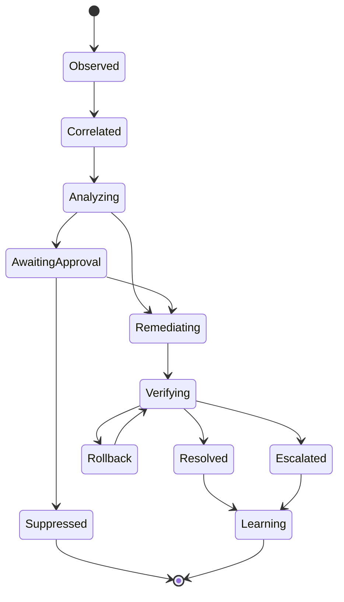


## 2.3 Detailed Feature Requirements

### Automatic Discovery

- Watch Pods, ReplicaSets, Deployments, StatefulSets, DaemonSets, Jobs, CronJobs, Services, EndpointSlices, Ingress, Gateway API, Nodes, Namespaces, ConfigMaps, Secrets metadata only, PVCs, PVs, StorageClasses, NetworkPolicies, HPAs, VPAs, PDBs, Events, Leases, ServiceAccounts, Roles, RoleBindings, ClusterRoles, and ClusterRoleBindings.
- Support namespace include/exclude selectors.
- Support workload annotations to override defaults.
- Detect ownerReferences and selector relationships.
- Detect service endpoints and readiness states.
- Emit topology change events.

### Metrics Collection

- Scrape kubelet, cAdvisor, kube-state-metrics, node exporter, application metrics, and platform metrics.
- Support OTLP metrics ingestion.
- Normalize labels to canonical dimensions: cluster, namespace, workload, workload_kind, pod, container, node, service, team, environment.
- Apply cardinality limits and relabeling.
- Route high-resolution data to short retention, rollups to long retention.

### Log Collection

- Tail CRI logs from nodes.
- Parse JSON and text logs.
- Extract severity, timestamp, trace/span IDs, Kubernetes metadata, container IDs, and known error patterns.
- Support multiline rules.
- Sample noisy logs via rate-limited token buckets.
- Redact secrets using configurable detectors.

### Tracing

- Accept OTLP gRPC/HTTP.
- Correlate spans with services, pods, deployments, and namespaces.
- Extract service dependency edges.
- Compute critical path, error spans, latency outliers, and fan-out dependencies.

### AI Agent

- Summarize incident state.
- Retrieve similar incidents and runbooks.
- Recommend low-risk remediations with rationale.
- Never execute cluster mutations directly.
- Must pass all actions through deterministic policy and decision engines.


# 3. Non Functional Requirements

## 3.1 Scalability

- Support clusters from 10 to 10,000 nodes using horizontal scaling, sharded collectors, and partitioned event subjects.
- Support 100,000+ pods with watch caches, local informers, batching, and graph incremental updates.
- Support telemetry burst absorption using event bus buffering and backpressure.
- Support multi-cluster aggregation through a central control plane.

## 3.2 Performance

- Detection latency target: under 30 seconds for high-severity Kubernetes event patterns.
- Metric anomaly evaluation target: under 2 evaluation windows.
- Action initiation target: under 10 seconds after policy approval for automated safe-tier actions.
- Dashboard incident page p95 API latency: under 500 ms for active incidents.

## 3.3 Availability and Fault Tolerance

- Controller manager replicas run with leader election.
- API gateway replicas run active-active behind a Service.
- Collectors run as DaemonSets plus gateway Deployments.
- NATS JetStream runs as 3 replicas in HA mode when enabled.
- PostgreSQL and ClickHouse may run in-cluster for small deployments or external managed services for production.
- Components fail closed for risky actions and fail open for observation where safe.

## 3.4 Security

- Least privilege Kubernetes RBAC.
- Separate service accounts by component and action class.
- NetworkPolicies deny by default between namespaces.
- TLS for all HTTP/gRPC endpoints.
- mTLS between internal services when service mesh is available.
- Secrets stored in Kubernetes Secrets or external secret providers.
- Audit all action decisions and Kubernetes mutations.

## 3.5 Resource Consumption

Default small-cluster profile:

- Controller manager: 100m CPU request, 256Mi memory request.
- API gateway: 100m CPU, 256Mi.
- Collector DaemonSet: 100m CPU, 256Mi per node.
- NATS: 250m CPU, 512Mi per replica.
- PostgreSQL: 500m CPU, 1Gi.
- ClickHouse optional: 1 CPU, 2Gi.

Production resource profiles must be driven by telemetry volume and retention.

## 3.6 Maintainability and Extensibility

- Go modules per bounded context.
- Versioned APIs and CRDs.
- OpenAPI generation from code.
- Controller-runtime envtest coverage.
- Contract tests for plugins.
- Backward-compatible event schema evolution.
- Helm chart values schema and docs.


# 4. High Level Architecture

The platform is composed of six planes:

1. **Discovery Plane** — Kubernetes watchers and topology extractors.
2. **Telemetry Plane** — collectors, parsers, normalizers, enrichers, aggregators, and storage sinks.
3. **Intelligence Plane** — anomaly detection, correlation, RCA, AI summarization, and knowledge retrieval.
4. **Control Plane** — policies, decision engine, remediation planning, CRD reconciliation, and approval workflows.
5. **Execution Plane** — action handlers, Kubernetes clients, external provider plugins, and rollback orchestration.
6. **Experience Plane** — dashboard, REST API, CLI, alerts, and GitOps surfaces.

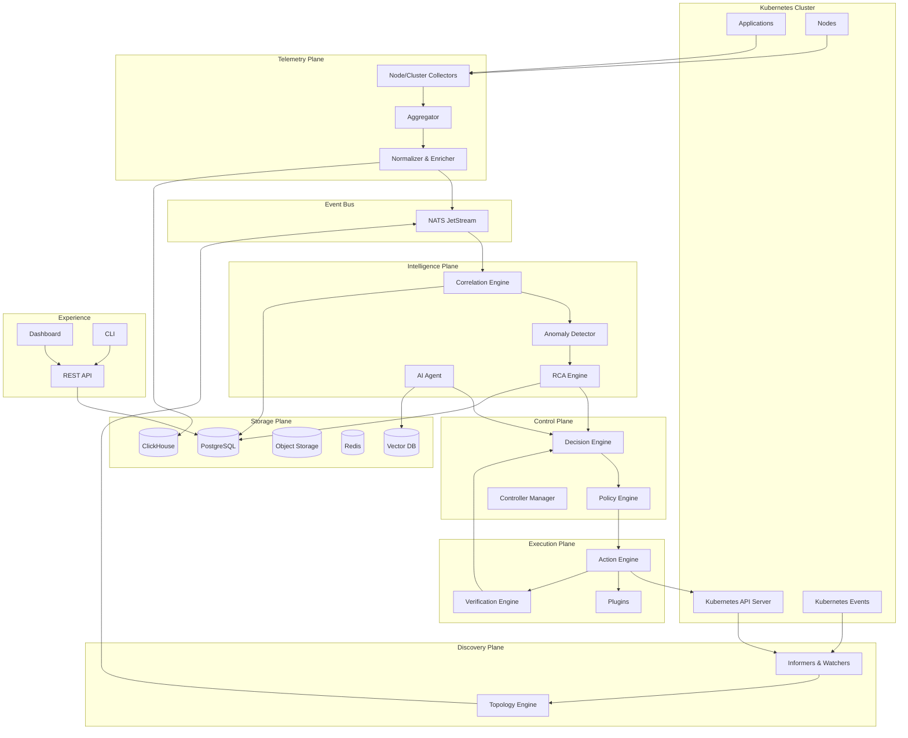


## 4.1 Data Flow

1. Collectors gather logs, metrics, traces, Kubernetes events, and metadata.
2. The aggregator normalizes and enriches telemetry with topology labels.
3. Events are published to JetStream subjects.
4. Correlation consumes signal events and emits incident candidates.
5. Anomaly detection scores signals and incident candidates.
6. RCA queries topology, historical incidents, traces, and logs to rank root causes.
7. Decision engine evaluates policy, risk, blast radius, and changesets.
8. Action engine applies Kubernetes mutations or external provider actions.
9. Verification engine observes recovery windows.
10. Knowledge base stores the final timeline, action outcomes, and embeddings.


# 5. Overall System Architecture

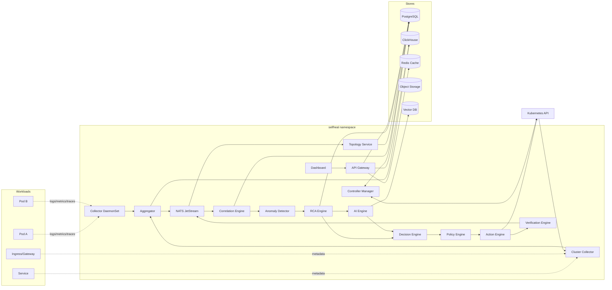


## 5.1 Subsystem Boundaries

- **Collectors** are stateless or semi-stateless agents responsible for acquisition only.
- **Aggregator** owns normalization, deduplication, enrichment, and rate shaping.
- **Event Bus** decouples producers from consumers and provides replay for incident reconstruction.
- **Topology Service** maintains the graph of discovered entities and dependencies.
- **Correlation/Anomaly/RCA** transform telemetry into incident hypotheses and ranked causes.
- **Decision/Policy** transform hypotheses into allowed remediation plans.
- **Action/Verification** mutate the cluster and validate outcomes.
- **Controller Manager** reconciles CRDs and maintains declarative state.
- **Dashboard/API** expose operational control and audit views.

# 6. Component Architecture


## 6.1 Collector

### Purpose

Collector is responsible for collecting node, workload, Kubernetes, and application telemetry. It is implemented primarily in Go and exposes typed interfaces for internal use, gRPC/HTTP endpoints where remote access is required, and event subjects for asynchronous integration.

### Responsibilities

- Discover scrape targets.
- Tail logs.
- Receive OTLP.
- Add Kubernetes metadata.
- Apply sampling and compression.

### Internal Architecture

- **Adapter layer:** Translates external APIs, Kubernetes objects, telemetry formats, or plugin calls into internal domain models.
- **Service layer:** Executes business logic, validation, deduplication, prioritization, and state transitions.
- **Store layer:** Persists durable records where needed and emits events to the bus.
- **Health layer:** Exposes `/healthz`, `/readyz`, and Prometheus metrics.
- **Config layer:** Watches ConfigMaps, Secrets, and SelfHealingPolicy resources for runtime updates.

### Interfaces

```go
type CollectorService interface {
    Start(ctx context.Context) error
    Health(ctx context.Context) ComponentHealth
    Configure(ctx context.Context, cfg ComponentConfig) error
}
```

### Inputs

- Kubernetes objects and events where relevant.
- Telemetry events from the event bus.
- Policy and configuration snapshots.
- Historical incident data.

### Outputs

- Domain events on JetStream subjects.
- Status updates on custom resources.
- Metrics and audit logs.
- API responses or action results as applicable.

### Configuration

```yaml
collector:
  enabled: true
  replicas: 2
  logLevel: info
  resources:
    requests:
      cpu: 100m
      memory: 256Mi
  queue:
    maxInFlight: 1000
    retryBackoff: 2s
```

### Failure Handling

- Uses bounded queues and backpressure.
- Retries transient failures with exponential backoff and jitter.
- Sends poison messages to a dead-letter subject.
- Emits degraded component conditions.
- Avoids unsafe cluster mutation when dependencies are unavailable.

### Scaling

- Horizontal scaling for stateless workers.
- Sharding by cluster, namespace, workload hash, or incident ID.
- Leader election only for singleton reconciliation tasks.
- Work queues partitioned by event subject and consumer durable name.

### Future Improvements

- Adaptive work stealing.
- Per-tenant QoS.
- Dynamic autoscaling from queue lag.
- Pluggable storage and policy providers.


## 6.2 Aggregator

### Purpose

Aggregator is responsible for normalizing, enriching, batching, deduplicating, and routing telemetry. It is implemented primarily in Go and exposes typed interfaces for internal use, gRPC/HTTP endpoints where remote access is required, and event subjects for asynchronous integration.

### Responsibilities

- Normalize schemas.
- Merge metadata.
- Apply cardinality controls.
- Route by signal type.

### Internal Architecture

- **Adapter layer:** Translates external APIs, Kubernetes objects, telemetry formats, or plugin calls into internal domain models.
- **Service layer:** Executes business logic, validation, deduplication, prioritization, and state transitions.
- **Store layer:** Persists durable records where needed and emits events to the bus.
- **Health layer:** Exposes `/healthz`, `/readyz`, and Prometheus metrics.
- **Config layer:** Watches ConfigMaps, Secrets, and SelfHealingPolicy resources for runtime updates.

### Interfaces

```go
type AggregatorService interface {
    Start(ctx context.Context) error
    Health(ctx context.Context) ComponentHealth
    Configure(ctx context.Context, cfg ComponentConfig) error
}
```

### Inputs

- Kubernetes objects and events where relevant.
- Telemetry events from the event bus.
- Policy and configuration snapshots.
- Historical incident data.

### Outputs

- Domain events on JetStream subjects.
- Status updates on custom resources.
- Metrics and audit logs.
- API responses or action results as applicable.

### Configuration

```yaml
aggregator:
  enabled: true
  replicas: 2
  logLevel: info
  resources:
    requests:
      cpu: 100m
      memory: 256Mi
  queue:
    maxInFlight: 1000
    retryBackoff: 2s
```

### Failure Handling

- Uses bounded queues and backpressure.
- Retries transient failures with exponential backoff and jitter.
- Sends poison messages to a dead-letter subject.
- Emits degraded component conditions.
- Avoids unsafe cluster mutation when dependencies are unavailable.

### Scaling

- Horizontal scaling for stateless workers.
- Sharding by cluster, namespace, workload hash, or incident ID.
- Leader election only for singleton reconciliation tasks.
- Work queues partitioned by event subject and consumer durable name.

### Future Improvements

- Adaptive work stealing.
- Per-tenant QoS.
- Dynamic autoscaling from queue lag.
- Pluggable storage and policy providers.


## 6.3 Metrics Engine

### Purpose

Metrics Engine is responsible for evaluating metrics streams and generating metric anomalies. It is implemented primarily in Go and exposes typed interfaces for internal use, gRPC/HTTP endpoints where remote access is required, and event subjects for asynchronous integration.

### Responsibilities

- Query time series.
- Compute rollups.
- Evaluate baselines.
- Publish metric anomalies.

### Internal Architecture

- **Adapter layer:** Translates external APIs, Kubernetes objects, telemetry formats, or plugin calls into internal domain models.
- **Service layer:** Executes business logic, validation, deduplication, prioritization, and state transitions.
- **Store layer:** Persists durable records where needed and emits events to the bus.
- **Health layer:** Exposes `/healthz`, `/readyz`, and Prometheus metrics.
- **Config layer:** Watches ConfigMaps, Secrets, and SelfHealingPolicy resources for runtime updates.

### Interfaces

```go
type MetricsEngineService interface {
    Start(ctx context.Context) error
    Health(ctx context.Context) ComponentHealth
    Configure(ctx context.Context, cfg ComponentConfig) error
}
```

### Inputs

- Kubernetes objects and events where relevant.
- Telemetry events from the event bus.
- Policy and configuration snapshots.
- Historical incident data.

### Outputs

- Domain events on JetStream subjects.
- Status updates on custom resources.
- Metrics and audit logs.
- API responses or action results as applicable.

### Configuration

```yaml
metrics_engine:
  enabled: true
  replicas: 2
  logLevel: info
  resources:
    requests:
      cpu: 100m
      memory: 256Mi
  queue:
    maxInFlight: 1000
    retryBackoff: 2s
```

### Failure Handling

- Uses bounded queues and backpressure.
- Retries transient failures with exponential backoff and jitter.
- Sends poison messages to a dead-letter subject.
- Emits degraded component conditions.
- Avoids unsafe cluster mutation when dependencies are unavailable.

### Scaling

- Horizontal scaling for stateless workers.
- Sharding by cluster, namespace, workload hash, or incident ID.
- Leader election only for singleton reconciliation tasks.
- Work queues partitioned by event subject and consumer durable name.

### Future Improvements

- Adaptive work stealing.
- Per-tenant QoS.
- Dynamic autoscaling from queue lag.
- Pluggable storage and policy providers.


## 6.4 Log Engine

### Purpose

Log Engine is responsible for parsing logs and identifying error patterns. It is implemented primarily in Go and exposes typed interfaces for internal use, gRPC/HTTP endpoints where remote access is required, and event subjects for asynchronous integration.

### Responsibilities

- Parse JSON/text logs.
- Extract trace IDs.
- Detect panic/OOM/error patterns.
- Redact sensitive strings.

### Internal Architecture

- **Adapter layer:** Translates external APIs, Kubernetes objects, telemetry formats, or plugin calls into internal domain models.
- **Service layer:** Executes business logic, validation, deduplication, prioritization, and state transitions.
- **Store layer:** Persists durable records where needed and emits events to the bus.
- **Health layer:** Exposes `/healthz`, `/readyz`, and Prometheus metrics.
- **Config layer:** Watches ConfigMaps, Secrets, and SelfHealingPolicy resources for runtime updates.

### Interfaces

```go
type LogEngineService interface {
    Start(ctx context.Context) error
    Health(ctx context.Context) ComponentHealth
    Configure(ctx context.Context, cfg ComponentConfig) error
}
```

### Inputs

- Kubernetes objects and events where relevant.
- Telemetry events from the event bus.
- Policy and configuration snapshots.
- Historical incident data.

### Outputs

- Domain events on JetStream subjects.
- Status updates on custom resources.
- Metrics and audit logs.
- API responses or action results as applicable.

### Configuration

```yaml
log_engine:
  enabled: true
  replicas: 2
  logLevel: info
  resources:
    requests:
      cpu: 100m
      memory: 256Mi
  queue:
    maxInFlight: 1000
    retryBackoff: 2s
```

### Failure Handling

- Uses bounded queues and backpressure.
- Retries transient failures with exponential backoff and jitter.
- Sends poison messages to a dead-letter subject.
- Emits degraded component conditions.
- Avoids unsafe cluster mutation when dependencies are unavailable.

### Scaling

- Horizontal scaling for stateless workers.
- Sharding by cluster, namespace, workload hash, or incident ID.
- Leader election only for singleton reconciliation tasks.
- Work queues partitioned by event subject and consumer durable name.

### Future Improvements

- Adaptive work stealing.
- Per-tenant QoS.
- Dynamic autoscaling from queue lag.
- Pluggable storage and policy providers.


## 6.5 Trace Engine

### Purpose

Trace Engine is responsible for processing OTLP spans and deriving service dependencies. It is implemented primarily in Go and exposes typed interfaces for internal use, gRPC/HTTP endpoints where remote access is required, and event subjects for asynchronous integration.

### Responsibilities

- Ingest spans.
- Build critical path.
- Extract upstream/downstream edges.
- Identify latency and error spans.

### Internal Architecture

- **Adapter layer:** Translates external APIs, Kubernetes objects, telemetry formats, or plugin calls into internal domain models.
- **Service layer:** Executes business logic, validation, deduplication, prioritization, and state transitions.
- **Store layer:** Persists durable records where needed and emits events to the bus.
- **Health layer:** Exposes `/healthz`, `/readyz`, and Prometheus metrics.
- **Config layer:** Watches ConfigMaps, Secrets, and SelfHealingPolicy resources for runtime updates.

### Interfaces

```go
type TraceEngineService interface {
    Start(ctx context.Context) error
    Health(ctx context.Context) ComponentHealth
    Configure(ctx context.Context, cfg ComponentConfig) error
}
```

### Inputs

- Kubernetes objects and events where relevant.
- Telemetry events from the event bus.
- Policy and configuration snapshots.
- Historical incident data.

### Outputs

- Domain events on JetStream subjects.
- Status updates on custom resources.
- Metrics and audit logs.
- API responses or action results as applicable.

### Configuration

```yaml
trace_engine:
  enabled: true
  replicas: 2
  logLevel: info
  resources:
    requests:
      cpu: 100m
      memory: 256Mi
  queue:
    maxInFlight: 1000
    retryBackoff: 2s
```

### Failure Handling

- Uses bounded queues and backpressure.
- Retries transient failures with exponential backoff and jitter.
- Sends poison messages to a dead-letter subject.
- Emits degraded component conditions.
- Avoids unsafe cluster mutation when dependencies are unavailable.

### Scaling

- Horizontal scaling for stateless workers.
- Sharding by cluster, namespace, workload hash, or incident ID.
- Leader election only for singleton reconciliation tasks.
- Work queues partitioned by event subject and consumer durable name.

### Future Improvements

- Adaptive work stealing.
- Per-tenant QoS.
- Dynamic autoscaling from queue lag.
- Pluggable storage and policy providers.


## 6.6 Topology Engine

### Purpose

Topology Engine is responsible for maintaining real-time workload and dependency graph state. It is implemented primarily in Go and exposes typed interfaces for internal use, gRPC/HTTP endpoints where remote access is required, and event subjects for asynchronous integration.

### Responsibilities

- Watch resources.
- Resolve owner refs.
- Build graph edges.
- Persist snapshots and deltas.

### Internal Architecture

- **Adapter layer:** Translates external APIs, Kubernetes objects, telemetry formats, or plugin calls into internal domain models.
- **Service layer:** Executes business logic, validation, deduplication, prioritization, and state transitions.
- **Store layer:** Persists durable records where needed and emits events to the bus.
- **Health layer:** Exposes `/healthz`, `/readyz`, and Prometheus metrics.
- **Config layer:** Watches ConfigMaps, Secrets, and SelfHealingPolicy resources for runtime updates.

### Interfaces

```go
type TopologyEngineService interface {
    Start(ctx context.Context) error
    Health(ctx context.Context) ComponentHealth
    Configure(ctx context.Context, cfg ComponentConfig) error
}
```

### Inputs

- Kubernetes objects and events where relevant.
- Telemetry events from the event bus.
- Policy and configuration snapshots.
- Historical incident data.

### Outputs

- Domain events on JetStream subjects.
- Status updates on custom resources.
- Metrics and audit logs.
- API responses or action results as applicable.

### Configuration

```yaml
topology_engine:
  enabled: true
  replicas: 2
  logLevel: info
  resources:
    requests:
      cpu: 100m
      memory: 256Mi
  queue:
    maxInFlight: 1000
    retryBackoff: 2s
```

### Failure Handling

- Uses bounded queues and backpressure.
- Retries transient failures with exponential backoff and jitter.
- Sends poison messages to a dead-letter subject.
- Emits degraded component conditions.
- Avoids unsafe cluster mutation when dependencies are unavailable.

### Scaling

- Horizontal scaling for stateless workers.
- Sharding by cluster, namespace, workload hash, or incident ID.
- Leader election only for singleton reconciliation tasks.
- Work queues partitioned by event subject and consumer durable name.

### Future Improvements

- Adaptive work stealing.
- Per-tenant QoS.
- Dynamic autoscaling from queue lag.
- Pluggable storage and policy providers.


## 6.7 Correlation Engine

### Purpose

Correlation Engine is responsible for converting telemetry into incident candidates. It is implemented primarily in Go and exposes typed interfaces for internal use, gRPC/HTTP endpoints where remote access is required, and event subjects for asynchronous integration.

### Responsibilities

- Group events by time, topology, dependency, and history.
- Deduplicate alerts.
- Emit incident candidates.

### Internal Architecture

- **Adapter layer:** Translates external APIs, Kubernetes objects, telemetry formats, or plugin calls into internal domain models.
- **Service layer:** Executes business logic, validation, deduplication, prioritization, and state transitions.
- **Store layer:** Persists durable records where needed and emits events to the bus.
- **Health layer:** Exposes `/healthz`, `/readyz`, and Prometheus metrics.
- **Config layer:** Watches ConfigMaps, Secrets, and SelfHealingPolicy resources for runtime updates.

### Interfaces

```go
type CorrelationEngineService interface {
    Start(ctx context.Context) error
    Health(ctx context.Context) ComponentHealth
    Configure(ctx context.Context, cfg ComponentConfig) error
}
```

### Inputs

- Kubernetes objects and events where relevant.
- Telemetry events from the event bus.
- Policy and configuration snapshots.
- Historical incident data.

### Outputs

- Domain events on JetStream subjects.
- Status updates on custom resources.
- Metrics and audit logs.
- API responses or action results as applicable.

### Configuration

```yaml
correlation_engine:
  enabled: true
  replicas: 2
  logLevel: info
  resources:
    requests:
      cpu: 100m
      memory: 256Mi
  queue:
    maxInFlight: 1000
    retryBackoff: 2s
```

### Failure Handling

- Uses bounded queues and backpressure.
- Retries transient failures with exponential backoff and jitter.
- Sends poison messages to a dead-letter subject.
- Emits degraded component conditions.
- Avoids unsafe cluster mutation when dependencies are unavailable.

### Scaling

- Horizontal scaling for stateless workers.
- Sharding by cluster, namespace, workload hash, or incident ID.
- Leader election only for singleton reconciliation tasks.
- Work queues partitioned by event subject and consumer durable name.

### Future Improvements

- Adaptive work stealing.
- Per-tenant QoS.
- Dynamic autoscaling from queue lag.
- Pluggable storage and policy providers.


## 6.8 Anomaly Detector

### Purpose

Anomaly Detector is responsible for scoring abnormal behavior across telemetry signals. It is implemented primarily in Go and exposes typed interfaces for internal use, gRPC/HTTP endpoints where remote access is required, and event subjects for asynchronous integration.

### Responsibilities

- Run threshold/EWMA/Z-score/ML detectors.
- Maintain baselines.
- Publish anomalies and confidence.

### Internal Architecture

- **Adapter layer:** Translates external APIs, Kubernetes objects, telemetry formats, or plugin calls into internal domain models.
- **Service layer:** Executes business logic, validation, deduplication, prioritization, and state transitions.
- **Store layer:** Persists durable records where needed and emits events to the bus.
- **Health layer:** Exposes `/healthz`, `/readyz`, and Prometheus metrics.
- **Config layer:** Watches ConfigMaps, Secrets, and SelfHealingPolicy resources for runtime updates.

### Interfaces

```go
type AnomalyDetectorService interface {
    Start(ctx context.Context) error
    Health(ctx context.Context) ComponentHealth
    Configure(ctx context.Context, cfg ComponentConfig) error
}
```

### Inputs

- Kubernetes objects and events where relevant.
- Telemetry events from the event bus.
- Policy and configuration snapshots.
- Historical incident data.

### Outputs

- Domain events on JetStream subjects.
- Status updates on custom resources.
- Metrics and audit logs.
- API responses or action results as applicable.

### Configuration

```yaml
anomaly_detector:
  enabled: true
  replicas: 2
  logLevel: info
  resources:
    requests:
      cpu: 100m
      memory: 256Mi
  queue:
    maxInFlight: 1000
    retryBackoff: 2s
```

### Failure Handling

- Uses bounded queues and backpressure.
- Retries transient failures with exponential backoff and jitter.
- Sends poison messages to a dead-letter subject.
- Emits degraded component conditions.
- Avoids unsafe cluster mutation when dependencies are unavailable.

### Scaling

- Horizontal scaling for stateless workers.
- Sharding by cluster, namespace, workload hash, or incident ID.
- Leader election only for singleton reconciliation tasks.
- Work queues partitioned by event subject and consumer durable name.

### Future Improvements

- Adaptive work stealing.
- Per-tenant QoS.
- Dynamic autoscaling from queue lag.
- Pluggable storage and policy providers.


## 6.9 RCA Engine

### Purpose

RCA Engine is responsible for ranking root cause hypotheses. It is implemented primarily in Go and exposes typed interfaces for internal use, gRPC/HTTP endpoints where remote access is required, and event subjects for asynchronous integration.

### Responsibilities

- Traverse dependency graph.
- Score evidence.
- Build timeline.
- Rank candidates by confidence.

### Internal Architecture

- **Adapter layer:** Translates external APIs, Kubernetes objects, telemetry formats, or plugin calls into internal domain models.
- **Service layer:** Executes business logic, validation, deduplication, prioritization, and state transitions.
- **Store layer:** Persists durable records where needed and emits events to the bus.
- **Health layer:** Exposes `/healthz`, `/readyz`, and Prometheus metrics.
- **Config layer:** Watches ConfigMaps, Secrets, and SelfHealingPolicy resources for runtime updates.

### Interfaces

```go
type RcaEngineService interface {
    Start(ctx context.Context) error
    Health(ctx context.Context) ComponentHealth
    Configure(ctx context.Context, cfg ComponentConfig) error
}
```

### Inputs

- Kubernetes objects and events where relevant.
- Telemetry events from the event bus.
- Policy and configuration snapshots.
- Historical incident data.

### Outputs

- Domain events on JetStream subjects.
- Status updates on custom resources.
- Metrics and audit logs.
- API responses or action results as applicable.

### Configuration

```yaml
rca_engine:
  enabled: true
  replicas: 2
  logLevel: info
  resources:
    requests:
      cpu: 100m
      memory: 256Mi
  queue:
    maxInFlight: 1000
    retryBackoff: 2s
```

### Failure Handling

- Uses bounded queues and backpressure.
- Retries transient failures with exponential backoff and jitter.
- Sends poison messages to a dead-letter subject.
- Emits degraded component conditions.
- Avoids unsafe cluster mutation when dependencies are unavailable.

### Scaling

- Horizontal scaling for stateless workers.
- Sharding by cluster, namespace, workload hash, or incident ID.
- Leader election only for singleton reconciliation tasks.
- Work queues partitioned by event subject and consumer durable name.

### Future Improvements

- Adaptive work stealing.
- Per-tenant QoS.
- Dynamic autoscaling from queue lag.
- Pluggable storage and policy providers.


## 6.10 Decision Engine

### Purpose

Decision Engine is responsible for selecting safe remediation plans. It is implemented primarily in Go and exposes typed interfaces for internal use, gRPC/HTTP endpoints where remote access is required, and event subjects for asynchronous integration.

### Responsibilities

- Evaluate action catalog.
- Choose plan.
- Check risk and priority.
- Request approval when needed.

### Internal Architecture

- **Adapter layer:** Translates external APIs, Kubernetes objects, telemetry formats, or plugin calls into internal domain models.
- **Service layer:** Executes business logic, validation, deduplication, prioritization, and state transitions.
- **Store layer:** Persists durable records where needed and emits events to the bus.
- **Health layer:** Exposes `/healthz`, `/readyz`, and Prometheus metrics.
- **Config layer:** Watches ConfigMaps, Secrets, and SelfHealingPolicy resources for runtime updates.

### Interfaces

```go
type DecisionEngineService interface {
    Start(ctx context.Context) error
    Health(ctx context.Context) ComponentHealth
    Configure(ctx context.Context, cfg ComponentConfig) error
}
```

### Inputs

- Kubernetes objects and events where relevant.
- Telemetry events from the event bus.
- Policy and configuration snapshots.
- Historical incident data.

### Outputs

- Domain events on JetStream subjects.
- Status updates on custom resources.
- Metrics and audit logs.
- API responses or action results as applicable.

### Configuration

```yaml
decision_engine:
  enabled: true
  replicas: 2
  logLevel: info
  resources:
    requests:
      cpu: 100m
      memory: 256Mi
  queue:
    maxInFlight: 1000
    retryBackoff: 2s
```

### Failure Handling

- Uses bounded queues and backpressure.
- Retries transient failures with exponential backoff and jitter.
- Sends poison messages to a dead-letter subject.
- Emits degraded component conditions.
- Avoids unsafe cluster mutation when dependencies are unavailable.

### Scaling

- Horizontal scaling for stateless workers.
- Sharding by cluster, namespace, workload hash, or incident ID.
- Leader election only for singleton reconciliation tasks.
- Work queues partitioned by event subject and consumer durable name.

### Future Improvements

- Adaptive work stealing.
- Per-tenant QoS.
- Dynamic autoscaling from queue lag.
- Pluggable storage and policy providers.


## 6.11 Policy Engine

### Purpose

Policy Engine is responsible for enforcing guardrails and authorization. It is implemented primarily in Go and exposes typed interfaces for internal use, gRPC/HTTP endpoints where remote access is required, and event subjects for asynchronous integration.

### Responsibilities

- Enforce deny/allow policies.
- Calculate blast radius.
- Require approvals.
- Audit decisions.

### Internal Architecture

- **Adapter layer:** Translates external APIs, Kubernetes objects, telemetry formats, or plugin calls into internal domain models.
- **Service layer:** Executes business logic, validation, deduplication, prioritization, and state transitions.
- **Store layer:** Persists durable records where needed and emits events to the bus.
- **Health layer:** Exposes `/healthz`, `/readyz`, and Prometheus metrics.
- **Config layer:** Watches ConfigMaps, Secrets, and SelfHealingPolicy resources for runtime updates.

### Interfaces

```go
type PolicyEngineService interface {
    Start(ctx context.Context) error
    Health(ctx context.Context) ComponentHealth
    Configure(ctx context.Context, cfg ComponentConfig) error
}
```

### Inputs

- Kubernetes objects and events where relevant.
- Telemetry events from the event bus.
- Policy and configuration snapshots.
- Historical incident data.

### Outputs

- Domain events on JetStream subjects.
- Status updates on custom resources.
- Metrics and audit logs.
- API responses or action results as applicable.

### Configuration

```yaml
policy_engine:
  enabled: true
  replicas: 2
  logLevel: info
  resources:
    requests:
      cpu: 100m
      memory: 256Mi
  queue:
    maxInFlight: 1000
    retryBackoff: 2s
```

### Failure Handling

- Uses bounded queues and backpressure.
- Retries transient failures with exponential backoff and jitter.
- Sends poison messages to a dead-letter subject.
- Emits degraded component conditions.
- Avoids unsafe cluster mutation when dependencies are unavailable.

### Scaling

- Horizontal scaling for stateless workers.
- Sharding by cluster, namespace, workload hash, or incident ID.
- Leader election only for singleton reconciliation tasks.
- Work queues partitioned by event subject and consumer durable name.

### Future Improvements

- Adaptive work stealing.
- Per-tenant QoS.
- Dynamic autoscaling from queue lag.
- Pluggable storage and policy providers.


## 6.12 AI Agent

### Purpose

AI Agent is responsible for summarizing incidents and retrieving operational knowledge. It is implemented primarily in Go and exposes typed interfaces for internal use, gRPC/HTTP endpoints where remote access is required, and event subjects for asynchronous integration.

### Responsibilities

- Generate summaries.
- Retrieve similar incidents.
- Suggest remediations.
- Explain reasoning without direct mutation.

### Internal Architecture

- **Adapter layer:** Translates external APIs, Kubernetes objects, telemetry formats, or plugin calls into internal domain models.
- **Service layer:** Executes business logic, validation, deduplication, prioritization, and state transitions.
- **Store layer:** Persists durable records where needed and emits events to the bus.
- **Health layer:** Exposes `/healthz`, `/readyz`, and Prometheus metrics.
- **Config layer:** Watches ConfigMaps, Secrets, and SelfHealingPolicy resources for runtime updates.

### Interfaces

```go
type AiAgentService interface {
    Start(ctx context.Context) error
    Health(ctx context.Context) ComponentHealth
    Configure(ctx context.Context, cfg ComponentConfig) error
}
```

### Inputs

- Kubernetes objects and events where relevant.
- Telemetry events from the event bus.
- Policy and configuration snapshots.
- Historical incident data.

### Outputs

- Domain events on JetStream subjects.
- Status updates on custom resources.
- Metrics and audit logs.
- API responses or action results as applicable.

### Configuration

```yaml
ai_agent:
  enabled: true
  replicas: 2
  logLevel: info
  resources:
    requests:
      cpu: 100m
      memory: 256Mi
  queue:
    maxInFlight: 1000
    retryBackoff: 2s
```

### Failure Handling

- Uses bounded queues and backpressure.
- Retries transient failures with exponential backoff and jitter.
- Sends poison messages to a dead-letter subject.
- Emits degraded component conditions.
- Avoids unsafe cluster mutation when dependencies are unavailable.

### Scaling

- Horizontal scaling for stateless workers.
- Sharding by cluster, namespace, workload hash, or incident ID.
- Leader election only for singleton reconciliation tasks.
- Work queues partitioned by event subject and consumer durable name.

### Future Improvements

- Adaptive work stealing.
- Per-tenant QoS.
- Dynamic autoscaling from queue lag.
- Pluggable storage and policy providers.


## 6.13 Action Engine

### Purpose

Action Engine is responsible for executing remediation through Kubernetes and plugins. It is implemented primarily in Go and exposes typed interfaces for internal use, gRPC/HTTP endpoints where remote access is required, and event subjects for asynchronous integration.

### Responsibilities

- Run actions.
- Track state.
- Enforce idempotency.
- Emit audit events.

### Internal Architecture

- **Adapter layer:** Translates external APIs, Kubernetes objects, telemetry formats, or plugin calls into internal domain models.
- **Service layer:** Executes business logic, validation, deduplication, prioritization, and state transitions.
- **Store layer:** Persists durable records where needed and emits events to the bus.
- **Health layer:** Exposes `/healthz`, `/readyz`, and Prometheus metrics.
- **Config layer:** Watches ConfigMaps, Secrets, and SelfHealingPolicy resources for runtime updates.

### Interfaces

```go
type ActionEngineService interface {
    Start(ctx context.Context) error
    Health(ctx context.Context) ComponentHealth
    Configure(ctx context.Context, cfg ComponentConfig) error
}
```

### Inputs

- Kubernetes objects and events where relevant.
- Telemetry events from the event bus.
- Policy and configuration snapshots.
- Historical incident data.

### Outputs

- Domain events on JetStream subjects.
- Status updates on custom resources.
- Metrics and audit logs.
- API responses or action results as applicable.

### Configuration

```yaml
action_engine:
  enabled: true
  replicas: 2
  logLevel: info
  resources:
    requests:
      cpu: 100m
      memory: 256Mi
  queue:
    maxInFlight: 1000
    retryBackoff: 2s
```

### Failure Handling

- Uses bounded queues and backpressure.
- Retries transient failures with exponential backoff and jitter.
- Sends poison messages to a dead-letter subject.
- Emits degraded component conditions.
- Avoids unsafe cluster mutation when dependencies are unavailable.

### Scaling

- Horizontal scaling for stateless workers.
- Sharding by cluster, namespace, workload hash, or incident ID.
- Leader election only for singleton reconciliation tasks.
- Work queues partitioned by event subject and consumer durable name.

### Future Improvements

- Adaptive work stealing.
- Per-tenant QoS.
- Dynamic autoscaling from queue lag.
- Pluggable storage and policy providers.


## 6.14 Verification Engine

### Purpose

Verification Engine is responsible for validating recovery after remediation. It is implemented primarily in Go and exposes typed interfaces for internal use, gRPC/HTTP endpoints where remote access is required, and event subjects for asynchronous integration.

### Responsibilities

- Run health checks.
- Query SLO metrics.
- Compare before/after.
- Trigger rollback.

### Internal Architecture

- **Adapter layer:** Translates external APIs, Kubernetes objects, telemetry formats, or plugin calls into internal domain models.
- **Service layer:** Executes business logic, validation, deduplication, prioritization, and state transitions.
- **Store layer:** Persists durable records where needed and emits events to the bus.
- **Health layer:** Exposes `/healthz`, `/readyz`, and Prometheus metrics.
- **Config layer:** Watches ConfigMaps, Secrets, and SelfHealingPolicy resources for runtime updates.

### Interfaces

```go
type VerificationEngineService interface {
    Start(ctx context.Context) error
    Health(ctx context.Context) ComponentHealth
    Configure(ctx context.Context, cfg ComponentConfig) error
}
```

### Inputs

- Kubernetes objects and events where relevant.
- Telemetry events from the event bus.
- Policy and configuration snapshots.
- Historical incident data.

### Outputs

- Domain events on JetStream subjects.
- Status updates on custom resources.
- Metrics and audit logs.
- API responses or action results as applicable.

### Configuration

```yaml
verification_engine:
  enabled: true
  replicas: 2
  logLevel: info
  resources:
    requests:
      cpu: 100m
      memory: 256Mi
  queue:
    maxInFlight: 1000
    retryBackoff: 2s
```

### Failure Handling

- Uses bounded queues and backpressure.
- Retries transient failures with exponential backoff and jitter.
- Sends poison messages to a dead-letter subject.
- Emits degraded component conditions.
- Avoids unsafe cluster mutation when dependencies are unavailable.

### Scaling

- Horizontal scaling for stateless workers.
- Sharding by cluster, namespace, workload hash, or incident ID.
- Leader election only for singleton reconciliation tasks.
- Work queues partitioned by event subject and consumer durable name.

### Future Improvements

- Adaptive work stealing.
- Per-tenant QoS.
- Dynamic autoscaling from queue lag.
- Pluggable storage and policy providers.


## 6.15 Knowledge Store

### Purpose

Knowledge Store is responsible for persisting incidents, runbooks, and embeddings. It is implemented primarily in Go and exposes typed interfaces for internal use, gRPC/HTTP endpoints where remote access is required, and event subjects for asynchronous integration.

### Responsibilities

- Store incident timelines.
- Index runbooks.
- Support similarity search.
- Retain action outcomes.

### Internal Architecture

- **Adapter layer:** Translates external APIs, Kubernetes objects, telemetry formats, or plugin calls into internal domain models.
- **Service layer:** Executes business logic, validation, deduplication, prioritization, and state transitions.
- **Store layer:** Persists durable records where needed and emits events to the bus.
- **Health layer:** Exposes `/healthz`, `/readyz`, and Prometheus metrics.
- **Config layer:** Watches ConfigMaps, Secrets, and SelfHealingPolicy resources for runtime updates.

### Interfaces

```go
type KnowledgeStoreService interface {
    Start(ctx context.Context) error
    Health(ctx context.Context) ComponentHealth
    Configure(ctx context.Context, cfg ComponentConfig) error
}
```

### Inputs

- Kubernetes objects and events where relevant.
- Telemetry events from the event bus.
- Policy and configuration snapshots.
- Historical incident data.

### Outputs

- Domain events on JetStream subjects.
- Status updates on custom resources.
- Metrics and audit logs.
- API responses or action results as applicable.

### Configuration

```yaml
knowledge_store:
  enabled: true
  replicas: 2
  logLevel: info
  resources:
    requests:
      cpu: 100m
      memory: 256Mi
  queue:
    maxInFlight: 1000
    retryBackoff: 2s
```

### Failure Handling

- Uses bounded queues and backpressure.
- Retries transient failures with exponential backoff and jitter.
- Sends poison messages to a dead-letter subject.
- Emits degraded component conditions.
- Avoids unsafe cluster mutation when dependencies are unavailable.

### Scaling

- Horizontal scaling for stateless workers.
- Sharding by cluster, namespace, workload hash, or incident ID.
- Leader election only for singleton reconciliation tasks.
- Work queues partitioned by event subject and consumer durable name.

### Future Improvements

- Adaptive work stealing.
- Per-tenant QoS.
- Dynamic autoscaling from queue lag.
- Pluggable storage and policy providers.


## 6.16 Dashboard

### Purpose

Dashboard is responsible for providing human-facing operations experience. It is implemented primarily in Go and exposes typed interfaces for internal use, gRPC/HTTP endpoints where remote access is required, and event subjects for asynchronous integration.

### Responsibilities

- Incident view.
- Topology graph.
- Action approvals.
- Settings and audit.

### Internal Architecture

- **Adapter layer:** Translates external APIs, Kubernetes objects, telemetry formats, or plugin calls into internal domain models.
- **Service layer:** Executes business logic, validation, deduplication, prioritization, and state transitions.
- **Store layer:** Persists durable records where needed and emits events to the bus.
- **Health layer:** Exposes `/healthz`, `/readyz`, and Prometheus metrics.
- **Config layer:** Watches ConfigMaps, Secrets, and SelfHealingPolicy resources for runtime updates.

### Interfaces

```go
type DashboardService interface {
    Start(ctx context.Context) error
    Health(ctx context.Context) ComponentHealth
    Configure(ctx context.Context, cfg ComponentConfig) error
}
```

### Inputs

- Kubernetes objects and events where relevant.
- Telemetry events from the event bus.
- Policy and configuration snapshots.
- Historical incident data.

### Outputs

- Domain events on JetStream subjects.
- Status updates on custom resources.
- Metrics and audit logs.
- API responses or action results as applicable.

### Configuration

```yaml
dashboard:
  enabled: true
  replicas: 2
  logLevel: info
  resources:
    requests:
      cpu: 100m
      memory: 256Mi
  queue:
    maxInFlight: 1000
    retryBackoff: 2s
```

### Failure Handling

- Uses bounded queues and backpressure.
- Retries transient failures with exponential backoff and jitter.
- Sends poison messages to a dead-letter subject.
- Emits degraded component conditions.
- Avoids unsafe cluster mutation when dependencies are unavailable.

### Scaling

- Horizontal scaling for stateless workers.
- Sharding by cluster, namespace, workload hash, or incident ID.
- Leader election only for singleton reconciliation tasks.
- Work queues partitioned by event subject and consumer durable name.

### Future Improvements

- Adaptive work stealing.
- Per-tenant QoS.
- Dynamic autoscaling from queue lag.
- Pluggable storage and policy providers.


## 6.17 API Gateway

### Purpose

API Gateway is responsible for exposing REST and streaming APIs. It is implemented primarily in Go and exposes typed interfaces for internal use, gRPC/HTTP endpoints where remote access is required, and event subjects for asynchronous integration.

### Responsibilities

- Authenticate users.
- Authorize resource access.
- Serve OpenAPI.
- Proxy event streams.

### Internal Architecture

- **Adapter layer:** Translates external APIs, Kubernetes objects, telemetry formats, or plugin calls into internal domain models.
- **Service layer:** Executes business logic, validation, deduplication, prioritization, and state transitions.
- **Store layer:** Persists durable records where needed and emits events to the bus.
- **Health layer:** Exposes `/healthz`, `/readyz`, and Prometheus metrics.
- **Config layer:** Watches ConfigMaps, Secrets, and SelfHealingPolicy resources for runtime updates.

### Interfaces

```go
type ApiGatewayService interface {
    Start(ctx context.Context) error
    Health(ctx context.Context) ComponentHealth
    Configure(ctx context.Context, cfg ComponentConfig) error
}
```

### Inputs

- Kubernetes objects and events where relevant.
- Telemetry events from the event bus.
- Policy and configuration snapshots.
- Historical incident data.

### Outputs

- Domain events on JetStream subjects.
- Status updates on custom resources.
- Metrics and audit logs.
- API responses or action results as applicable.

### Configuration

```yaml
api_gateway:
  enabled: true
  replicas: 2
  logLevel: info
  resources:
    requests:
      cpu: 100m
      memory: 256Mi
  queue:
    maxInFlight: 1000
    retryBackoff: 2s
```

### Failure Handling

- Uses bounded queues and backpressure.
- Retries transient failures with exponential backoff and jitter.
- Sends poison messages to a dead-letter subject.
- Emits degraded component conditions.
- Avoids unsafe cluster mutation when dependencies are unavailable.

### Scaling

- Horizontal scaling for stateless workers.
- Sharding by cluster, namespace, workload hash, or incident ID.
- Leader election only for singleton reconciliation tasks.
- Work queues partitioned by event subject and consumer durable name.

### Future Improvements

- Adaptive work stealing.
- Per-tenant QoS.
- Dynamic autoscaling from queue lag.
- Pluggable storage and policy providers.


## 6.18 Controller Manager

### Purpose

Controller Manager is responsible for reconciling platform CRDs. It is implemented primarily in Go and exposes typed interfaces for internal use, gRPC/HTTP endpoints where remote access is required, and event subjects for asynchronous integration.

### Responsibilities

- Reconcile policies/incidents/remediations.
- Update status.
- Manage finalizers.
- Run leader-elected controllers.

### Internal Architecture

- **Adapter layer:** Translates external APIs, Kubernetes objects, telemetry formats, or plugin calls into internal domain models.
- **Service layer:** Executes business logic, validation, deduplication, prioritization, and state transitions.
- **Store layer:** Persists durable records where needed and emits events to the bus.
- **Health layer:** Exposes `/healthz`, `/readyz`, and Prometheus metrics.
- **Config layer:** Watches ConfigMaps, Secrets, and SelfHealingPolicy resources for runtime updates.

### Interfaces

```go
type ControllerManagerService interface {
    Start(ctx context.Context) error
    Health(ctx context.Context) ComponentHealth
    Configure(ctx context.Context, cfg ComponentConfig) error
}
```

### Inputs

- Kubernetes objects and events where relevant.
- Telemetry events from the event bus.
- Policy and configuration snapshots.
- Historical incident data.

### Outputs

- Domain events on JetStream subjects.
- Status updates on custom resources.
- Metrics and audit logs.
- API responses or action results as applicable.

### Configuration

```yaml
controller_manager:
  enabled: true
  replicas: 2
  logLevel: info
  resources:
    requests:
      cpu: 100m
      memory: 256Mi
  queue:
    maxInFlight: 1000
    retryBackoff: 2s
```

### Failure Handling

- Uses bounded queues and backpressure.
- Retries transient failures with exponential backoff and jitter.
- Sends poison messages to a dead-letter subject.
- Emits degraded component conditions.
- Avoids unsafe cluster mutation when dependencies are unavailable.

### Scaling

- Horizontal scaling for stateless workers.
- Sharding by cluster, namespace, workload hash, or incident ID.
- Leader election only for singleton reconciliation tasks.
- Work queues partitioned by event subject and consumer durable name.

### Future Improvements

- Adaptive work stealing.
- Per-tenant QoS.
- Dynamic autoscaling from queue lag.
- Pluggable storage and policy providers.


## 6.19 Scheduler

### Purpose

Scheduler is responsible for scheduling analysis and remediation tasks. It is implemented primarily in Go and exposes typed interfaces for internal use, gRPC/HTTP endpoints where remote access is required, and event subjects for asynchronous integration.

### Responsibilities

- Prioritize work.
- Apply concurrency limits.
- Manage retries.
- Assign workers.

### Internal Architecture

- **Adapter layer:** Translates external APIs, Kubernetes objects, telemetry formats, or plugin calls into internal domain models.
- **Service layer:** Executes business logic, validation, deduplication, prioritization, and state transitions.
- **Store layer:** Persists durable records where needed and emits events to the bus.
- **Health layer:** Exposes `/healthz`, `/readyz`, and Prometheus metrics.
- **Config layer:** Watches ConfigMaps, Secrets, and SelfHealingPolicy resources for runtime updates.

### Interfaces

```go
type SchedulerService interface {
    Start(ctx context.Context) error
    Health(ctx context.Context) ComponentHealth
    Configure(ctx context.Context, cfg ComponentConfig) error
}
```

### Inputs

- Kubernetes objects and events where relevant.
- Telemetry events from the event bus.
- Policy and configuration snapshots.
- Historical incident data.

### Outputs

- Domain events on JetStream subjects.
- Status updates on custom resources.
- Metrics and audit logs.
- API responses or action results as applicable.

### Configuration

```yaml
scheduler:
  enabled: true
  replicas: 2
  logLevel: info
  resources:
    requests:
      cpu: 100m
      memory: 256Mi
  queue:
    maxInFlight: 1000
    retryBackoff: 2s
```

### Failure Handling

- Uses bounded queues and backpressure.
- Retries transient failures with exponential backoff and jitter.
- Sends poison messages to a dead-letter subject.
- Emits degraded component conditions.
- Avoids unsafe cluster mutation when dependencies are unavailable.

### Scaling

- Horizontal scaling for stateless workers.
- Sharding by cluster, namespace, workload hash, or incident ID.
- Leader election only for singleton reconciliation tasks.
- Work queues partitioned by event subject and consumer durable name.

### Future Improvements

- Adaptive work stealing.
- Per-tenant QoS.
- Dynamic autoscaling from queue lag.
- Pluggable storage and policy providers.


## 6.20 Plugin Manager

### Purpose

Plugin Manager is responsible for loading and managing external extensions. It is implemented primarily in Go and exposes typed interfaces for internal use, gRPC/HTTP endpoints where remote access is required, and event subjects for asynchronous integration.

### Responsibilities

- Register plugins.
- Validate capabilities.
- Sandbox calls.
- Route plugin requests.

### Internal Architecture

- **Adapter layer:** Translates external APIs, Kubernetes objects, telemetry formats, or plugin calls into internal domain models.
- **Service layer:** Executes business logic, validation, deduplication, prioritization, and state transitions.
- **Store layer:** Persists durable records where needed and emits events to the bus.
- **Health layer:** Exposes `/healthz`, `/readyz`, and Prometheus metrics.
- **Config layer:** Watches ConfigMaps, Secrets, and SelfHealingPolicy resources for runtime updates.

### Interfaces

```go
type PluginManagerService interface {
    Start(ctx context.Context) error
    Health(ctx context.Context) ComponentHealth
    Configure(ctx context.Context, cfg ComponentConfig) error
}
```

### Inputs

- Kubernetes objects and events where relevant.
- Telemetry events from the event bus.
- Policy and configuration snapshots.
- Historical incident data.

### Outputs

- Domain events on JetStream subjects.
- Status updates on custom resources.
- Metrics and audit logs.
- API responses or action results as applicable.

### Configuration

```yaml
plugin_manager:
  enabled: true
  replicas: 2
  logLevel: info
  resources:
    requests:
      cpu: 100m
      memory: 256Mi
  queue:
    maxInFlight: 1000
    retryBackoff: 2s
```

### Failure Handling

- Uses bounded queues and backpressure.
- Retries transient failures with exponential backoff and jitter.
- Sends poison messages to a dead-letter subject.
- Emits degraded component conditions.
- Avoids unsafe cluster mutation when dependencies are unavailable.

### Scaling

- Horizontal scaling for stateless workers.
- Sharding by cluster, namespace, workload hash, or incident ID.
- Leader election only for singleton reconciliation tasks.
- Work queues partitioned by event subject and consumer durable name.

### Future Improvements

- Adaptive work stealing.
- Per-tenant QoS.
- Dynamic autoscaling from queue lag.
- Pluggable storage and policy providers.


# 7. Collector Architecture

## 7.1 Deployment Model

The collector is deployed in two forms:

- **DaemonSet collector:** Runs on every node and collects node-local logs, host metrics, cAdvisor metrics, kubelet metrics, and OTLP from local workloads.
- **Cluster collector:** Runs as a Deployment and watches Kubernetes API resources, events, and cluster-level metrics.
- **Gateway collector:** Runs as a horizontally scalable Deployment and receives OTLP from apps, sidecars, service mesh, and remote clusters.

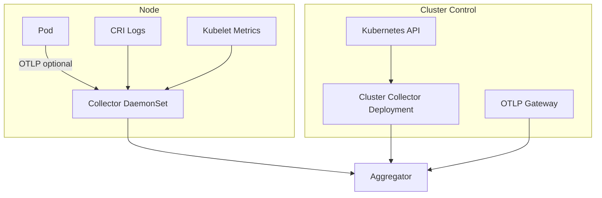


## 7.2 Discovery

Discovery is performed by Kubernetes informers using shared caches. The collector watches objects and converts them into metadata snapshots. Discovery is incremental: each add/update/delete event emits a topology delta.

## 7.3 Scraping

Scrape target discovery supports:

- Pod annotations such as `prometheus.io/scrape`.
- ServiceMonitors/PodMonitors when Prometheus Operator CRDs exist.
- Static scrape configs from Helm values.
- Kubelet endpoints.
- Platform component metrics endpoints.

## 7.4 Streaming

Logs and traces are streamed rather than batch-polled. Metrics are scraped at configured intervals and batched for compression.

## 7.5 OpenTelemetry

The platform uses OTLP internally for logs, metrics, and traces whenever possible. The collector can be deployed as a custom OpenTelemetry Collector distribution or as native Go collectors using OTel SDKs.

## 7.6 Metadata Enrichment

Each telemetry item is enriched with:

```yaml
resource:
  cluster: prod-us-east-1
  namespace: payments
  workload_kind: Deployment
  workload_name: checkout-api
  pod: checkout-api-7f8c9
  container: app
  node: ip-10-0-1-23
  service: checkout
  team: payments-platform
  environment: production
```

## 7.7 Sampling

- Tail-based sampling for traces.
- Rate-based sampling for logs.
- Error-biased sampling.
- Incident-mode sampling expansion: when an incident is active, increase sample rate for affected topology neighborhoods.

## 7.8 Compression

- gzip/zstd for batches.
- Dictionary compression for repeated Kubernetes labels.
- Columnar storage compression delegated to ClickHouse for long-term telemetry.

## 7.9 Backpressure

Backpressure is applied in this order:

1. Drop debug logs.
2. Sample repeated identical log lines.
3. Reduce trace sampling.
4. Increase metric scrape interval for non-critical jobs.
5. Reject OTLP with retryable status when queues are full.
6. Emit collector degraded condition.


# 8. Telemetry Pipeline

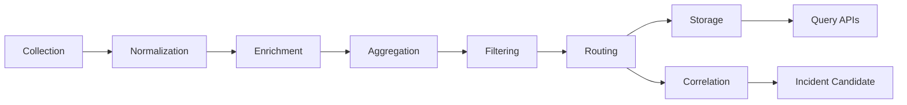


## 8.1 Canonical Event Envelope

```json
{
  "id": "evt_01J...",
  "type": "telemetry.metric.anomaly",
  "source": "collector/node/ip-10-0-1-23",
  "cluster": "prod",
  "namespace": "payments",
  "workload": "checkout-api",
  "subject": "selfheal.telemetry.metrics",
  "time": "2026-07-29T05:30:00Z",
  "severity": "warning",
  "labels": {
    "pod": "checkout-api-123",
    "node": "ip-10-0-1-23"
  },
  "payload": {},
  "schemaVersion": "v1"
}
```

## 8.2 Pipeline Stages

- **Collection:** acquire data from Kubernetes, workload endpoints, logs, traces, and events.
- **Normalization:** convert to canonical schemas.
- **Enrichment:** attach Kubernetes, topology, ownership, and policy metadata.
- **Aggregation:** roll up high-cardinality samples and batch writes.
- **Filtering:** drop unwanted namespaces, labels, noisy logs, or secrets.
- **Routing:** publish to subjects and storage backends.
- **Storage:** write raw, aggregated, and indexed records.
- **Correlation:** consume enriched events and produce incident candidates.

## 8.3 Routing Rules Example

```yaml
routing:
  metrics:
    raw: clickhouse
    anomalies: nats
    rollups: clickhouse
  logs:
    error: [clickhouse, nats]
    debug: clickhouse
  traces:
    errorSpans: [clickhouse, nats]
    all: clickhouse
```


# 9. Topology Discovery

## 9.1 Discovered Entities

The topology engine discovers:

- Pods
- Deployments
- ReplicaSets
- StatefulSets
- DaemonSets
- Jobs and CronJobs
- Services
- EndpointSlices
- Ingress and Gateway API resources
- Nodes
- Namespaces
- PersistentVolumes and PersistentVolumeClaims
- StorageClasses
- NetworkPolicies
- ServiceAccounts
- HPAs and VPAs
- PodDisruptionBudgets
- Service mesh virtual services, destination rules, gateways, and sidecar resources where supported

## 9.2 Graph Model

```text
(:Namespace)-[:CONTAINS]->(:Workload)-[:OWNS]->(:Pod)-[:RUNS_ON]->(:Node)
(:Service)-[:SELECTS]->(:Pod)
(:Ingress)-[:ROUTES_TO]->(:Service)
(:Pod)-[:MOUNTS]->(:PVC)-[:BINDS]->(:PV)
(:NetworkPolicy)-[:APPLIES_TO]->(:Pod)
(:TraceService)-[:CALLS]->(:TraceService)
```

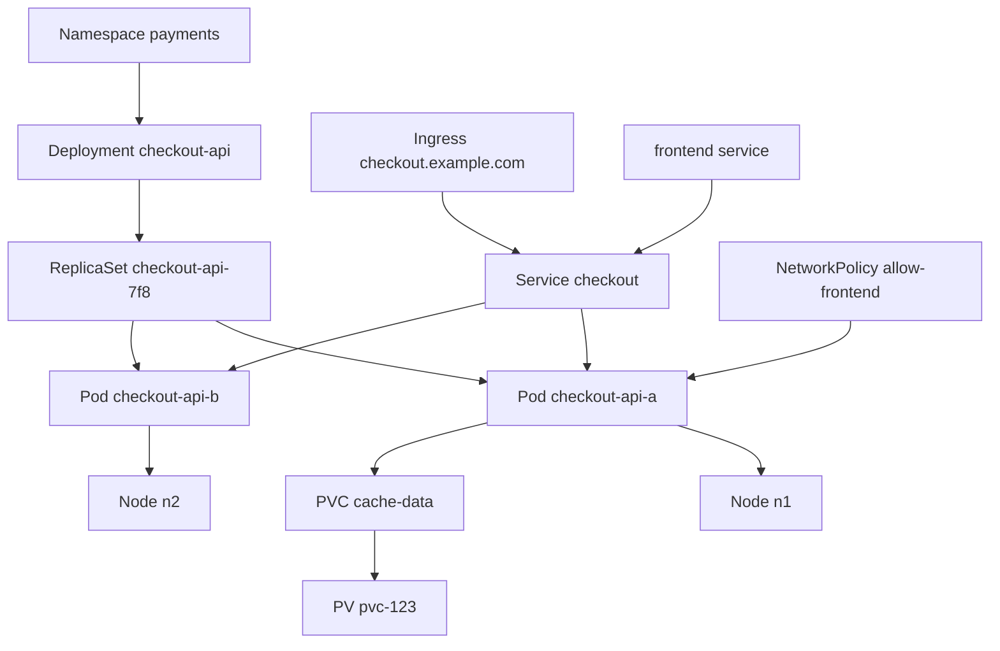


## 9.3 Dependency Edge Sources

| Edge Type | Source | Confidence |
|---|---|---:|
| Service selects pod | Service selector + EndpointSlice | High |
| Ingress routes to service | Ingress/Gateway spec | High |
| Workload owns pod | ownerReferences | High |
| Pod calls service | traces/service mesh | High |
| Pod calls external endpoint | DNS/eBPF/plugin | Medium |
| Pod depends on PVC | pod volume spec | High |
| Network policy applies to pod | podSelector/namespaceSelector | High |
| Deployment rollout owns ReplicaSet | ownerReferences | High |

## 9.4 Incremental Graph Update

Each Kubernetes watch event produces a graph delta. Deltas are idempotent and versioned using resourceVersion. The topology engine periodically compacts deltas into snapshots.


# 10. Correlation Engine

## 10.1 Purpose

The correlation engine converts independent signals into coherent incidents. It prevents alert storms by grouping symptoms that share time, topology, dependencies, and historical patterns.

## 10.2 Correlation Dimensions

- **Time correlation:** signals occurring within the same sliding time window.
- **Spatial correlation:** signals from the same pod, node, namespace, workload, service, or zone.
- **Dependency correlation:** signals from upstream/downstream dependencies in the topology graph.
- **Historical correlation:** similarity to prior incident fingerprints.
- **Change correlation:** signals after rollout, config update, node drain, certificate rotation, or autoscaling event.

## 10.3 Incident Candidate Algorithm

```text
for each incoming signal:
  normalize fingerprint
  find active windows by time and topology
  score similarity to windows
  if score > merge_threshold:
      merge signal into incident candidate
  else:
      create new candidate
  recompute severity and affected graph radius
  publish incident.candidate.updated
```

## 10.4 Scoring

```text
score = 0.25*time_overlap +
        0.25*topology_overlap +
        0.20*dependency_proximity +
        0.15*change_proximity +
        0.15*history_similarity
```

## 10.5 Outputs

- IncidentCandidate events.
- Evidence bundles.
- Suppression decisions for duplicates.
- Correlation explanations.


# 11. Anomaly Detection

## 11.1 Detector Types

### Threshold Detector

Static thresholds are suitable for hard limits such as restart count, disk utilization, certificate expiry, queue depth, and error rate.

```yaml
detectors:
  - name: high-pod-restarts
    type: threshold
    metric: kube_pod_container_status_restarts_total
    condition: rate_5m > 3
    severity: warning
```

### Moving Average

A moving average detector smooths short-term noise. It is useful for gradual CPU, memory, and latency changes.

### EWMA

EWMA reacts to recent values while preserving historical trend. It is useful for request latency and error rate.

```text
S_t = alpha * X_t + (1 - alpha) * S_{t-1}
```

### Z-Score

Z-score compares current values to historical mean and standard deviation.

```text
z = (x - mean) / stddev
```

### Isolation Forest

Isolation Forest is useful for multivariate anomalies involving CPU, memory, restarts, latency, and saturation. It should run offline or in a sidecar model service to avoid bloating the controller binary.

### Prophet / Seasonal Forecasting

Seasonality models are useful for traffic patterns with daily/weekly cycles. They should be trained per service or service class.

### LSTM

LSTMs can be used for sequence anomalies but require careful operational controls, explainability constraints, and model lifecycle management. They are not required for MVP.

### Adaptive Thresholds

Adaptive thresholds combine rolling windows, seasonality, and service SLOs.

## 11.2 Detector Execution Framework

```go
type Detector interface {
    Name() string
    SignalTypes() []SignalType
    Evaluate(ctx context.Context, input EvaluationInput) ([]Anomaly, error)
}
```

## 11.3 Baseline Store

Baselines are stored per metric, cluster, namespace, workload, and time bucket. The baseline store retains:

- mean
- median
- p95/p99
- stddev
- seasonal bucket
- sample count
- last updated timestamp

## 11.4 Dynamic Baseline YAML

```yaml
apiVersion: selfheal.io/v1alpha1
kind: SelfHealingPolicy
metadata:
  name: checkout-latency
spec:
  targetRef:
    kind: Deployment
    name: checkout-api
  detectors:
    - name: adaptive-latency
      type: adaptiveThreshold
      metric: http_server_duration_p95
      window: 5m
      baselineWindow: 14d
      sensitivity: medium
      seasonality: daily
```


# 12. Root Cause Analysis

## 12.1 RCA Model

RCA ranks candidate causes using evidence from topology, telemetry, events, resource changes, and historical incidents.

## 12.2 Candidate Cause Categories

- Bad deployment rollout.
- CrashLoopBackOff.
- OOMKilled.
- CPU throttling.
- Pod pending due to scheduling constraints.
- Image pull failures.
- DNS failure.
- Service selector mismatch.
- NetworkPolicy deny.
- Ingress misconfiguration.
- Certificate expiry.
- Secret/config drift.
- PVC attach/mount failure.
- Node NotReady.
- CNI issue.
- Quota exhaustion.
- HPA misconfiguration.
- PDB blocking disruption.
- Dependency service outage.

## 12.3 Graph Traversal

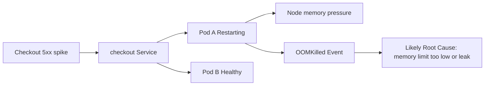


Traversal algorithm:

1. Start with affected service/workload.
2. Traverse downstream dependencies to find earlier anomalies.
3. Traverse infrastructure dependencies: pod → node → zone → storage → network.
4. Traverse rollout/change history.
5. Assign evidence scores.
6. Rank causes by confidence.

## 12.4 Bayesian Reasoning

The RCA engine may compute posterior probability:

```text
P(cause | evidence) = P(evidence | cause) * P(cause) / P(evidence)
```

Priors come from historical incidents and detector reliability. Evidence likelihood comes from rule-produced features.

## 12.5 Failure Propagation

If database latency increases before API latency and API error rate rises after connection pool saturation, the graph supports a downstream dependency root cause. If pod restarts precede service 5xx, local workload root cause is favored.

## 12.6 Scoring Example

```yaml
rootCauses:
  - type: OOMKilled
    entity: pod/checkout-api-a
    confidence: 0.91
    evidence:
      - kube event reason OOMKilled
      - memory working set exceeded limit 3 times in 5m
      - restart count increased
      - only pods on same deployment affected
  - type: DownstreamDependencyFailure
    entity: service/payments-db
    confidence: 0.42
```

## 12.7 Incident Timeline

```text
10:00:02 deployment checkout-api rolled out image v2.4.1
10:02:18 p95 latency crossed adaptive threshold
10:02:31 first OOMKilled event for pod checkout-api-a
10:02:46 5xx rate exceeded 5%
10:03:01 incident candidate created
10:03:09 RCA selected OOMKilled as top cause
10:03:15 decision selected rollback to v2.4.0
```


# 13. AI Engine

## 13.1 Role of AI

The AI engine assists humans and deterministic systems. It does not directly mutate Kubernetes. It is allowed to:

- Summarize incidents.
- Explain suspected root causes.
- Retrieve related incidents and runbooks.
- Draft remediation plans.
- Generate postmortem drafts.
- Suggest policy improvements.

It is not allowed to:

- Execute kubectl-like mutations directly.
- Bypass policy engine decisions.
- Approve high-risk actions.
- Invent telemetry evidence.
- Leak secrets into prompts.

## 13.2 Architecture

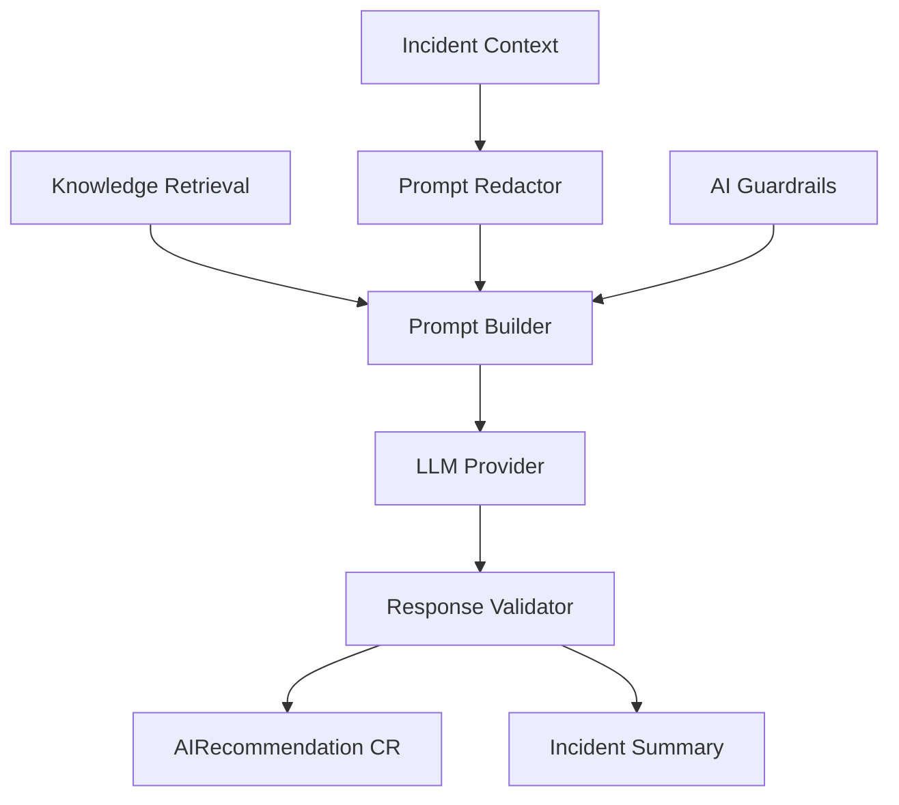


## 13.3 Prompting

Prompts must include:

- Incident ID and time range.
- Topology neighborhood.
- Evidence and confidence scores.
- Recent changes.
- Relevant policies.
- Allowed action catalog.
- Explicit instruction not to assume missing evidence.

## 13.4 RAG and Vector Database

Knowledge sources:

- Runbooks.
- Playbooks.
- Previous incidents.
- Postmortems.
- Action outcomes.
- Team ownership metadata.

Embeddings are stored in pgvector, Qdrant, Weaviate, or another configured vector store.

## 13.5 Human Approval

AI recommendations can create `AIRecommendation` CRs. The decision engine may use them as input but must still evaluate policies. Human approval is required for risky action classes.

## 13.6 Prompt Redaction

- Redact tokens, passwords, private keys, Authorization headers, connection strings, and Kubernetes Secret values.
- Use allowlisted labels and metadata.
- Hash pod names if configured for privacy.


# 14. Decision Engine

## 14.1 Decision Inputs

- Incident severity.
- RCA candidates and confidence.
- Available actions.
- SelfHealingPolicy.
- Risk and blast radius.
- Change windows.
- Action history.
- Human approval state.
- AI recommendations.

## 14.2 Decision Flow

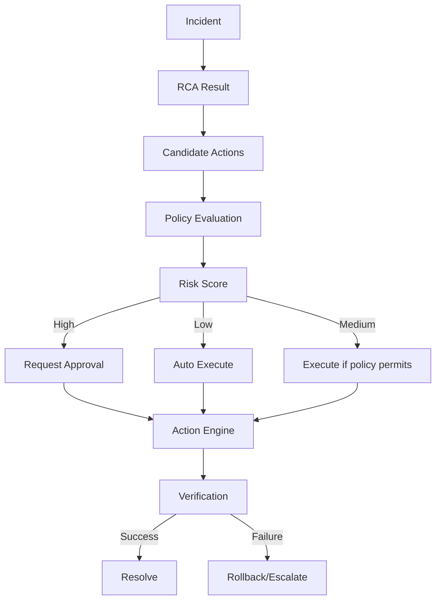


## 14.3 Risk Model

```text
risk = action_risk * blast_radius * confidence_inverse * data_safety_factor * time_window_factor
```

Risk tiers:

- Tier 0: observe only.
- Tier 1: safe actions such as restart failed pod, resync topology, refresh DNS cache if plugin supports it.
- Tier 2: bounded workload actions such as scale deployment or rollout restart.
- Tier 3: node/storage/network actions requiring approval.
- Tier 4: destructive or persistent-data-impacting actions disabled by default.

## 14.4 Priority

Priority is computed from severity, affected users, SLO burn rate, business criticality, and incident age.

## 14.5 Retries and Rollback

Every action must define:

- idempotency key.
- preconditions.
- timeout.
- maximum attempts.
- rollback action if supported.
- verification criteria.


# 15. Action Engine

## 15.1 Action Contract

```go
type Action interface {
    Name() string
    Risk() RiskTier
    Preconditions(ctx context.Context, plan ActionPlan) error
    Execute(ctx context.Context, plan ActionPlan) (ActionResult, error)
    Rollback(ctx context.Context, result ActionResult) error
    Verify(ctx context.Context, result ActionResult) (VerificationResult, error)
}
```

## 15.2 Supported Actions

### Restart Pod

Deletes a pod controlled by a Deployment/ReplicaSet/StatefulSet/DaemonSet so the owning controller recreates it.

Preconditions:

- Pod has ownerReference.
- PDB allows disruption or policy permits emergency override.
- Not more than configured percentage of replicas currently unavailable.

### Delete Pod

Same as restart pod but can target pending/failed orphan pods with stricter policy.

### Scale Deployment

Patches `.spec.replicas` or HPA min/max where configured.

### Restart Node

High-risk plugin action. Requires provider integration or node agent. Disabled by default.

### Drain Node

Cordon and evict pods with respect for PDB. Requires high-risk approval.

### Uncordon

Marks node schedulable after verification.

### Rollback

For Deployments, use rollout undo or patch image to previous known good ReplicaSet. For Argo Rollouts or Flagger, call provider plugin.

### Canary

Initiate or adjust canary strategy through rollout plugin. Verify canary metrics before promotion.

### Traffic Shift

Use service mesh or Gateway API plugin to shift traffic away from unhealthy backend.

### Restart StatefulSet

Delete pods one at a time in ordinal order. Must respect quorum rules.

### Restart DaemonSet

Restart pods gradually by node selectors or rolling update patch.

### Secret Rotation

Use external secrets or provider plugin. Never generate secrets unless explicitly configured.

### Certificate Rotation

Integrate with cert-manager Certificate resources or secret-based TLS assets. Verify expiry and chain.

### PVC Recovery

Possible safe actions: rescan, reattach through CSI plugin, expand PVC if StorageClass supports expansion. Never delete PV by default.

### DNS Recovery

Restart CoreDNS pods, verify endpoints, check kube-dns service, validate DNS resolution from synthetic probes.

### Ingress Recovery

Reload ingress controller, verify backend endpoints, validate TLS, and run HTTP probes.

### NetworkPolicy Recovery

Detect recent policy changes and recommend rollback. Automatic patching is disabled unless an allowlisted policy exists.

### Resource Quota Recovery

Recommend quota adjustment or scale-down lower-priority workload. Automatic quota increase is disabled by default.

## 15.3 Action YAML Example

```yaml
apiVersion: selfheal.io/v1alpha1
kind: Remediation
metadata:
  name: remediate-checkout-oom
spec:
  incidentRef:
    name: inc-20260729-001
  actions:
    - type: RollbackDeployment
      target:
        namespace: payments
        kind: Deployment
        name: checkout-api
      parameters:
        revision: previousStable
      verification:
        window: 5m
        successCriteria:
          errorRate: "< 1%"
          availability: "> 99%"
```


# 16. Verification Engine

## 16.1 Verification Signals

- Pod readiness.
- Deployment available replicas.
- Kubernetes conditions.
- Error rate.
- Latency p50/p95/p99.
- Request throughput.
- SLO burn rate.
- Synthetic probes.
- Trace error spans.
- Log error patterns.

## 16.2 Verification State Machine

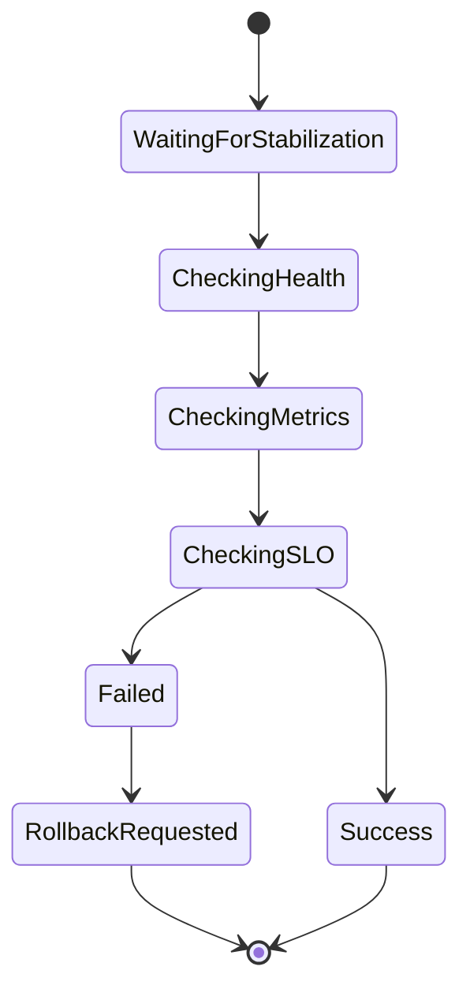


## 16.3 Success Criteria

```yaml
verification:
  stabilizationDelay: 30s
  window: 5m
  successCriteria:
    deploymentAvailable: true
    errorRate: "< 1%"
    p95Latency: "< 300ms"
    restartRate: "== 0"
    syntheticProbe: pass
```

## 16.4 Rollback Trigger

Rollback is triggered when:

- Error rate worsens after action.
- Availability decreases below threshold.
- New critical anomalies appear in affected graph radius.
- Action timeout expires.
- Health checks fail continuously for verification window.


# 17. Knowledge Base

## 17.1 Stored Knowledge Types

- Incidents.
- Incident timelines.
- Root cause hypotheses and final root cause.
- Action plans and results.
- Verification outcomes.
- Human comments and approvals.
- Runbooks and playbooks.
- Postmortems.
- AI recommendations and validation status.

## 17.2 Learning Loop

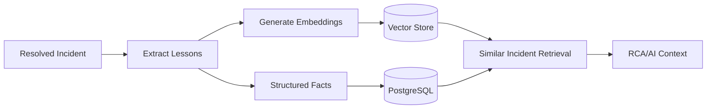


## 17.3 Similarity Search

Similarity combines:

- embedding similarity over summaries/runbooks.
- graph feature similarity.
- root cause category match.
- workload label similarity.
- event fingerprint similarity.

## 17.4 Runbook Schema

```yaml
apiVersion: selfheal.io/v1alpha1
kind: KnowledgeEntry
metadata:
  name: oomkilled-runbook
spec:
  type: runbook
  title: OOMKilled Workload Recovery
  tags: [memory, kubernetes, oom]
  contentRef:
    type: configMap
    name: runbook-oomkilled
  actions:
    recommended:
      - RestartPod
      - RollbackDeployment
    prohibited:
      - DeletePVC
```


# 18. Event Driven Architecture

## 18.1 Event Bus

NATS JetStream is the default event bus because it supports persistent streams, replay, acknowledgements, replication, and durable consumers. Kafka can be supported through an event bus abstraction for organizations already standardized on Kafka.

## 18.2 Subject Naming

```text
selfheal.telemetry.metrics.v1
selfheal.telemetry.logs.v1
selfheal.telemetry.traces.v1
selfheal.k8s.events.v1
selfheal.topology.delta.v1
selfheal.anomaly.detected.v1
selfheal.incident.candidate.v1
selfheal.incident.updated.v1
selfheal.rca.completed.v1
selfheal.decision.made.v1
selfheal.action.started.v1
selfheal.action.completed.v1
selfheal.verification.completed.v1
selfheal.dlq.v1
```

## 18.3 Stream Configuration Example

```yaml
apiVersion: jetstream.nats.io/v1beta1
kind: Stream
metadata:
  name: selfheal-events
spec:
  name: SELFHEAL_EVENTS
  subjects:
    - selfheal.>
  storage: file
  replicas: 3
  retention: limits
  maxAge: 168h
```

## 18.4 Retry and DLQ

- Consumers use explicit acknowledgement.
- Transient errors are retried with exponential backoff.
- Non-retryable validation errors go to DLQ.
- DLQ events include original subject, payload hash, error class, and component.


# 19. Storage Architecture

## 19.1 PostgreSQL

Used for relational state:

- incidents
- remediation plans
- action executions
- approvals
- policies snapshots
- topology snapshots metadata
- audit records

## 19.2 ClickHouse

Used for high-volume telemetry:

- metrics samples and rollups
- logs
- traces
- event history
- anomaly features

## 19.3 Object Storage

Used for:

- raw evidence bundles
- large logs attached to incidents
- model artifacts
- exported reports
- backup files

## 19.4 Redis

Used for:

- API cache
- distributed rate limits
- short-lived locks where Lease API is not appropriate
- session cache

## 19.5 Vector Database

Used for:

- runbook embeddings
- incident summary embeddings
- postmortem embeddings
- semantic search

## 19.6 PostgreSQL Schema

```sql
CREATE TABLE incidents (
  id UUID PRIMARY KEY,
  cluster TEXT NOT NULL,
  namespace TEXT,
  severity TEXT NOT NULL,
  status TEXT NOT NULL,
  title TEXT NOT NULL,
  summary TEXT,
  created_at TIMESTAMPTZ NOT NULL,
  updated_at TIMESTAMPTZ NOT NULL,
  resolved_at TIMESTAMPTZ,
  labels JSONB DEFAULT '{}'::jsonb
);

CREATE TABLE incident_evidence (
  id UUID PRIMARY KEY,
  incident_id UUID REFERENCES incidents(id),
  evidence_type TEXT NOT NULL,
  source TEXT NOT NULL,
  event_time TIMESTAMPTZ NOT NULL,
  payload JSONB NOT NULL
);

CREATE TABLE remediations (
  id UUID PRIMARY KEY,
  incident_id UUID REFERENCES incidents(id),
  status TEXT NOT NULL,
  risk_tier TEXT NOT NULL,
  plan JSONB NOT NULL,
  created_at TIMESTAMPTZ NOT NULL
);

CREATE TABLE action_executions (
  id UUID PRIMARY KEY,
  remediation_id UUID REFERENCES remediations(id),
  action_type TEXT NOT NULL,
  target JSONB NOT NULL,
  status TEXT NOT NULL,
  started_at TIMESTAMPTZ,
  completed_at TIMESTAMPTZ,
  result JSONB
);
```

## 19.7 ClickHouse Schema

```sql
CREATE TABLE telemetry_logs (
  timestamp DateTime64(3),
  cluster LowCardinality(String),
  namespace LowCardinality(String),
  workload LowCardinality(String),
  pod String,
  container LowCardinality(String),
  severity LowCardinality(String),
  trace_id String,
  span_id String,
  body String,
  attributes Map(String, String)
) ENGINE = MergeTree()
PARTITION BY toYYYYMMDD(timestamp)
ORDER BY (cluster, namespace, workload, timestamp)
TTL timestamp + INTERVAL 14 DAY;

CREATE TABLE telemetry_metrics (
  timestamp DateTime64(3),
  metric LowCardinality(String),
  cluster LowCardinality(String),
  namespace LowCardinality(String),
  workload LowCardinality(String),
  value Float64,
  labels Map(String, String)
) ENGINE = MergeTree()
PARTITION BY toYYYYMMDD(timestamp)
ORDER BY (metric, cluster, namespace, workload, timestamp)
TTL timestamp + INTERVAL 30 DAY;
```


# 20. Kubernetes Operator Design

## 20.1 Controllers

Controllers:

- SelfHealingPolicyController
- IncidentController
- RemediationController
- AnalysisController
- TopologyController
- KnowledgeEntryController
- AIRecommendationController
- PluginController

## 20.2 Reconcile Pattern

```go
func (r *IncidentReconciler) Reconcile(ctx context.Context, req ctrl.Request) (ctrl.Result, error) {
    var incident selfhealv1alpha1.Incident
    if err := r.Get(ctx, req.NamespacedName, &incident); err != nil {
        return ctrl.Result{}, client.IgnoreNotFound(err)
    }
    if incident.ObjectMeta.DeletionTimestamp.IsZero() {
        ensureFinalizer(&incident)
    } else {
        return r.finalize(ctx, &incident)
    }
    desired := buildDesiredIncidentState(&incident)
    observed := r.observe(ctx, &incident)
    result, err := r.converge(ctx, desired, observed)
    r.updateStatus(ctx, &incident, result)
    return ctrl.Result{RequeueAfter: result.NextRequeue}, err
}
```

## 20.3 Watchers

- Watch custom resources.
- Watch owned resources.
- Watch Kubernetes Events for involved objects.
- Watch ConfigMaps/Secrets for config reload.

## 20.4 Leader Election

Controller manager runs with leader election enabled for active-passive reconciliation. Non-mutating API and metrics endpoints remain available on all replicas.

## 20.5 Work Queues

- Rate-limited queue per controller.
- Exponential backoff on errors.
- Max concurrent reconciles configurable per controller.
- Predicate filters for status-only changes where needed.

## 20.6 Finalizers

Finalizers ensure:

- in-flight actions complete or are cancelled.
- external plugin resources are cleaned.
- incident evidence is persisted before deletion.

## 20.7 Predicates

Predicates reduce noise:

- ignore managed status updates.
- process generation changes for spec modifications.
- process label/annotation changes only when policy-relevant.


# 21. Custom Resource Definitions

CRDs are the public declarative API of the platform.

## 21.1 SelfHealingPolicy

```yaml
apiVersion: apiextensions.k8s.io/v1
kind: CustomResourceDefinition
metadata:
  name: selfhealingpolicies.selfheal.io
spec:
  group: selfheal.io
  scope: Namespaced
  names:
    plural: selfhealingpolicies
    singular: selfhealingpolicy
    kind: SelfHealingPolicy
    shortNames: [shp]
  versions:
    - name: v1alpha1
      served: true
      storage: true
      subresources:
        status: {}
      schema:
        openAPIV3Schema:
          type: object
          required: [spec]
          properties:
            spec:
              type: object
              required: [targetRef]
              properties:
                targetRef:
                  type: object
                  required: [kind, name]
                  properties:
                    apiVersion: { type: string }
                    kind: { type: string }
                    name: { type: string }
                    namespace: { type: string }
                mode:
                  type: string
                  enum: [ObserveOnly, Suggest, AutoSafe, AutoWithApproval]
                detectors:
                  type: array
                  items:
                    type: object
                    properties:
                      name: { type: string }
                      type: { type: string }
                      metric: { type: string }
                      window: { type: string }
                      sensitivity: { type: string }
                actions:
                  type: object
                  properties:
                    allowed:
                      type: array
                      items: { type: string }
                    denied:
                      type: array
                      items: { type: string }
                approval:
                  type: object
                  properties:
                    requiredForRiskTier:
                      type: array
                      items: { type: string }
            status:
              type: object
              properties:
                observedGeneration: { type: integer }
                conditions:
                  type: array
                  items:
                    type: object
                    properties:
                      type: { type: string }
                      status: { type: string }
                      reason: { type: string }
                      message: { type: string }
                      lastTransitionTime: { type: string, format: date-time }
```


## 21.2 Incident Custom Resource Example

```yaml
apiVersion: selfheal.io/v1alpha1
kind: Incident
metadata:
  name: inc-20260729-001
  namespace: payments
spec:
  severity: critical
  affectedRefs:
    - apiVersion: apps/v1
      kind: Deployment
      name: checkout-api
  symptoms:
    - type: HighErrorRate
      firstSeen: "2026-07-29T05:30:00Z"
status:
  phase: Analyzing
  confidence: 0.86
  summary: Checkout API has elevated 5xx with OOMKilled pod evidence.
```

## 21.3 Remediation

```yaml
apiVersion: selfheal.io/v1alpha1
kind: Remediation
metadata:
  name: remediation-inc-20260729-001
spec:
  incidentRef:
    name: inc-20260729-001
  approvalRequired: false
  actions:
    - type: RestartPod
      targetRef:
        kind: Pod
        name: checkout-api-a
status:
  phase: Verifying
  actionResults:
    - type: RestartPod
      status: Succeeded
```

## 21.4 Analysis

```yaml
apiVersion: selfheal.io/v1alpha1
kind: Analysis
metadata:
  name: analysis-inc-20260729-001
spec:
  incidentRef:
    name: inc-20260729-001
status:
  rootCauses:
    - type: OOMKilled
      confidence: 0.91
      targetRef:
        kind: Pod
        name: checkout-api-a
```

## 21.5 Topology

```yaml
apiVersion: selfheal.io/v1alpha1
kind: Topology
metadata:
  name: payments-topology
spec:
  scope:
    namespace: payments
status:
  nodes: 128
  edges: 469
  snapshotVersion: "2026-07-29T05:30:00Z"
```

## 21.6 KnowledgeEntry

```yaml
apiVersion: selfheal.io/v1alpha1
kind: KnowledgeEntry
metadata:
  name: checkout-oom-runbook
spec:
  type: runbook
  title: Checkout OOM Recovery
  tags: [checkout, oom, memory]
  content: |
    Check memory limit, recent releases, and heap profile.
```

## 21.7 AIRecommendation

```yaml
apiVersion: selfheal.io/v1alpha1
kind: AIRecommendation
metadata:
  name: ai-inc-20260729-001
spec:
  incidentRef:
    name: inc-20260729-001
  recommendation: Roll back checkout-api to previous stable revision.
  rationale: OOMKilled began after deployment revision 42.
status:
  validated: true
  policyAllowed: true
```


# 22. REST API

## 22.1 API Principles

- Versioned under `/api/v1`.
- JSON request/response.
- Server-sent events or WebSocket for live updates.
- OIDC bearer tokens in production.
- Kubernetes subject access review integration for authorization.

## 22.2 Endpoint Catalog

```yaml
openapi: 3.1.0
info:
  title: SelfHeal API
  version: v1
paths:
  /api/v1/incidents:
    get:
      summary: List incidents
      parameters:
        - name: namespace
          in: query
          schema: { type: string }
        - name: status
          in: query
          schema: { type: string }
      responses:
        '200': { description: Incident list }
    post:
      summary: Create manual incident
      responses:
        '201': { description: Incident created }
  /api/v1/incidents/{id}:
    get:
      summary: Get incident
      responses:
        '200': { description: Incident details }
  /api/v1/incidents/{id}/timeline:
    get:
      summary: Get incident timeline
      responses:
        '200': { description: Timeline }
  /api/v1/incidents/{id}/approve:
    post:
      summary: Approve pending remediation
      responses:
        '202': { description: Approval recorded }
  /api/v1/remediations:
    get:
      summary: List remediations
      responses:
        '200': { description: Remediation list }
  /api/v1/remediations/{id}/execute:
    post:
      summary: Execute remediation
      responses:
        '202': { description: Execution accepted }
  /api/v1/topology:
    get:
      summary: Query topology graph
      responses:
        '200': { description: Graph }
  /api/v1/knowledge/search:
    post:
      summary: Search knowledge base
      responses:
        '200': { description: Search results }
  /api/v1/policies:
    get:
      summary: List policies
      responses:
        '200': { description: Policy list }
  /api/v1/actions/catalog:
    get:
      summary: List supported actions
      responses:
        '200': { description: Action catalog }
```

## 22.3 Incident Response Example

```json
{
  "id": "inc-20260729-001",
  "severity": "critical",
  "status": "Analyzing",
  "title": "Checkout API elevated 5xx",
  "affected": [{"kind":"Deployment","namespace":"payments","name":"checkout-api"}],
  "rootCauses": [{"type":"OOMKilled","confidence":0.91}],
  "recommendedActions": [{"type":"RollbackDeployment","risk":"Medium"}]
}
```


# 23. Dashboard

## 23.1 Pages

- Overview
- Incident View
- Topology View
- Dependency Graph
- Metrics Explorer
- Logs Explorer
- Traces Explorer
- Actions and Approvals
- Timeline
- Knowledge Search
- Policy Management
- Plugin Management
- Settings
- Audit Log

## 23.2 Incident View

Incident view includes:

- Severity, status, duration, affected services.
- Current phase.
- RCA ranking.
- Evidence summary.
- Timeline.
- Recommended actions.
- Approval controls.
- Verification progress.
- Similar incidents.

## 23.3 Topology View

Topology supports:

- Namespace/workload filtering.
- Graph radius around incident.
- Health overlay.
- Edge confidence.
- Dependency direction.
- Recent changes overlay.

## 23.4 UX Wireframe

```text
+-------------------------------------------------------------+
| SelfHeal | Incidents | Topology | Actions | Knowledge | Settings |
+-------------------------------------------------------------+
| Critical Incident: Checkout API elevated 5xx                 |
| Status: Analyzing  Confidence: 91%  SLO Burn: 12x            |
+---------------------------+---------------------------------+
| RCA Candidates            | Timeline                        |
| 1. OOMKilled pod A        | 10:00 rollout started           |
| 2. Bad deployment         | 10:02 latency anomaly          |
| 3. Downstream DB          | 10:03 pod OOMKilled            |
+---------------------------+---------------------------------+
| Recommended Action: RollbackDeployment                       |
| [Approve] [Reject] [Open Runbook] [View Evidence]            |
+-------------------------------------------------------------+
```


# 24. Security

## 24.1 RBAC

Use separate service accounts:

- selfheal-controller-manager
- selfheal-collector
- selfheal-api
- selfheal-action-safe
- selfheal-action-node
- selfheal-action-storage

## 24.2 Least Privilege Example

```yaml
apiVersion: rbac.authorization.k8s.io/v1
kind: ClusterRole
metadata:
  name: selfheal-readonly-discovery
rules:
  - apiGroups: [""]
    resources: [pods, services, endpoints, nodes, namespaces, events, persistentvolumeclaims, persistentvolumes]
    verbs: [get, list, watch]
  - apiGroups: [apps]
    resources: [deployments, replicasets, statefulsets, daemonsets]
    verbs: [get, list, watch]
```

## 24.3 Mutating RBAC by Action Class

Safe pod restart role:

```yaml
apiVersion: rbac.authorization.k8s.io/v1
kind: Role
metadata:
  name: selfheal-pod-restarter
  namespace: payments
rules:
  - apiGroups: [""]
    resources: [pods]
    verbs: [get, list, watch, delete]
```

## 24.4 Network Policies

```yaml
apiVersion: networking.k8s.io/v1
kind: NetworkPolicy
metadata:
  name: selfheal-default-deny
  namespace: selfheal
spec:
  podSelector: {}
  policyTypes: [Ingress, Egress]
```

## 24.5 Secrets

- Store credentials in Kubernetes Secrets or external secret managers.
- Never log secret values.
- Mount service account tokens with projected bounded tokens.
- Rotate webhooks and internal TLS certificates.

## 24.6 TLS and mTLS

- TLS for API gateway.
- TLS for OTLP endpoints.
- mTLS for internal traffic when mesh is available.
- cert-manager integration recommended.

## 24.7 Audit

Every decision and mutation records:

- actor
- source component
- incident ID
- policy version
- action type
- target
- request payload hash
- result
- timestamps


# 25. Helm Chart

## 25.1 Folder Structure

```text
charts/selfheal/
  Chart.yaml
  values.yaml
  values.schema.json
  templates/
    _helpers.tpl
    namespace.yaml
    serviceaccounts.yaml
    rbac-discovery.yaml
    rbac-actions.yaml
    networkpolicies.yaml
    configmaps.yaml
    secrets.yaml
    crds/
      selfhealingpolicies.yaml
      incidents.yaml
      remediations.yaml
      analyses.yaml
      topologies.yaml
      knowledgeentries.yaml
      airecommendations.yaml
    controller-manager-deployment.yaml
    collector-daemonset.yaml
    collector-cluster-deployment.yaml
    aggregator-deployment.yaml
    api-gateway-deployment.yaml
    dashboard-deployment.yaml
    services.yaml
    ingress.yaml
    nats.yaml
    postgresql.yaml
    clickhouse.yaml
    redis.yaml
    servicemonitor.yaml
    poddisruptionbudgets.yaml
    horizontalpodautoscalers.yaml
```

## 25.2 values.yaml

```yaml
global:
  clusterName: default
  imageRegistry: ghcr.io/example
  mode: AutoSafe
  logLevel: info

controllerManager:
  enabled: true
  replicas: 2
  leaderElection: true

collector:
  daemonset:
    enabled: true
  cluster:
    enabled: true
  otlp:
    grpc: true
    http: true

nats:
  enabled: true
  jetstream:
    enabled: true
    replicas: 3
    storage: 10Gi

postgresql:
  enabled: true
  external:
    enabled: false

clickhouse:
  enabled: true
  retention:
    logs: 14d
    metrics: 30d
    traces: 7d

ai:
  enabled: false
  provider: openai-compatible
  secretRef: selfheal-ai-provider
  rag:
    enabled: true

security:
  networkPolicies: true
  oidc:
    enabled: false

remediation:
  defaultMode: AutoSafe
  riskyActionsRequireApproval: true
```

## 25.3 Template Responsibilities

- CRD templates install platform APIs.
- RBAC templates define read-only discovery and mutating action roles.
- Deployment templates run control-plane services.
- DaemonSet template runs node collectors.
- Storage templates are optional for in-cluster small deployments.
- ServiceMonitor template integrates with Prometheus Operator.


# 26. Repository Structure

```text
selfheal/
  cmd/
    controller-manager/
    api-gateway/
    collector/
    aggregator/
    scheduler/
    cli/
  api/
    v1alpha1/
      selfhealingpolicy_types.go
      incident_types.go
      remediation_types.go
      analysis_types.go
      topology_types.go
      knowledgeentry_types.go
      airecommendation_types.go
  internal/
    action/
    ai/
    analysis/
    anomaly/
    api/
    auth/
    collector/
    config/
    correlation/
    decision/
    eventbus/
    graph/
    knowledge/
    metrics/
    policy/
    rca/
    scheduler/
    storage/
    telemetry/
    verification/
  pkg/
    client/
    plugin/
    proto/
    sdk/
  charts/
    selfheal/
  config/
    crd/
    rbac/
    manager/
    samples/
  deployments/
    docker/
    kustomize/
  web/
    dashboard/
  docs/
    architecture/
    runbooks/
    api/
  test/
    e2e/
    envtest/
    load/
    chaos/
  build/
    Dockerfile.controller
    Dockerfile.collector
    Dockerfile.api
  Makefile
  go.mod
  go.sum
```


# 27. Plugin System

## 27.1 Plugin Types

- Collector plugins.
- Detector plugins.
- RCA plugins.
- Action plugins.
- Verification plugins.
- Knowledge source plugins.
- Notification plugins.

## 27.2 Runtime Options

| Runtime | Pros | Cons | Usage |
|---|---|---|---|
| Go in-process | Fast, type-safe | Requires rebuild | Core plugins |
| gRPC external | Language neutral, isolated | Operational overhead | Provider plugins |
| WASM | Sandboxed, portable | Runtime limitations | Detectors/policies |

## 27.3 Plugin Interface

```go
type Plugin interface {
    Metadata() PluginMetadata
    Capabilities() []Capability
    Configure(ctx context.Context, cfg map[string]any) error
    Health(ctx context.Context) error
}

type ActionPlugin interface {
    Plugin
    Plan(ctx context.Context, req ActionPlanRequest) (ActionPlanResponse, error)
    Execute(ctx context.Context, req ActionExecuteRequest) (ActionExecuteResponse, error)
    Rollback(ctx context.Context, req ActionRollbackRequest) (ActionRollbackResponse, error)
}
```

## 27.4 Registration

```yaml
apiVersion: selfheal.io/v1alpha1
kind: Plugin
metadata:
  name: aws-node-repair
spec:
  type: action
  runtime: grpc
  endpoint: aws-node-repair.selfheal.svc:9443
  capabilities:
    - DrainNode
    - ReplaceNode
```


# 28. Deployment

## 28.1 Single Cluster

- All components in `selfheal` namespace.
- In-cluster PostgreSQL/NATS/ClickHouse optional.
- Default AutoSafe mode.

## 28.2 High Availability

- Controller manager: 2+ replicas with leader election.
- API gateway: 2+ replicas.
- NATS: 3 replicas with JetStream replication.
- PostgreSQL: managed external or HA operator.
- ClickHouse: replicated shards for production.
- Collectors: DaemonSet on every node.

## 28.3 Multi Cluster

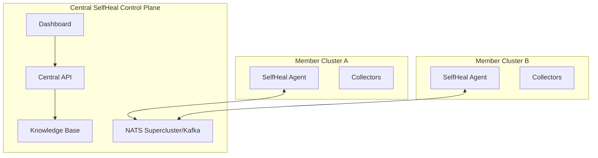


## 28.4 Edge

- Lightweight collector and controller profile.
- Local NATS with periodic sync.
- Reduced retention.
- Offline-safe policies.

## 28.5 Air Gapped

- Images mirrored to private registry.
- No external AI provider unless private model is deployed.
- Object storage and vector DB in-cluster or internal.
- Helm chart includes CRDs and all manifests.


# 29. Scalability

## 29.1 Horizontal Scaling

Scale stateless components by replicas:

- aggregator
- API gateway
- anomaly workers
- RCA workers
- action workers
- verification workers

## 29.2 Sharding

Shard keys:

- cluster
- namespace
- workload hash
- incident ID
- telemetry signal type

## 29.3 Leader Election

Only singleton reconciliation tasks require leader election. Data-plane workers should be active-active using queue partitions.

## 29.4 Worker Pools

```yaml
workers:
  anomaly:
    replicas: 4
    maxConcurrent: 100
  rca:
    replicas: 3
    maxConcurrent: 50
  action:
    replicas: 2
    maxConcurrent: 20
```

## 29.5 Cardinality Control

- Drop unbounded labels.
- Hash high-cardinality values.
- Enforce per-namespace series budgets.
- Alert when collectors exceed cardinality thresholds.

# 30. Failure Scenarios


## 30.1 Pod CrashLoopBackOff

**Detection:** detector-specific signals, Kubernetes events, topology impact, and telemetry anomalies.

**RCA evidence:** correlated event timeline, affected graph radius, recent changes, and historical similarity.

**Possible remediation:** policy-gated action selected from restart, rollback, scale, cordon/drain, DNS recovery, ingress reload, network policy rollback recommendation, storage plugin recovery, or escalation.

**Verification:** readiness, availability, error rate, latency, SLO burn rate, and absence of repeated events during the verification window.

**Safeguards:** blast-radius limit, approval for high-risk actions, retry budget, rollback plan, and audit record.


## 30.2 OOMKilled container

**Detection:** detector-specific signals, Kubernetes events, topology impact, and telemetry anomalies.

**RCA evidence:** correlated event timeline, affected graph radius, recent changes, and historical similarity.

**Possible remediation:** policy-gated action selected from restart, rollback, scale, cordon/drain, DNS recovery, ingress reload, network policy rollback recommendation, storage plugin recovery, or escalation.

**Verification:** readiness, availability, error rate, latency, SLO burn rate, and absence of repeated events during the verification window.

**Safeguards:** blast-radius limit, approval for high-risk actions, retry budget, rollback plan, and audit record.


## 30.3 Deployment bad rollout

**Detection:** detector-specific signals, Kubernetes events, topology impact, and telemetry anomalies.

**RCA evidence:** correlated event timeline, affected graph radius, recent changes, and historical similarity.

**Possible remediation:** policy-gated action selected from restart, rollback, scale, cordon/drain, DNS recovery, ingress reload, network policy rollback recommendation, storage plugin recovery, or escalation.

**Verification:** readiness, availability, error rate, latency, SLO burn rate, and absence of repeated events during the verification window.

**Safeguards:** blast-radius limit, approval for high-risk actions, retry budget, rollback plan, and audit record.


## 30.4 ImagePullBackOff

**Detection:** detector-specific signals, Kubernetes events, topology impact, and telemetry anomalies.

**RCA evidence:** correlated event timeline, affected graph radius, recent changes, and historical similarity.

**Possible remediation:** policy-gated action selected from restart, rollback, scale, cordon/drain, DNS recovery, ingress reload, network policy rollback recommendation, storage plugin recovery, or escalation.

**Verification:** readiness, availability, error rate, latency, SLO burn rate, and absence of repeated events during the verification window.

**Safeguards:** blast-radius limit, approval for high-risk actions, retry budget, rollback plan, and audit record.


## 30.5 Pod pending due to insufficient CPU

**Detection:** detector-specific signals, Kubernetes events, topology impact, and telemetry anomalies.

**RCA evidence:** correlated event timeline, affected graph radius, recent changes, and historical similarity.

**Possible remediation:** policy-gated action selected from restart, rollback, scale, cordon/drain, DNS recovery, ingress reload, network policy rollback recommendation, storage plugin recovery, or escalation.

**Verification:** readiness, availability, error rate, latency, SLO burn rate, and absence of repeated events during the verification window.

**Safeguards:** blast-radius limit, approval for high-risk actions, retry budget, rollback plan, and audit record.


## 30.6 Pod pending due to taints/tolerations

**Detection:** detector-specific signals, Kubernetes events, topology impact, and telemetry anomalies.

**RCA evidence:** correlated event timeline, affected graph radius, recent changes, and historical similarity.

**Possible remediation:** policy-gated action selected from restart, rollback, scale, cordon/drain, DNS recovery, ingress reload, network policy rollback recommendation, storage plugin recovery, or escalation.

**Verification:** readiness, availability, error rate, latency, SLO burn rate, and absence of repeated events during the verification window.

**Safeguards:** blast-radius limit, approval for high-risk actions, retry budget, rollback plan, and audit record.


## 30.7 Node NotReady

**Detection:** detector-specific signals, Kubernetes events, topology impact, and telemetry anomalies.

**RCA evidence:** correlated event timeline, affected graph radius, recent changes, and historical similarity.

**Possible remediation:** policy-gated action selected from restart, rollback, scale, cordon/drain, DNS recovery, ingress reload, network policy rollback recommendation, storage plugin recovery, or escalation.

**Verification:** readiness, availability, error rate, latency, SLO burn rate, and absence of repeated events during the verification window.

**Safeguards:** blast-radius limit, approval for high-risk actions, retry budget, rollback plan, and audit record.


## 30.8 Node memory pressure

**Detection:** detector-specific signals, Kubernetes events, topology impact, and telemetry anomalies.

**RCA evidence:** correlated event timeline, affected graph radius, recent changes, and historical similarity.

**Possible remediation:** policy-gated action selected from restart, rollback, scale, cordon/drain, DNS recovery, ingress reload, network policy rollback recommendation, storage plugin recovery, or escalation.

**Verification:** readiness, availability, error rate, latency, SLO burn rate, and absence of repeated events during the verification window.

**Safeguards:** blast-radius limit, approval for high-risk actions, retry budget, rollback plan, and audit record.


## 30.9 Node disk pressure

**Detection:** detector-specific signals, Kubernetes events, topology impact, and telemetry anomalies.

**RCA evidence:** correlated event timeline, affected graph radius, recent changes, and historical similarity.

**Possible remediation:** policy-gated action selected from restart, rollback, scale, cordon/drain, DNS recovery, ingress reload, network policy rollback recommendation, storage plugin recovery, or escalation.

**Verification:** readiness, availability, error rate, latency, SLO burn rate, and absence of repeated events during the verification window.

**Safeguards:** blast-radius limit, approval for high-risk actions, retry budget, rollback plan, and audit record.


## 30.10 CNI plugin failure

**Detection:** detector-specific signals, Kubernetes events, topology impact, and telemetry anomalies.

**RCA evidence:** correlated event timeline, affected graph radius, recent changes, and historical similarity.

**Possible remediation:** policy-gated action selected from restart, rollback, scale, cordon/drain, DNS recovery, ingress reload, network policy rollback recommendation, storage plugin recovery, or escalation.

**Verification:** readiness, availability, error rate, latency, SLO burn rate, and absence of repeated events during the verification window.

**Safeguards:** blast-radius limit, approval for high-risk actions, retry budget, rollback plan, and audit record.


## 30.11 CoreDNS unavailable

**Detection:** detector-specific signals, Kubernetes events, topology impact, and telemetry anomalies.

**RCA evidence:** correlated event timeline, affected graph radius, recent changes, and historical similarity.

**Possible remediation:** policy-gated action selected from restart, rollback, scale, cordon/drain, DNS recovery, ingress reload, network policy rollback recommendation, storage plugin recovery, or escalation.

**Verification:** readiness, availability, error rate, latency, SLO burn rate, and absence of repeated events during the verification window.

**Safeguards:** blast-radius limit, approval for high-risk actions, retry budget, rollback plan, and audit record.


## 30.12 Service selector mismatch

**Detection:** detector-specific signals, Kubernetes events, topology impact, and telemetry anomalies.

**RCA evidence:** correlated event timeline, affected graph radius, recent changes, and historical similarity.

**Possible remediation:** policy-gated action selected from restart, rollback, scale, cordon/drain, DNS recovery, ingress reload, network policy rollback recommendation, storage plugin recovery, or escalation.

**Verification:** readiness, availability, error rate, latency, SLO burn rate, and absence of repeated events during the verification window.

**Safeguards:** blast-radius limit, approval for high-risk actions, retry budget, rollback plan, and audit record.


## 30.13 EndpointSlice empty

**Detection:** detector-specific signals, Kubernetes events, topology impact, and telemetry anomalies.

**RCA evidence:** correlated event timeline, affected graph radius, recent changes, and historical similarity.

**Possible remediation:** policy-gated action selected from restart, rollback, scale, cordon/drain, DNS recovery, ingress reload, network policy rollback recommendation, storage plugin recovery, or escalation.

**Verification:** readiness, availability, error rate, latency, SLO burn rate, and absence of repeated events during the verification window.

**Safeguards:** blast-radius limit, approval for high-risk actions, retry budget, rollback plan, and audit record.


## 30.14 Ingress backend misconfigured

**Detection:** detector-specific signals, Kubernetes events, topology impact, and telemetry anomalies.

**RCA evidence:** correlated event timeline, affected graph radius, recent changes, and historical similarity.

**Possible remediation:** policy-gated action selected from restart, rollback, scale, cordon/drain, DNS recovery, ingress reload, network policy rollback recommendation, storage plugin recovery, or escalation.

**Verification:** readiness, availability, error rate, latency, SLO burn rate, and absence of repeated events during the verification window.

**Safeguards:** blast-radius limit, approval for high-risk actions, retry budget, rollback plan, and audit record.


## 30.15 TLS certificate expired

**Detection:** detector-specific signals, Kubernetes events, topology impact, and telemetry anomalies.

**RCA evidence:** correlated event timeline, affected graph radius, recent changes, and historical similarity.

**Possible remediation:** policy-gated action selected from restart, rollback, scale, cordon/drain, DNS recovery, ingress reload, network policy rollback recommendation, storage plugin recovery, or escalation.

**Verification:** readiness, availability, error rate, latency, SLO burn rate, and absence of repeated events during the verification window.

**Safeguards:** blast-radius limit, approval for high-risk actions, retry budget, rollback plan, and audit record.


## 30.16 Secret missing

**Detection:** detector-specific signals, Kubernetes events, topology impact, and telemetry anomalies.

**RCA evidence:** correlated event timeline, affected graph radius, recent changes, and historical similarity.

**Possible remediation:** policy-gated action selected from restart, rollback, scale, cordon/drain, DNS recovery, ingress reload, network policy rollback recommendation, storage plugin recovery, or escalation.

**Verification:** readiness, availability, error rate, latency, SLO burn rate, and absence of repeated events during the verification window.

**Safeguards:** blast-radius limit, approval for high-risk actions, retry budget, rollback plan, and audit record.


## 30.17 ConfigMap bad change

**Detection:** detector-specific signals, Kubernetes events, topology impact, and telemetry anomalies.

**RCA evidence:** correlated event timeline, affected graph radius, recent changes, and historical similarity.

**Possible remediation:** policy-gated action selected from restart, rollback, scale, cordon/drain, DNS recovery, ingress reload, network policy rollback recommendation, storage plugin recovery, or escalation.

**Verification:** readiness, availability, error rate, latency, SLO burn rate, and absence of repeated events during the verification window.

**Safeguards:** blast-radius limit, approval for high-risk actions, retry budget, rollback plan, and audit record.


## 30.18 PVC pending

**Detection:** detector-specific signals, Kubernetes events, topology impact, and telemetry anomalies.

**RCA evidence:** correlated event timeline, affected graph radius, recent changes, and historical similarity.

**Possible remediation:** policy-gated action selected from restart, rollback, scale, cordon/drain, DNS recovery, ingress reload, network policy rollback recommendation, storage plugin recovery, or escalation.

**Verification:** readiness, availability, error rate, latency, SLO burn rate, and absence of repeated events during the verification window.

**Safeguards:** blast-radius limit, approval for high-risk actions, retry budget, rollback plan, and audit record.


## 30.19 PV attach failure

**Detection:** detector-specific signals, Kubernetes events, topology impact, and telemetry anomalies.

**RCA evidence:** correlated event timeline, affected graph radius, recent changes, and historical similarity.

**Possible remediation:** policy-gated action selected from restart, rollback, scale, cordon/drain, DNS recovery, ingress reload, network policy rollback recommendation, storage plugin recovery, or escalation.

**Verification:** readiness, availability, error rate, latency, SLO burn rate, and absence of repeated events during the verification window.

**Safeguards:** blast-radius limit, approval for high-risk actions, retry budget, rollback plan, and audit record.


## 30.20 PVC full

**Detection:** detector-specific signals, Kubernetes events, topology impact, and telemetry anomalies.

**RCA evidence:** correlated event timeline, affected graph radius, recent changes, and historical similarity.

**Possible remediation:** policy-gated action selected from restart, rollback, scale, cordon/drain, DNS recovery, ingress reload, network policy rollback recommendation, storage plugin recovery, or escalation.

**Verification:** readiness, availability, error rate, latency, SLO burn rate, and absence of repeated events during the verification window.

**Safeguards:** blast-radius limit, approval for high-risk actions, retry budget, rollback plan, and audit record.


## 30.21 StatefulSet quorum risk

**Detection:** detector-specific signals, Kubernetes events, topology impact, and telemetry anomalies.

**RCA evidence:** correlated event timeline, affected graph radius, recent changes, and historical similarity.

**Possible remediation:** policy-gated action selected from restart, rollback, scale, cordon/drain, DNS recovery, ingress reload, network policy rollback recommendation, storage plugin recovery, or escalation.

**Verification:** readiness, availability, error rate, latency, SLO burn rate, and absence of repeated events during the verification window.

**Safeguards:** blast-radius limit, approval for high-risk actions, retry budget, rollback plan, and audit record.


## 30.22 DaemonSet rollout stuck

**Detection:** detector-specific signals, Kubernetes events, topology impact, and telemetry anomalies.

**RCA evidence:** correlated event timeline, affected graph radius, recent changes, and historical similarity.

**Possible remediation:** policy-gated action selected from restart, rollback, scale, cordon/drain, DNS recovery, ingress reload, network policy rollback recommendation, storage plugin recovery, or escalation.

**Verification:** readiness, availability, error rate, latency, SLO burn rate, and absence of repeated events during the verification window.

**Safeguards:** blast-radius limit, approval for high-risk actions, retry budget, rollback plan, and audit record.


## 30.23 HPA scaling too aggressively

**Detection:** detector-specific signals, Kubernetes events, topology impact, and telemetry anomalies.

**RCA evidence:** correlated event timeline, affected graph radius, recent changes, and historical similarity.

**Possible remediation:** policy-gated action selected from restart, rollback, scale, cordon/drain, DNS recovery, ingress reload, network policy rollback recommendation, storage plugin recovery, or escalation.

**Verification:** readiness, availability, error rate, latency, SLO burn rate, and absence of repeated events during the verification window.

**Safeguards:** blast-radius limit, approval for high-risk actions, retry budget, rollback plan, and audit record.


## 30.24 HPA unable to scale due to metrics outage

**Detection:** detector-specific signals, Kubernetes events, topology impact, and telemetry anomalies.

**RCA evidence:** correlated event timeline, affected graph radius, recent changes, and historical similarity.

**Possible remediation:** policy-gated action selected from restart, rollback, scale, cordon/drain, DNS recovery, ingress reload, network policy rollback recommendation, storage plugin recovery, or escalation.

**Verification:** readiness, availability, error rate, latency, SLO burn rate, and absence of repeated events during the verification window.

**Safeguards:** blast-radius limit, approval for high-risk actions, retry budget, rollback plan, and audit record.


## 30.25 Quota exceeded

**Detection:** detector-specific signals, Kubernetes events, topology impact, and telemetry anomalies.

**RCA evidence:** correlated event timeline, affected graph radius, recent changes, and historical similarity.

**Possible remediation:** policy-gated action selected from restart, rollback, scale, cordon/drain, DNS recovery, ingress reload, network policy rollback recommendation, storage plugin recovery, or escalation.

**Verification:** readiness, availability, error rate, latency, SLO burn rate, and absence of repeated events during the verification window.

**Safeguards:** blast-radius limit, approval for high-risk actions, retry budget, rollback plan, and audit record.


## 30.26 LimitRange too restrictive

**Detection:** detector-specific signals, Kubernetes events, topology impact, and telemetry anomalies.

**RCA evidence:** correlated event timeline, affected graph radius, recent changes, and historical similarity.

**Possible remediation:** policy-gated action selected from restart, rollback, scale, cordon/drain, DNS recovery, ingress reload, network policy rollback recommendation, storage plugin recovery, or escalation.

**Verification:** readiness, availability, error rate, latency, SLO burn rate, and absence of repeated events during the verification window.

**Safeguards:** blast-radius limit, approval for high-risk actions, retry budget, rollback plan, and audit record.


## 30.27 NetworkPolicy blocks dependency

**Detection:** detector-specific signals, Kubernetes events, topology impact, and telemetry anomalies.

**RCA evidence:** correlated event timeline, affected graph radius, recent changes, and historical similarity.

**Possible remediation:** policy-gated action selected from restart, rollback, scale, cordon/drain, DNS recovery, ingress reload, network policy rollback recommendation, storage plugin recovery, or escalation.

**Verification:** readiness, availability, error rate, latency, SLO burn rate, and absence of repeated events during the verification window.

**Safeguards:** blast-radius limit, approval for high-risk actions, retry budget, rollback plan, and audit record.


## 30.28 Service mesh sidecar injection failure

**Detection:** detector-specific signals, Kubernetes events, topology impact, and telemetry anomalies.

**RCA evidence:** correlated event timeline, affected graph radius, recent changes, and historical similarity.

**Possible remediation:** policy-gated action selected from restart, rollback, scale, cordon/drain, DNS recovery, ingress reload, network policy rollback recommendation, storage plugin recovery, or escalation.

**Verification:** readiness, availability, error rate, latency, SLO burn rate, and absence of repeated events during the verification window.

**Safeguards:** blast-radius limit, approval for high-risk actions, retry budget, rollback plan, and audit record.


## 30.29 API server throttling clients

**Detection:** detector-specific signals, Kubernetes events, topology impact, and telemetry anomalies.

**RCA evidence:** correlated event timeline, affected graph radius, recent changes, and historical similarity.

**Possible remediation:** policy-gated action selected from restart, rollback, scale, cordon/drain, DNS recovery, ingress reload, network policy rollback recommendation, storage plugin recovery, or escalation.

**Verification:** readiness, availability, error rate, latency, SLO burn rate, and absence of repeated events during the verification window.

**Safeguards:** blast-radius limit, approval for high-risk actions, retry budget, rollback plan, and audit record.


## 30.30 Prometheus scrape failure

**Detection:** detector-specific signals, Kubernetes events, topology impact, and telemetry anomalies.

**RCA evidence:** correlated event timeline, affected graph radius, recent changes, and historical similarity.

**Possible remediation:** policy-gated action selected from restart, rollback, scale, cordon/drain, DNS recovery, ingress reload, network policy rollback recommendation, storage plugin recovery, or escalation.

**Verification:** readiness, availability, error rate, latency, SLO burn rate, and absence of repeated events during the verification window.

**Safeguards:** blast-radius limit, approval for high-risk actions, retry budget, rollback plan, and audit record.


## 30.31 NATS unavailable

**Detection:** detector-specific signals, Kubernetes events, topology impact, and telemetry anomalies.

**RCA evidence:** correlated event timeline, affected graph radius, recent changes, and historical similarity.

**Possible remediation:** policy-gated action selected from restart, rollback, scale, cordon/drain, DNS recovery, ingress reload, network policy rollback recommendation, storage plugin recovery, or escalation.

**Verification:** readiness, availability, error rate, latency, SLO burn rate, and absence of repeated events during the verification window.

**Safeguards:** blast-radius limit, approval for high-risk actions, retry budget, rollback plan, and audit record.


## 30.32 PostgreSQL unavailable

**Detection:** detector-specific signals, Kubernetes events, topology impact, and telemetry anomalies.

**RCA evidence:** correlated event timeline, affected graph radius, recent changes, and historical similarity.

**Possible remediation:** policy-gated action selected from restart, rollback, scale, cordon/drain, DNS recovery, ingress reload, network policy rollback recommendation, storage plugin recovery, or escalation.

**Verification:** readiness, availability, error rate, latency, SLO burn rate, and absence of repeated events during the verification window.

**Safeguards:** blast-radius limit, approval for high-risk actions, retry budget, rollback plan, and audit record.


## 30.33 ClickHouse slow inserts

**Detection:** detector-specific signals, Kubernetes events, topology impact, and telemetry anomalies.

**RCA evidence:** correlated event timeline, affected graph radius, recent changes, and historical similarity.

**Possible remediation:** policy-gated action selected from restart, rollback, scale, cordon/drain, DNS recovery, ingress reload, network policy rollback recommendation, storage plugin recovery, or escalation.

**Verification:** readiness, availability, error rate, latency, SLO burn rate, and absence of repeated events during the verification window.

**Safeguards:** blast-radius limit, approval for high-risk actions, retry budget, rollback plan, and audit record.


## 30.34 AI provider unavailable

**Detection:** detector-specific signals, Kubernetes events, topology impact, and telemetry anomalies.

**RCA evidence:** correlated event timeline, affected graph radius, recent changes, and historical similarity.

**Possible remediation:** policy-gated action selected from restart, rollback, scale, cordon/drain, DNS recovery, ingress reload, network policy rollback recommendation, storage plugin recovery, or escalation.

**Verification:** readiness, availability, error rate, latency, SLO burn rate, and absence of repeated events during the verification window.

**Safeguards:** blast-radius limit, approval for high-risk actions, retry budget, rollback plan, and audit record.


## 30.35 Action plugin timeout

**Detection:** detector-specific signals, Kubernetes events, topology impact, and telemetry anomalies.

**RCA evidence:** correlated event timeline, affected graph radius, recent changes, and historical similarity.

**Possible remediation:** policy-gated action selected from restart, rollback, scale, cordon/drain, DNS recovery, ingress reload, network policy rollback recommendation, storage plugin recovery, or escalation.

**Verification:** readiness, availability, error rate, latency, SLO burn rate, and absence of repeated events during the verification window.

**Safeguards:** blast-radius limit, approval for high-risk actions, retry budget, rollback plan, and audit record.


## 30.36 Verification false negative

**Detection:** detector-specific signals, Kubernetes events, topology impact, and telemetry anomalies.

**RCA evidence:** correlated event timeline, affected graph radius, recent changes, and historical similarity.

**Possible remediation:** policy-gated action selected from restart, rollback, scale, cordon/drain, DNS recovery, ingress reload, network policy rollback recommendation, storage plugin recovery, or escalation.

**Verification:** readiness, availability, error rate, latency, SLO burn rate, and absence of repeated events during the verification window.

**Safeguards:** blast-radius limit, approval for high-risk actions, retry budget, rollback plan, and audit record.


## 30.37 RBAC permission denied

**Detection:** detector-specific signals, Kubernetes events, topology impact, and telemetry anomalies.

**RCA evidence:** correlated event timeline, affected graph radius, recent changes, and historical similarity.

**Possible remediation:** policy-gated action selected from restart, rollback, scale, cordon/drain, DNS recovery, ingress reload, network policy rollback recommendation, storage plugin recovery, or escalation.

**Verification:** readiness, availability, error rate, latency, SLO burn rate, and absence of repeated events during the verification window.

**Safeguards:** blast-radius limit, approval for high-risk actions, retry budget, rollback plan, and audit record.


## 30.38 Webhook certificate expired

**Detection:** detector-specific signals, Kubernetes events, topology impact, and telemetry anomalies.

**RCA evidence:** correlated event timeline, affected graph radius, recent changes, and historical similarity.

**Possible remediation:** policy-gated action selected from restart, rollback, scale, cordon/drain, DNS recovery, ingress reload, network policy rollback recommendation, storage plugin recovery, or escalation.

**Verification:** readiness, availability, error rate, latency, SLO burn rate, and absence of repeated events during the verification window.

**Safeguards:** blast-radius limit, approval for high-risk actions, retry budget, rollback plan, and audit record.


## 30.39 Namespace deletion stuck

**Detection:** detector-specific signals, Kubernetes events, topology impact, and telemetry anomalies.

**RCA evidence:** correlated event timeline, affected graph radius, recent changes, and historical similarity.

**Possible remediation:** policy-gated action selected from restart, rollback, scale, cordon/drain, DNS recovery, ingress reload, network policy rollback recommendation, storage plugin recovery, or escalation.

**Verification:** readiness, availability, error rate, latency, SLO burn rate, and absence of repeated events during the verification window.

**Safeguards:** blast-radius limit, approval for high-risk actions, retry budget, rollback plan, and audit record.


## 30.40 PDB blocks node drain

**Detection:** detector-specific signals, Kubernetes events, topology impact, and telemetry anomalies.

**RCA evidence:** correlated event timeline, affected graph radius, recent changes, and historical similarity.

**Possible remediation:** policy-gated action selected from restart, rollback, scale, cordon/drain, DNS recovery, ingress reload, network policy rollback recommendation, storage plugin recovery, or escalation.

**Verification:** readiness, availability, error rate, latency, SLO burn rate, and absence of repeated events during the verification window.

**Safeguards:** blast-radius limit, approval for high-risk actions, retry budget, rollback plan, and audit record.


# 31. Sequence Diagrams

## 31.1 Incident Detection

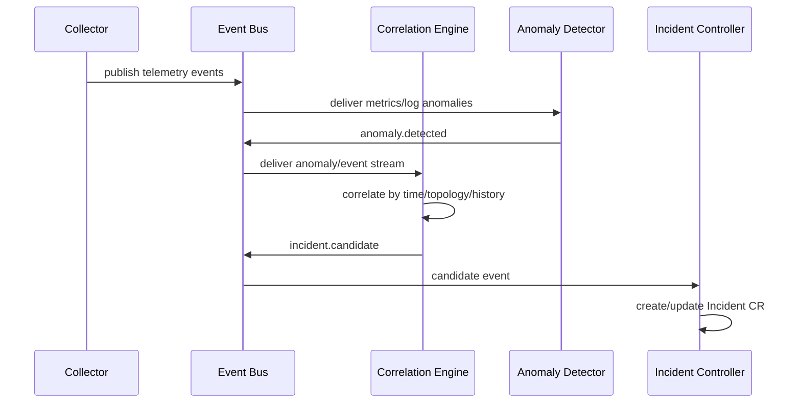


## 31.2 Healing

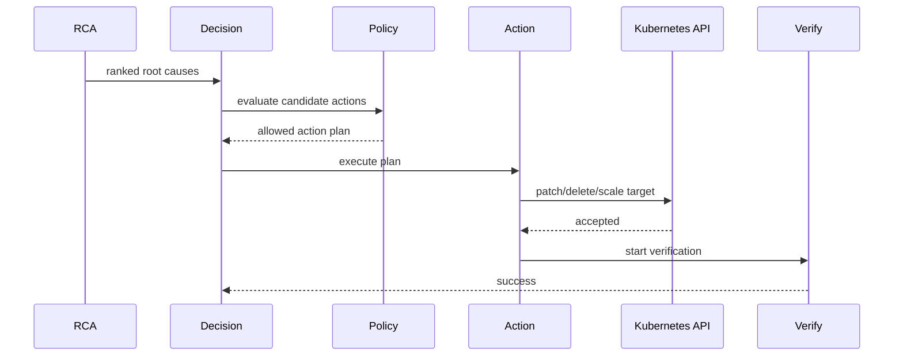


## 31.3 Rollback

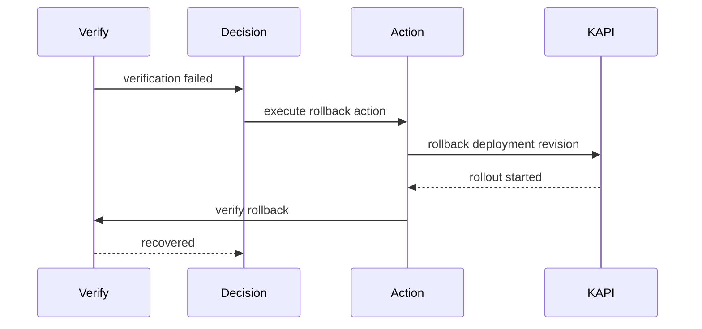


## 31.4 Topology Discovery

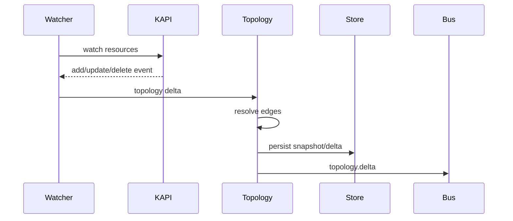


## 31.5 AI Recommendation

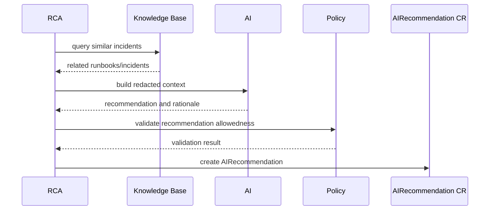


# 32. Technology Stack

| Layer | Recommendation | Rationale |
|---|---|---|
| Language | Go | Native Kubernetes ecosystem, concurrency, static binaries |
| Kubernetes clients | controller-runtime, client-go | Operator and informer support |
| Telemetry | OpenTelemetry | Standard signals and OTLP support |
| Metrics | Prometheus format | Kubernetes ecosystem compatibility |
| Event bus | NATS JetStream | Low-latency durable event bus |
| Analytics store | ClickHouse | High-volume logs/metrics/traces |
| Relational store | PostgreSQL | Incidents, policies, audit, topology metadata |
| Cache | Redis | API cache, rate limits, ephemeral state |
| Workflow | Temporal optional | Complex long-running remediation workflows |
| Dashboard charts | Grafana optional | Metrics visualization integration |
| HTTP framework | Echo or Gin | Lightweight Go APIs |
| CLI | Cobra | Kubernetes-style CLI |
| Config | Viper | File/env/config support |
| Logging | Zap | Structured high-performance logging |
| Policy | OPA/Rego or CEL | Declarative guardrails |
| Vector DB | pgvector/Qdrant/Weaviate | RAG and similarity search |
| Packaging | Helm | Single install surface |
| GitOps | Argo CD/Flux compatible | Declarative operations |


# 33. Development Roadmap

## Phase 1 — Core Kubernetes-Native MVP

Complexity: High

- Helm chart.
- CRDs.
- Controller manager.
- Kubernetes discovery.
- Basic topology.
- Metrics/events collection.
- Threshold anomaly detection.
- Incident CR lifecycle.
- Restart pod and rollback deployment actions.
- Verification engine.
- Basic dashboard.

## Phase 2 — Telemetry and Correlation

Complexity: Very High

- Logs and traces.
- OpenTelemetry collector distribution.
- NATS JetStream pipelines.
- ClickHouse schemas.
- Correlation engine.
- RCA v1.
- Policy engine.
- Audit logs.

## Phase 3 — Multi-Cluster and Knowledge

Complexity: Very High

- Central control plane.
- Member agents.
- Knowledge base.
- Similar incident retrieval.
- Runbook management.
- Edge profile.

## Phase 4 — AI and Advanced Remediation

Complexity: Very High

- AI agent.
- Prompt redaction.
- RAG.
- Human approval workflows.
- Node/network/storage plugins.
- Canary/traffic-shift integration.

## Phase 5 — Predictive and Autonomous Operations

Complexity: Extreme

- Predictive healing.
- Advanced ML models.
- Automated policy tuning.
- Chaos validation.
- Autonomous scaling recommendations.


# 34. Future Roadmap

- Predictive healing based on leading indicators.
- Autonomous scaling with workload-specific control loops.
- Multi-agent AI reasoning with strict policy boundaries.
- Chaos engineering integration to validate runbooks.
- GitOps remediation pull requests.
- Multi-cloud provider action plugins.
- eBPF-based network and syscall diagnostics.
- Cost-aware remediation.
- Business impact scoring.
- Automated postmortem generation.


# 35. Testing Strategy

## 35.1 Unit Testing

- Detector algorithms.
- Policy decisions.
- RCA scoring.
- Action preconditions.
- Verification criteria.

## 35.2 Controller Tests

Use envtest for controller reconciliation, status updates, finalizers, and RBAC behavior.

## 35.3 Integration Tests

- Kind-based clusters.
- Helm install/upgrade/uninstall.
- CRD conversion tests.
- NATS/PostgreSQL/ClickHouse integration.

## 35.4 E2E Tests

Scenarios:

- CrashLoopBackOff detected and pod restarted.
- Bad rollout detected and rolled back.
- DNS outage detected and CoreDNS remediation suggested.
- Certificate expiry detected and rotation recommended.
- NetworkPolicy regression detected and rollback recommended.

## 35.5 Chaos Tests

- Kill controller leader.
- Kill NATS pod.
- Throttle Kubernetes API.
- Fill collector queues.
- Make ClickHouse unavailable.
- Break plugin endpoint.

## 35.6 Load Tests

- 10k pods telemetry simulation.
- 100k events/minute pipeline.
- API query latency.
- Dashboard graph rendering.


# 36. CI/CD Architecture

## 36.1 Pipeline

```mermaid
flowchart LR
    PR[Pull Request] --> Lint[Go lint + YAML lint]
    Lint --> Unit[Unit tests]
    Unit --> Envtest[Controller envtest]
    Envtest --> Build[Build images]
    Build --> Scan[Security scan/SBOM]
    Scan --> Kind[Kind integration]
    Kind --> Helm[Helm chart test]
    Helm --> E2E[E2E tests]
    E2E --> Release[Release artifacts]
```


## 36.2 Required Checks

- go test ./...
- golangci-lint
- gosec
- govulncheck
- helm lint
- kubeconform
- controller-gen verify
- generated OpenAPI verify
- container image scan
- SBOM generation
- license scan

## 36.3 Release Artifacts

- OCI images.
- Helm chart.
- CRD bundle.
- CLI binaries.
- SBOM.
- checksums and signatures.


# 37. Observability of the Platform Itself

## 37.1 Platform Metrics

- collector_events_received_total
- collector_events_dropped_total
- eventbus_publish_latency_seconds
- correlation_windows_active
- incidents_created_total
- rca_duration_seconds
- decision_policy_denied_total
- action_executions_total
- action_execution_duration_seconds
- verification_success_total
- verification_failure_total
- plugin_errors_total

## 37.2 Health Checks

- `/healthz`: process health.
- `/readyz`: dependencies ready.
- `/metrics`: Prometheus metrics.
- `/debug/pprof`: optional and protected.

## 37.3 Alerts

- Event bus consumer lag high.
- Collector drop rate above threshold.
- PostgreSQL unavailable.
- ClickHouse insert failures.
- Controller leader election flapping.
- Action failure rate high.
- Verification timeout rate high.

## 37.4 Self-Healing the Self-Healer

The platform should observe itself but must avoid circular hazardous automation. Default self-healing actions for platform components are limited to restart pods, scale stateless components, and alert humans for storage/event bus failures.


# 38. Appendices

## 38.1 Go Domain Models

```go
type Incident struct {
    ID        string
    Severity  Severity
    Status    IncidentStatus
    Affected  []ObjectRef
    Evidence  []Evidence
    CreatedAt time.Time
    UpdatedAt time.Time
}

type RootCause struct {
    Type       string
    Target     ObjectRef
    Confidence float64
    Evidence   []EvidenceRef
}

type RemediationPlan struct {
    ID          string
    IncidentID  string
    Actions     []PlannedAction
    RiskTier    RiskTier
    RequiresApproval bool
}
```

## 38.2 Design Decisions

### Decision: Use CRDs for Incident Lifecycle

**Decision:** Represent incidents, analyses, remediations, topology, knowledge entries, and AI recommendations as CRDs.

**Rationale:** Kubernetes-native APIs provide declarative workflows, RBAC, audit, status, watchability, and GitOps compatibility.

**Trade-off:** CRDs are not ideal for large telemetry payloads. Store only references and summaries in CRDs; store large evidence in databases/object storage.

### Decision: NATS JetStream as Default Bus

**Decision:** Use NATS JetStream by default.

**Rationale:** It provides durable streams and acknowledgements with lower operational complexity than Kafka for many platform control-plane workloads.

**Trade-off:** Kafka may be preferred for organizations with existing large-scale streaming teams; provide an abstraction.

### Decision: Deterministic Decision Engine

**Decision:** AI cannot directly execute actions.

**Rationale:** Safety-critical decisions need deterministic, auditable policies.

**Trade-off:** Some autonomy is delayed until recommendations pass policy and approval gates.

## 38.3 Production Readiness Checklist

- [ ] CRDs installed and versioned.
- [ ] RBAC least privilege reviewed.
- [ ] NetworkPolicies enabled.
- [ ] TLS configured.
- [ ] Storage backups configured.
- [ ] NATS persistence configured.
- [ ] Dashboard authentication configured.
- [ ] AI disabled or private provider configured.
- [ ] Risky actions require approval.
- [ ] E2E failure scenarios tested.
- [ ] Observability dashboards installed.
- [ ] Runbooks loaded into knowledge base.

## 38.4 Example Install

```bash
helm repo add selfheal https://example.github.io/selfheal
helm repo update
helm install selfheal selfheal/selfheal   --namespace selfheal   --create-namespace   --set global.clusterName=prod-a   --set remediation.defaultMode=AutoSafe
```

## 38.5 Example Policy

```yaml
apiVersion: selfheal.io/v1alpha1
kind: SelfHealingPolicy
metadata:
  name: payments-default
  namespace: payments
spec:
  mode: AutoSafe
  targetRef:
    kind: Namespace
    name: payments
  actions:
    allowed:
      - RestartPod
      - RollbackDeployment
      - ScaleDeployment
    denied:
      - DeletePVC
      - RestartNode
  approval:
    requiredForRiskTier: [High, Critical]
  limits:
    maxConcurrentActions: 3
    maxPodsDisruptedPercent: 20
```


# 39. Extended Implementation Specification

This chapter expands the implementation details into build-ready engineering packages. Each package should be owned by a small team with a clear API contract, test suite, operational dashboard, and release checklist.


## 39.1 Discovery Package


### Responsibility Boundary

Discovery Package owns a cohesive set of runtime responsibilities and must avoid leaking storage-specific, transport-specific, or Kubernetes-client-specific implementation details to other packages. Public APIs must be expressed as Go interfaces, versioned event schemas, or CRD status contracts.


### Internal Modules


#### Shared Informer Factory


**Purpose:** The shared informer factory provides a focused unit of behavior within Discovery Package. It should expose a small constructor, accept dependencies through interfaces, and be covered by unit tests using fake clocks, fake Kubernetes clients, and deterministic event fixtures.

**Inputs:** configuration snapshot, contextual logger, tracing span context, Kubernetes object references where relevant, event envelope metadata, and a cancellation-aware Go context.

**Outputs:** typed domain objects, emitted events, status conditions, operational metrics, and structured errors. The module must not write arbitrary logs without incident IDs or correlation IDs.

**Error handling:** distinguish validation errors, transient infrastructure errors, permission errors, dependency unavailable errors, and invariant violations. Transient errors should be retried by the caller; validation errors should include field paths; invariant violations should generate high-severity platform alerts.

**Concurrency:** the implementation must be safe under concurrent calls. Shared maps require locks or copy-on-write snapshots. Long-running calls must honor context cancellation. Background goroutines must be registered with the component lifecycle manager.

**Testing:** include table-driven tests, fuzz tests for parsers, golden-file tests for schemas, and failure-injection tests for dependency errors.

#### Resource Mapper


**Purpose:** The resource mapper provides a focused unit of behavior within Discovery Package. It should expose a small constructor, accept dependencies through interfaces, and be covered by unit tests using fake clocks, fake Kubernetes clients, and deterministic event fixtures.

**Inputs:** configuration snapshot, contextual logger, tracing span context, Kubernetes object references where relevant, event envelope metadata, and a cancellation-aware Go context.

**Outputs:** typed domain objects, emitted events, status conditions, operational metrics, and structured errors. The module must not write arbitrary logs without incident IDs or correlation IDs.

**Error handling:** distinguish validation errors, transient infrastructure errors, permission errors, dependency unavailable errors, and invariant violations. Transient errors should be retried by the caller; validation errors should include field paths; invariant violations should generate high-severity platform alerts.

**Concurrency:** the implementation must be safe under concurrent calls. Shared maps require locks or copy-on-write snapshots. Long-running calls must honor context cancellation. Background goroutines must be registered with the component lifecycle manager.

**Testing:** include table-driven tests, fuzz tests for parsers, golden-file tests for schemas, and failure-injection tests for dependency errors.

#### Metadata Cache


**Purpose:** The metadata cache provides a focused unit of behavior within Discovery Package. It should expose a small constructor, accept dependencies through interfaces, and be covered by unit tests using fake clocks, fake Kubernetes clients, and deterministic event fixtures.

**Inputs:** configuration snapshot, contextual logger, tracing span context, Kubernetes object references where relevant, event envelope metadata, and a cancellation-aware Go context.

**Outputs:** typed domain objects, emitted events, status conditions, operational metrics, and structured errors. The module must not write arbitrary logs without incident IDs or correlation IDs.

**Error handling:** distinguish validation errors, transient infrastructure errors, permission errors, dependency unavailable errors, and invariant violations. Transient errors should be retried by the caller; validation errors should include field paths; invariant violations should generate high-severity platform alerts.

**Concurrency:** the implementation must be safe under concurrent calls. Shared maps require locks or copy-on-write snapshots. Long-running calls must honor context cancellation. Background goroutines must be registered with the component lifecycle manager.

**Testing:** include table-driven tests, fuzz tests for parsers, golden-file tests for schemas, and failure-injection tests for dependency errors.

#### Owner Reference Resolver


**Purpose:** The owner reference resolver provides a focused unit of behavior within Discovery Package. It should expose a small constructor, accept dependencies through interfaces, and be covered by unit tests using fake clocks, fake Kubernetes clients, and deterministic event fixtures.

**Inputs:** configuration snapshot, contextual logger, tracing span context, Kubernetes object references where relevant, event envelope metadata, and a cancellation-aware Go context.

**Outputs:** typed domain objects, emitted events, status conditions, operational metrics, and structured errors. The module must not write arbitrary logs without incident IDs or correlation IDs.

**Error handling:** distinguish validation errors, transient infrastructure errors, permission errors, dependency unavailable errors, and invariant violations. Transient errors should be retried by the caller; validation errors should include field paths; invariant violations should generate high-severity platform alerts.

**Concurrency:** the implementation must be safe under concurrent calls. Shared maps require locks or copy-on-write snapshots. Long-running calls must honor context cancellation. Background goroutines must be registered with the component lifecycle manager.

**Testing:** include table-driven tests, fuzz tests for parsers, golden-file tests for schemas, and failure-injection tests for dependency errors.

#### Selector Matcher


**Purpose:** The selector matcher provides a focused unit of behavior within Discovery Package. It should expose a small constructor, accept dependencies through interfaces, and be covered by unit tests using fake clocks, fake Kubernetes clients, and deterministic event fixtures.

**Inputs:** configuration snapshot, contextual logger, tracing span context, Kubernetes object references where relevant, event envelope metadata, and a cancellation-aware Go context.

**Outputs:** typed domain objects, emitted events, status conditions, operational metrics, and structured errors. The module must not write arbitrary logs without incident IDs or correlation IDs.

**Error handling:** distinguish validation errors, transient infrastructure errors, permission errors, dependency unavailable errors, and invariant violations. Transient errors should be retried by the caller; validation errors should include field paths; invariant violations should generate high-severity platform alerts.

**Concurrency:** the implementation must be safe under concurrent calls. Shared maps require locks or copy-on-write snapshots. Long-running calls must honor context cancellation. Background goroutines must be registered with the component lifecycle manager.

**Testing:** include table-driven tests, fuzz tests for parsers, golden-file tests for schemas, and failure-injection tests for dependency errors.

#### Event Recorder


**Purpose:** The event recorder provides a focused unit of behavior within Discovery Package. It should expose a small constructor, accept dependencies through interfaces, and be covered by unit tests using fake clocks, fake Kubernetes clients, and deterministic event fixtures.

**Inputs:** configuration snapshot, contextual logger, tracing span context, Kubernetes object references where relevant, event envelope metadata, and a cancellation-aware Go context.

**Outputs:** typed domain objects, emitted events, status conditions, operational metrics, and structured errors. The module must not write arbitrary logs without incident IDs or correlation IDs.

**Error handling:** distinguish validation errors, transient infrastructure errors, permission errors, dependency unavailable errors, and invariant violations. Transient errors should be retried by the caller; validation errors should include field paths; invariant violations should generate high-severity platform alerts.

**Concurrency:** the implementation must be safe under concurrent calls. Shared maps require locks or copy-on-write snapshots. Long-running calls must honor context cancellation. Background goroutines must be registered with the component lifecycle manager.

**Testing:** include table-driven tests, fuzz tests for parsers, golden-file tests for schemas, and failure-injection tests for dependency errors.

### Package Metrics


```text
selfheal_discovery_package_requests_total
selfheal_discovery_package_errors_total
selfheal_discovery_package_duration_seconds
selfheal_discovery_package_queue_depth
selfheal_discovery_package_retries_total
```


## 39.18 Telemetry Package


### Responsibility Boundary

Telemetry Package owns a cohesive set of runtime responsibilities and must avoid leaking storage-specific, transport-specific, or Kubernetes-client-specific implementation details to other packages. Public APIs must be expressed as Go interfaces, versioned event schemas, or CRD status contracts.


### Internal Modules


#### Otlp Receiver


**Purpose:** The OTLP receiver provides a focused unit of behavior within Telemetry Package. It should expose a small constructor, accept dependencies through interfaces, and be covered by unit tests using fake clocks, fake Kubernetes clients, and deterministic event fixtures.

**Inputs:** configuration snapshot, contextual logger, tracing span context, Kubernetes object references where relevant, event envelope metadata, and a cancellation-aware Go context.

**Outputs:** typed domain objects, emitted events, status conditions, operational metrics, and structured errors. The module must not write arbitrary logs without incident IDs or correlation IDs.

**Error handling:** distinguish validation errors, transient infrastructure errors, permission errors, dependency unavailable errors, and invariant violations. Transient errors should be retried by the caller; validation errors should include field paths; invariant violations should generate high-severity platform alerts.

**Concurrency:** the implementation must be safe under concurrent calls. Shared maps require locks or copy-on-write snapshots. Long-running calls must honor context cancellation. Background goroutines must be registered with the component lifecycle manager.

**Testing:** include table-driven tests, fuzz tests for parsers, golden-file tests for schemas, and failure-injection tests for dependency errors.

#### Prometheus Scraper Adapter


**Purpose:** The Prometheus scraper adapter provides a focused unit of behavior within Telemetry Package. It should expose a small constructor, accept dependencies through interfaces, and be covered by unit tests using fake clocks, fake Kubernetes clients, and deterministic event fixtures.

**Inputs:** configuration snapshot, contextual logger, tracing span context, Kubernetes object references where relevant, event envelope metadata, and a cancellation-aware Go context.

**Outputs:** typed domain objects, emitted events, status conditions, operational metrics, and structured errors. The module must not write arbitrary logs without incident IDs or correlation IDs.

**Error handling:** distinguish validation errors, transient infrastructure errors, permission errors, dependency unavailable errors, and invariant violations. Transient errors should be retried by the caller; validation errors should include field paths; invariant violations should generate high-severity platform alerts.

**Concurrency:** the implementation must be safe under concurrent calls. Shared maps require locks or copy-on-write snapshots. Long-running calls must honor context cancellation. Background goroutines must be registered with the component lifecycle manager.

**Testing:** include table-driven tests, fuzz tests for parsers, golden-file tests for schemas, and failure-injection tests for dependency errors.

#### Log Tailer


**Purpose:** The log tailer provides a focused unit of behavior within Telemetry Package. It should expose a small constructor, accept dependencies through interfaces, and be covered by unit tests using fake clocks, fake Kubernetes clients, and deterministic event fixtures.

**Inputs:** configuration snapshot, contextual logger, tracing span context, Kubernetes object references where relevant, event envelope metadata, and a cancellation-aware Go context.

**Outputs:** typed domain objects, emitted events, status conditions, operational metrics, and structured errors. The module must not write arbitrary logs without incident IDs or correlation IDs.

**Error handling:** distinguish validation errors, transient infrastructure errors, permission errors, dependency unavailable errors, and invariant violations. Transient errors should be retried by the caller; validation errors should include field paths; invariant violations should generate high-severity platform alerts.

**Concurrency:** the implementation must be safe under concurrent calls. Shared maps require locks or copy-on-write snapshots. Long-running calls must honor context cancellation. Background goroutines must be registered with the component lifecycle manager.

**Testing:** include table-driven tests, fuzz tests for parsers, golden-file tests for schemas, and failure-injection tests for dependency errors.

#### Metadata Enricher


**Purpose:** The metadata enricher provides a focused unit of behavior within Telemetry Package. It should expose a small constructor, accept dependencies through interfaces, and be covered by unit tests using fake clocks, fake Kubernetes clients, and deterministic event fixtures.

**Inputs:** configuration snapshot, contextual logger, tracing span context, Kubernetes object references where relevant, event envelope metadata, and a cancellation-aware Go context.

**Outputs:** typed domain objects, emitted events, status conditions, operational metrics, and structured errors. The module must not write arbitrary logs without incident IDs or correlation IDs.

**Error handling:** distinguish validation errors, transient infrastructure errors, permission errors, dependency unavailable errors, and invariant violations. Transient errors should be retried by the caller; validation errors should include field paths; invariant violations should generate high-severity platform alerts.

**Concurrency:** the implementation must be safe under concurrent calls. Shared maps require locks or copy-on-write snapshots. Long-running calls must honor context cancellation. Background goroutines must be registered with the component lifecycle manager.

**Testing:** include table-driven tests, fuzz tests for parsers, golden-file tests for schemas, and failure-injection tests for dependency errors.

#### Batch Processor


**Purpose:** The batch processor provides a focused unit of behavior within Telemetry Package. It should expose a small constructor, accept dependencies through interfaces, and be covered by unit tests using fake clocks, fake Kubernetes clients, and deterministic event fixtures.

**Inputs:** configuration snapshot, contextual logger, tracing span context, Kubernetes object references where relevant, event envelope metadata, and a cancellation-aware Go context.

**Outputs:** typed domain objects, emitted events, status conditions, operational metrics, and structured errors. The module must not write arbitrary logs without incident IDs or correlation IDs.

**Error handling:** distinguish validation errors, transient infrastructure errors, permission errors, dependency unavailable errors, and invariant violations. Transient errors should be retried by the caller; validation errors should include field paths; invariant violations should generate high-severity platform alerts.

**Concurrency:** the implementation must be safe under concurrent calls. Shared maps require locks or copy-on-write snapshots. Long-running calls must honor context cancellation. Background goroutines must be registered with the component lifecycle manager.

**Testing:** include table-driven tests, fuzz tests for parsers, golden-file tests for schemas, and failure-injection tests for dependency errors.

#### Export Router


**Purpose:** The export router provides a focused unit of behavior within Telemetry Package. It should expose a small constructor, accept dependencies through interfaces, and be covered by unit tests using fake clocks, fake Kubernetes clients, and deterministic event fixtures.

**Inputs:** configuration snapshot, contextual logger, tracing span context, Kubernetes object references where relevant, event envelope metadata, and a cancellation-aware Go context.

**Outputs:** typed domain objects, emitted events, status conditions, operational metrics, and structured errors. The module must not write arbitrary logs without incident IDs or correlation IDs.

**Error handling:** distinguish validation errors, transient infrastructure errors, permission errors, dependency unavailable errors, and invariant violations. Transient errors should be retried by the caller; validation errors should include field paths; invariant violations should generate high-severity platform alerts.

**Concurrency:** the implementation must be safe under concurrent calls. Shared maps require locks or copy-on-write snapshots. Long-running calls must honor context cancellation. Background goroutines must be registered with the component lifecycle manager.

**Testing:** include table-driven tests, fuzz tests for parsers, golden-file tests for schemas, and failure-injection tests for dependency errors.

### Package Metrics


```text
selfheal_telemetry_package_requests_total
selfheal_telemetry_package_errors_total
selfheal_telemetry_package_duration_seconds
selfheal_telemetry_package_queue_depth
selfheal_telemetry_package_retries_total
```


## 39.35 Graph Package


### Responsibility Boundary

Graph Package owns a cohesive set of runtime responsibilities and must avoid leaking storage-specific, transport-specific, or Kubernetes-client-specific implementation details to other packages. Public APIs must be expressed as Go interfaces, versioned event schemas, or CRD status contracts.


### Internal Modules


#### Graph Store


**Purpose:** The graph store provides a focused unit of behavior within Graph Package. It should expose a small constructor, accept dependencies through interfaces, and be covered by unit tests using fake clocks, fake Kubernetes clients, and deterministic event fixtures.

**Inputs:** configuration snapshot, contextual logger, tracing span context, Kubernetes object references where relevant, event envelope metadata, and a cancellation-aware Go context.

**Outputs:** typed domain objects, emitted events, status conditions, operational metrics, and structured errors. The module must not write arbitrary logs without incident IDs or correlation IDs.

**Error handling:** distinguish validation errors, transient infrastructure errors, permission errors, dependency unavailable errors, and invariant violations. Transient errors should be retried by the caller; validation errors should include field paths; invariant violations should generate high-severity platform alerts.

**Concurrency:** the implementation must be safe under concurrent calls. Shared maps require locks or copy-on-write snapshots. Long-running calls must honor context cancellation. Background goroutines must be registered with the component lifecycle manager.

**Testing:** include table-driven tests, fuzz tests for parsers, golden-file tests for schemas, and failure-injection tests for dependency errors.

#### Edge Resolver


**Purpose:** The edge resolver provides a focused unit of behavior within Graph Package. It should expose a small constructor, accept dependencies through interfaces, and be covered by unit tests using fake clocks, fake Kubernetes clients, and deterministic event fixtures.

**Inputs:** configuration snapshot, contextual logger, tracing span context, Kubernetes object references where relevant, event envelope metadata, and a cancellation-aware Go context.

**Outputs:** typed domain objects, emitted events, status conditions, operational metrics, and structured errors. The module must not write arbitrary logs without incident IDs or correlation IDs.

**Error handling:** distinguish validation errors, transient infrastructure errors, permission errors, dependency unavailable errors, and invariant violations. Transient errors should be retried by the caller; validation errors should include field paths; invariant violations should generate high-severity platform alerts.

**Concurrency:** the implementation must be safe under concurrent calls. Shared maps require locks or copy-on-write snapshots. Long-running calls must honor context cancellation. Background goroutines must be registered with the component lifecycle manager.

**Testing:** include table-driven tests, fuzz tests for parsers, golden-file tests for schemas, and failure-injection tests for dependency errors.

#### Delta Compactor


**Purpose:** The delta compactor provides a focused unit of behavior within Graph Package. It should expose a small constructor, accept dependencies through interfaces, and be covered by unit tests using fake clocks, fake Kubernetes clients, and deterministic event fixtures.

**Inputs:** configuration snapshot, contextual logger, tracing span context, Kubernetes object references where relevant, event envelope metadata, and a cancellation-aware Go context.

**Outputs:** typed domain objects, emitted events, status conditions, operational metrics, and structured errors. The module must not write arbitrary logs without incident IDs or correlation IDs.

**Error handling:** distinguish validation errors, transient infrastructure errors, permission errors, dependency unavailable errors, and invariant violations. Transient errors should be retried by the caller; validation errors should include field paths; invariant violations should generate high-severity platform alerts.

**Concurrency:** the implementation must be safe under concurrent calls. Shared maps require locks or copy-on-write snapshots. Long-running calls must honor context cancellation. Background goroutines must be registered with the component lifecycle manager.

**Testing:** include table-driven tests, fuzz tests for parsers, golden-file tests for schemas, and failure-injection tests for dependency errors.

#### Query Engine


**Purpose:** The query engine provides a focused unit of behavior within Graph Package. It should expose a small constructor, accept dependencies through interfaces, and be covered by unit tests using fake clocks, fake Kubernetes clients, and deterministic event fixtures.

**Inputs:** configuration snapshot, contextual logger, tracing span context, Kubernetes object references where relevant, event envelope metadata, and a cancellation-aware Go context.

**Outputs:** typed domain objects, emitted events, status conditions, operational metrics, and structured errors. The module must not write arbitrary logs without incident IDs or correlation IDs.

**Error handling:** distinguish validation errors, transient infrastructure errors, permission errors, dependency unavailable errors, and invariant violations. Transient errors should be retried by the caller; validation errors should include field paths; invariant violations should generate high-severity platform alerts.

**Concurrency:** the implementation must be safe under concurrent calls. Shared maps require locks or copy-on-write snapshots. Long-running calls must honor context cancellation. Background goroutines must be registered with the component lifecycle manager.

**Testing:** include table-driven tests, fuzz tests for parsers, golden-file tests for schemas, and failure-injection tests for dependency errors.

#### Graph Serializer


**Purpose:** The graph serializer provides a focused unit of behavior within Graph Package. It should expose a small constructor, accept dependencies through interfaces, and be covered by unit tests using fake clocks, fake Kubernetes clients, and deterministic event fixtures.

**Inputs:** configuration snapshot, contextual logger, tracing span context, Kubernetes object references where relevant, event envelope metadata, and a cancellation-aware Go context.

**Outputs:** typed domain objects, emitted events, status conditions, operational metrics, and structured errors. The module must not write arbitrary logs without incident IDs or correlation IDs.

**Error handling:** distinguish validation errors, transient infrastructure errors, permission errors, dependency unavailable errors, and invariant violations. Transient errors should be retried by the caller; validation errors should include field paths; invariant violations should generate high-severity platform alerts.

**Concurrency:** the implementation must be safe under concurrent calls. Shared maps require locks or copy-on-write snapshots. Long-running calls must honor context cancellation. Background goroutines must be registered with the component lifecycle manager.

**Testing:** include table-driven tests, fuzz tests for parsers, golden-file tests for schemas, and failure-injection tests for dependency errors.

#### Impact-Radius Calculator


**Purpose:** The impact-radius calculator provides a focused unit of behavior within Graph Package. It should expose a small constructor, accept dependencies through interfaces, and be covered by unit tests using fake clocks, fake Kubernetes clients, and deterministic event fixtures.

**Inputs:** configuration snapshot, contextual logger, tracing span context, Kubernetes object references where relevant, event envelope metadata, and a cancellation-aware Go context.

**Outputs:** typed domain objects, emitted events, status conditions, operational metrics, and structured errors. The module must not write arbitrary logs without incident IDs or correlation IDs.

**Error handling:** distinguish validation errors, transient infrastructure errors, permission errors, dependency unavailable errors, and invariant violations. Transient errors should be retried by the caller; validation errors should include field paths; invariant violations should generate high-severity platform alerts.

**Concurrency:** the implementation must be safe under concurrent calls. Shared maps require locks or copy-on-write snapshots. Long-running calls must honor context cancellation. Background goroutines must be registered with the component lifecycle manager.

**Testing:** include table-driven tests, fuzz tests for parsers, golden-file tests for schemas, and failure-injection tests for dependency errors.

### Package Metrics


```text
selfheal_graph_package_requests_total
selfheal_graph_package_errors_total
selfheal_graph_package_duration_seconds
selfheal_graph_package_queue_depth
selfheal_graph_package_retries_total
```


## 39.52 Incident Package


### Responsibility Boundary

Incident Package owns a cohesive set of runtime responsibilities and must avoid leaking storage-specific, transport-specific, or Kubernetes-client-specific implementation details to other packages. Public APIs must be expressed as Go interfaces, versioned event schemas, or CRD status contracts.


### Internal Modules


#### Incident Aggregate


**Purpose:** The incident aggregate provides a focused unit of behavior within Incident Package. It should expose a small constructor, accept dependencies through interfaces, and be covered by unit tests using fake clocks, fake Kubernetes clients, and deterministic event fixtures.

**Inputs:** configuration snapshot, contextual logger, tracing span context, Kubernetes object references where relevant, event envelope metadata, and a cancellation-aware Go context.

**Outputs:** typed domain objects, emitted events, status conditions, operational metrics, and structured errors. The module must not write arbitrary logs without incident IDs or correlation IDs.

**Error handling:** distinguish validation errors, transient infrastructure errors, permission errors, dependency unavailable errors, and invariant violations. Transient errors should be retried by the caller; validation errors should include field paths; invariant violations should generate high-severity platform alerts.

**Concurrency:** the implementation must be safe under concurrent calls. Shared maps require locks or copy-on-write snapshots. Long-running calls must honor context cancellation. Background goroutines must be registered with the component lifecycle manager.

**Testing:** include table-driven tests, fuzz tests for parsers, golden-file tests for schemas, and failure-injection tests for dependency errors.

#### Timeline Builder


**Purpose:** The timeline builder provides a focused unit of behavior within Incident Package. It should expose a small constructor, accept dependencies through interfaces, and be covered by unit tests using fake clocks, fake Kubernetes clients, and deterministic event fixtures.

**Inputs:** configuration snapshot, contextual logger, tracing span context, Kubernetes object references where relevant, event envelope metadata, and a cancellation-aware Go context.

**Outputs:** typed domain objects, emitted events, status conditions, operational metrics, and structured errors. The module must not write arbitrary logs without incident IDs or correlation IDs.

**Error handling:** distinguish validation errors, transient infrastructure errors, permission errors, dependency unavailable errors, and invariant violations. Transient errors should be retried by the caller; validation errors should include field paths; invariant violations should generate high-severity platform alerts.

**Concurrency:** the implementation must be safe under concurrent calls. Shared maps require locks or copy-on-write snapshots. Long-running calls must honor context cancellation. Background goroutines must be registered with the component lifecycle manager.

**Testing:** include table-driven tests, fuzz tests for parsers, golden-file tests for schemas, and failure-injection tests for dependency errors.

#### Evidence Store


**Purpose:** The evidence store provides a focused unit of behavior within Incident Package. It should expose a small constructor, accept dependencies through interfaces, and be covered by unit tests using fake clocks, fake Kubernetes clients, and deterministic event fixtures.

**Inputs:** configuration snapshot, contextual logger, tracing span context, Kubernetes object references where relevant, event envelope metadata, and a cancellation-aware Go context.

**Outputs:** typed domain objects, emitted events, status conditions, operational metrics, and structured errors. The module must not write arbitrary logs without incident IDs or correlation IDs.

**Error handling:** distinguish validation errors, transient infrastructure errors, permission errors, dependency unavailable errors, and invariant violations. Transient errors should be retried by the caller; validation errors should include field paths; invariant violations should generate high-severity platform alerts.

**Concurrency:** the implementation must be safe under concurrent calls. Shared maps require locks or copy-on-write snapshots. Long-running calls must honor context cancellation. Background goroutines must be registered with the component lifecycle manager.

**Testing:** include table-driven tests, fuzz tests for parsers, golden-file tests for schemas, and failure-injection tests for dependency errors.

#### Status Projector


**Purpose:** The status projector provides a focused unit of behavior within Incident Package. It should expose a small constructor, accept dependencies through interfaces, and be covered by unit tests using fake clocks, fake Kubernetes clients, and deterministic event fixtures.

**Inputs:** configuration snapshot, contextual logger, tracing span context, Kubernetes object references where relevant, event envelope metadata, and a cancellation-aware Go context.

**Outputs:** typed domain objects, emitted events, status conditions, operational metrics, and structured errors. The module must not write arbitrary logs without incident IDs or correlation IDs.

**Error handling:** distinguish validation errors, transient infrastructure errors, permission errors, dependency unavailable errors, and invariant violations. Transient errors should be retried by the caller; validation errors should include field paths; invariant violations should generate high-severity platform alerts.

**Concurrency:** the implementation must be safe under concurrent calls. Shared maps require locks or copy-on-write snapshots. Long-running calls must honor context cancellation. Background goroutines must be registered with the component lifecycle manager.

**Testing:** include table-driven tests, fuzz tests for parsers, golden-file tests for schemas, and failure-injection tests for dependency errors.

#### Duplicate Suppressor


**Purpose:** The duplicate suppressor provides a focused unit of behavior within Incident Package. It should expose a small constructor, accept dependencies through interfaces, and be covered by unit tests using fake clocks, fake Kubernetes clients, and deterministic event fixtures.

**Inputs:** configuration snapshot, contextual logger, tracing span context, Kubernetes object references where relevant, event envelope metadata, and a cancellation-aware Go context.

**Outputs:** typed domain objects, emitted events, status conditions, operational metrics, and structured errors. The module must not write arbitrary logs without incident IDs or correlation IDs.

**Error handling:** distinguish validation errors, transient infrastructure errors, permission errors, dependency unavailable errors, and invariant violations. Transient errors should be retried by the caller; validation errors should include field paths; invariant violations should generate high-severity platform alerts.

**Concurrency:** the implementation must be safe under concurrent calls. Shared maps require locks or copy-on-write snapshots. Long-running calls must honor context cancellation. Background goroutines must be registered with the component lifecycle manager.

**Testing:** include table-driven tests, fuzz tests for parsers, golden-file tests for schemas, and failure-injection tests for dependency errors.

#### Severity Calculator


**Purpose:** The severity calculator provides a focused unit of behavior within Incident Package. It should expose a small constructor, accept dependencies through interfaces, and be covered by unit tests using fake clocks, fake Kubernetes clients, and deterministic event fixtures.

**Inputs:** configuration snapshot, contextual logger, tracing span context, Kubernetes object references where relevant, event envelope metadata, and a cancellation-aware Go context.

**Outputs:** typed domain objects, emitted events, status conditions, operational metrics, and structured errors. The module must not write arbitrary logs without incident IDs or correlation IDs.

**Error handling:** distinguish validation errors, transient infrastructure errors, permission errors, dependency unavailable errors, and invariant violations. Transient errors should be retried by the caller; validation errors should include field paths; invariant violations should generate high-severity platform alerts.

**Concurrency:** the implementation must be safe under concurrent calls. Shared maps require locks or copy-on-write snapshots. Long-running calls must honor context cancellation. Background goroutines must be registered with the component lifecycle manager.

**Testing:** include table-driven tests, fuzz tests for parsers, golden-file tests for schemas, and failure-injection tests for dependency errors.

### Package Metrics


```text
selfheal_incident_package_requests_total
selfheal_incident_package_errors_total
selfheal_incident_package_duration_seconds
selfheal_incident_package_queue_depth
selfheal_incident_package_retries_total
```


## 39.69 Policy Package


### Responsibility Boundary

Policy Package owns a cohesive set of runtime responsibilities and must avoid leaking storage-specific, transport-specific, or Kubernetes-client-specific implementation details to other packages. Public APIs must be expressed as Go interfaces, versioned event schemas, or CRD status contracts.


### Internal Modules


#### Policy Loader


**Purpose:** The policy loader provides a focused unit of behavior within Policy Package. It should expose a small constructor, accept dependencies through interfaces, and be covered by unit tests using fake clocks, fake Kubernetes clients, and deterministic event fixtures.

**Inputs:** configuration snapshot, contextual logger, tracing span context, Kubernetes object references where relevant, event envelope metadata, and a cancellation-aware Go context.

**Outputs:** typed domain objects, emitted events, status conditions, operational metrics, and structured errors. The module must not write arbitrary logs without incident IDs or correlation IDs.

**Error handling:** distinguish validation errors, transient infrastructure errors, permission errors, dependency unavailable errors, and invariant violations. Transient errors should be retried by the caller; validation errors should include field paths; invariant violations should generate high-severity platform alerts.

**Concurrency:** the implementation must be safe under concurrent calls. Shared maps require locks or copy-on-write snapshots. Long-running calls must honor context cancellation. Background goroutines must be registered with the component lifecycle manager.

**Testing:** include table-driven tests, fuzz tests for parsers, golden-file tests for schemas, and failure-injection tests for dependency errors.

#### Rule Evaluator


**Purpose:** The rule evaluator provides a focused unit of behavior within Policy Package. It should expose a small constructor, accept dependencies through interfaces, and be covered by unit tests using fake clocks, fake Kubernetes clients, and deterministic event fixtures.

**Inputs:** configuration snapshot, contextual logger, tracing span context, Kubernetes object references where relevant, event envelope metadata, and a cancellation-aware Go context.

**Outputs:** typed domain objects, emitted events, status conditions, operational metrics, and structured errors. The module must not write arbitrary logs without incident IDs or correlation IDs.

**Error handling:** distinguish validation errors, transient infrastructure errors, permission errors, dependency unavailable errors, and invariant violations. Transient errors should be retried by the caller; validation errors should include field paths; invariant violations should generate high-severity platform alerts.

**Concurrency:** the implementation must be safe under concurrent calls. Shared maps require locks or copy-on-write snapshots. Long-running calls must honor context cancellation. Background goroutines must be registered with the component lifecycle manager.

**Testing:** include table-driven tests, fuzz tests for parsers, golden-file tests for schemas, and failure-injection tests for dependency errors.

#### Risk Calculator


**Purpose:** The risk calculator provides a focused unit of behavior within Policy Package. It should expose a small constructor, accept dependencies through interfaces, and be covered by unit tests using fake clocks, fake Kubernetes clients, and deterministic event fixtures.

**Inputs:** configuration snapshot, contextual logger, tracing span context, Kubernetes object references where relevant, event envelope metadata, and a cancellation-aware Go context.

**Outputs:** typed domain objects, emitted events, status conditions, operational metrics, and structured errors. The module must not write arbitrary logs without incident IDs or correlation IDs.

**Error handling:** distinguish validation errors, transient infrastructure errors, permission errors, dependency unavailable errors, and invariant violations. Transient errors should be retried by the caller; validation errors should include field paths; invariant violations should generate high-severity platform alerts.

**Concurrency:** the implementation must be safe under concurrent calls. Shared maps require locks or copy-on-write snapshots. Long-running calls must honor context cancellation. Background goroutines must be registered with the component lifecycle manager.

**Testing:** include table-driven tests, fuzz tests for parsers, golden-file tests for schemas, and failure-injection tests for dependency errors.

#### Approval Gate


**Purpose:** The approval gate provides a focused unit of behavior within Policy Package. It should expose a small constructor, accept dependencies through interfaces, and be covered by unit tests using fake clocks, fake Kubernetes clients, and deterministic event fixtures.

**Inputs:** configuration snapshot, contextual logger, tracing span context, Kubernetes object references where relevant, event envelope metadata, and a cancellation-aware Go context.

**Outputs:** typed domain objects, emitted events, status conditions, operational metrics, and structured errors. The module must not write arbitrary logs without incident IDs or correlation IDs.

**Error handling:** distinguish validation errors, transient infrastructure errors, permission errors, dependency unavailable errors, and invariant violations. Transient errors should be retried by the caller; validation errors should include field paths; invariant violations should generate high-severity platform alerts.

**Concurrency:** the implementation must be safe under concurrent calls. Shared maps require locks or copy-on-write snapshots. Long-running calls must honor context cancellation. Background goroutines must be registered with the component lifecycle manager.

**Testing:** include table-driven tests, fuzz tests for parsers, golden-file tests for schemas, and failure-injection tests for dependency errors.

#### Audit Writer


**Purpose:** The audit writer provides a focused unit of behavior within Policy Package. It should expose a small constructor, accept dependencies through interfaces, and be covered by unit tests using fake clocks, fake Kubernetes clients, and deterministic event fixtures.

**Inputs:** configuration snapshot, contextual logger, tracing span context, Kubernetes object references where relevant, event envelope metadata, and a cancellation-aware Go context.

**Outputs:** typed domain objects, emitted events, status conditions, operational metrics, and structured errors. The module must not write arbitrary logs without incident IDs or correlation IDs.

**Error handling:** distinguish validation errors, transient infrastructure errors, permission errors, dependency unavailable errors, and invariant violations. Transient errors should be retried by the caller; validation errors should include field paths; invariant violations should generate high-severity platform alerts.

**Concurrency:** the implementation must be safe under concurrent calls. Shared maps require locks or copy-on-write snapshots. Long-running calls must honor context cancellation. Background goroutines must be registered with the component lifecycle manager.

**Testing:** include table-driven tests, fuzz tests for parsers, golden-file tests for schemas, and failure-injection tests for dependency errors.

#### Tenant Boundary Checker


**Purpose:** The tenant boundary checker provides a focused unit of behavior within Policy Package. It should expose a small constructor, accept dependencies through interfaces, and be covered by unit tests using fake clocks, fake Kubernetes clients, and deterministic event fixtures.

**Inputs:** configuration snapshot, contextual logger, tracing span context, Kubernetes object references where relevant, event envelope metadata, and a cancellation-aware Go context.

**Outputs:** typed domain objects, emitted events, status conditions, operational metrics, and structured errors. The module must not write arbitrary logs without incident IDs or correlation IDs.

**Error handling:** distinguish validation errors, transient infrastructure errors, permission errors, dependency unavailable errors, and invariant violations. Transient errors should be retried by the caller; validation errors should include field paths; invariant violations should generate high-severity platform alerts.

**Concurrency:** the implementation must be safe under concurrent calls. Shared maps require locks or copy-on-write snapshots. Long-running calls must honor context cancellation. Background goroutines must be registered with the component lifecycle manager.

**Testing:** include table-driven tests, fuzz tests for parsers, golden-file tests for schemas, and failure-injection tests for dependency errors.

### Package Metrics


```text
selfheal_policy_package_requests_total
selfheal_policy_package_errors_total
selfheal_policy_package_duration_seconds
selfheal_policy_package_queue_depth
selfheal_policy_package_retries_total
```


## 39.86 Action Package


### Responsibility Boundary

Action Package owns a cohesive set of runtime responsibilities and must avoid leaking storage-specific, transport-specific, or Kubernetes-client-specific implementation details to other packages. Public APIs must be expressed as Go interfaces, versioned event schemas, or CRD status contracts.


### Internal Modules


#### Action Registry


**Purpose:** The action registry provides a focused unit of behavior within Action Package. It should expose a small constructor, accept dependencies through interfaces, and be covered by unit tests using fake clocks, fake Kubernetes clients, and deterministic event fixtures.

**Inputs:** configuration snapshot, contextual logger, tracing span context, Kubernetes object references where relevant, event envelope metadata, and a cancellation-aware Go context.

**Outputs:** typed domain objects, emitted events, status conditions, operational metrics, and structured errors. The module must not write arbitrary logs without incident IDs or correlation IDs.

**Error handling:** distinguish validation errors, transient infrastructure errors, permission errors, dependency unavailable errors, and invariant violations. Transient errors should be retried by the caller; validation errors should include field paths; invariant violations should generate high-severity platform alerts.

**Concurrency:** the implementation must be safe under concurrent calls. Shared maps require locks or copy-on-write snapshots. Long-running calls must honor context cancellation. Background goroutines must be registered with the component lifecycle manager.

**Testing:** include table-driven tests, fuzz tests for parsers, golden-file tests for schemas, and failure-injection tests for dependency errors.

#### Precondition Checker


**Purpose:** The precondition checker provides a focused unit of behavior within Action Package. It should expose a small constructor, accept dependencies through interfaces, and be covered by unit tests using fake clocks, fake Kubernetes clients, and deterministic event fixtures.

**Inputs:** configuration snapshot, contextual logger, tracing span context, Kubernetes object references where relevant, event envelope metadata, and a cancellation-aware Go context.

**Outputs:** typed domain objects, emitted events, status conditions, operational metrics, and structured errors. The module must not write arbitrary logs without incident IDs or correlation IDs.

**Error handling:** distinguish validation errors, transient infrastructure errors, permission errors, dependency unavailable errors, and invariant violations. Transient errors should be retried by the caller; validation errors should include field paths; invariant violations should generate high-severity platform alerts.

**Concurrency:** the implementation must be safe under concurrent calls. Shared maps require locks or copy-on-write snapshots. Long-running calls must honor context cancellation. Background goroutines must be registered with the component lifecycle manager.

**Testing:** include table-driven tests, fuzz tests for parsers, golden-file tests for schemas, and failure-injection tests for dependency errors.

#### Executor


**Purpose:** The executor provides a focused unit of behavior within Action Package. It should expose a small constructor, accept dependencies through interfaces, and be covered by unit tests using fake clocks, fake Kubernetes clients, and deterministic event fixtures.

**Inputs:** configuration snapshot, contextual logger, tracing span context, Kubernetes object references where relevant, event envelope metadata, and a cancellation-aware Go context.

**Outputs:** typed domain objects, emitted events, status conditions, operational metrics, and structured errors. The module must not write arbitrary logs without incident IDs or correlation IDs.

**Error handling:** distinguish validation errors, transient infrastructure errors, permission errors, dependency unavailable errors, and invariant violations. Transient errors should be retried by the caller; validation errors should include field paths; invariant violations should generate high-severity platform alerts.

**Concurrency:** the implementation must be safe under concurrent calls. Shared maps require locks or copy-on-write snapshots. Long-running calls must honor context cancellation. Background goroutines must be registered with the component lifecycle manager.

**Testing:** include table-driven tests, fuzz tests for parsers, golden-file tests for schemas, and failure-injection tests for dependency errors.

#### Rollback Coordinator


**Purpose:** The rollback coordinator provides a focused unit of behavior within Action Package. It should expose a small constructor, accept dependencies through interfaces, and be covered by unit tests using fake clocks, fake Kubernetes clients, and deterministic event fixtures.

**Inputs:** configuration snapshot, contextual logger, tracing span context, Kubernetes object references where relevant, event envelope metadata, and a cancellation-aware Go context.

**Outputs:** typed domain objects, emitted events, status conditions, operational metrics, and structured errors. The module must not write arbitrary logs without incident IDs or correlation IDs.

**Error handling:** distinguish validation errors, transient infrastructure errors, permission errors, dependency unavailable errors, and invariant violations. Transient errors should be retried by the caller; validation errors should include field paths; invariant violations should generate high-severity platform alerts.

**Concurrency:** the implementation must be safe under concurrent calls. Shared maps require locks or copy-on-write snapshots. Long-running calls must honor context cancellation. Background goroutines must be registered with the component lifecycle manager.

**Testing:** include table-driven tests, fuzz tests for parsers, golden-file tests for schemas, and failure-injection tests for dependency errors.

#### Idempotency Store


**Purpose:** The idempotency store provides a focused unit of behavior within Action Package. It should expose a small constructor, accept dependencies through interfaces, and be covered by unit tests using fake clocks, fake Kubernetes clients, and deterministic event fixtures.

**Inputs:** configuration snapshot, contextual logger, tracing span context, Kubernetes object references where relevant, event envelope metadata, and a cancellation-aware Go context.

**Outputs:** typed domain objects, emitted events, status conditions, operational metrics, and structured errors. The module must not write arbitrary logs without incident IDs or correlation IDs.

**Error handling:** distinguish validation errors, transient infrastructure errors, permission errors, dependency unavailable errors, and invariant violations. Transient errors should be retried by the caller; validation errors should include field paths; invariant violations should generate high-severity platform alerts.

**Concurrency:** the implementation must be safe under concurrent calls. Shared maps require locks or copy-on-write snapshots. Long-running calls must honor context cancellation. Background goroutines must be registered with the component lifecycle manager.

**Testing:** include table-driven tests, fuzz tests for parsers, golden-file tests for schemas, and failure-injection tests for dependency errors.

#### Result Normalizer


**Purpose:** The result normalizer provides a focused unit of behavior within Action Package. It should expose a small constructor, accept dependencies through interfaces, and be covered by unit tests using fake clocks, fake Kubernetes clients, and deterministic event fixtures.

**Inputs:** configuration snapshot, contextual logger, tracing span context, Kubernetes object references where relevant, event envelope metadata, and a cancellation-aware Go context.

**Outputs:** typed domain objects, emitted events, status conditions, operational metrics, and structured errors. The module must not write arbitrary logs without incident IDs or correlation IDs.

**Error handling:** distinguish validation errors, transient infrastructure errors, permission errors, dependency unavailable errors, and invariant violations. Transient errors should be retried by the caller; validation errors should include field paths; invariant violations should generate high-severity platform alerts.

**Concurrency:** the implementation must be safe under concurrent calls. Shared maps require locks or copy-on-write snapshots. Long-running calls must honor context cancellation. Background goroutines must be registered with the component lifecycle manager.

**Testing:** include table-driven tests, fuzz tests for parsers, golden-file tests for schemas, and failure-injection tests for dependency errors.

### Package Metrics


```text
selfheal_action_package_requests_total
selfheal_action_package_errors_total
selfheal_action_package_duration_seconds
selfheal_action_package_queue_depth
selfheal_action_package_retries_total
```


## 39.103 AI Package


### Responsibility Boundary

AI Package owns a cohesive set of runtime responsibilities and must avoid leaking storage-specific, transport-specific, or Kubernetes-client-specific implementation details to other packages. Public APIs must be expressed as Go interfaces, versioned event schemas, or CRD status contracts.


### Internal Modules


#### Prompt Builder


**Purpose:** The prompt builder provides a focused unit of behavior within AI Package. It should expose a small constructor, accept dependencies through interfaces, and be covered by unit tests using fake clocks, fake Kubernetes clients, and deterministic event fixtures.

**Inputs:** configuration snapshot, contextual logger, tracing span context, Kubernetes object references where relevant, event envelope metadata, and a cancellation-aware Go context.

**Outputs:** typed domain objects, emitted events, status conditions, operational metrics, and structured errors. The module must not write arbitrary logs without incident IDs or correlation IDs.

**Error handling:** distinguish validation errors, transient infrastructure errors, permission errors, dependency unavailable errors, and invariant violations. Transient errors should be retried by the caller; validation errors should include field paths; invariant violations should generate high-severity platform alerts.

**Concurrency:** the implementation must be safe under concurrent calls. Shared maps require locks or copy-on-write snapshots. Long-running calls must honor context cancellation. Background goroutines must be registered with the component lifecycle manager.

**Testing:** include table-driven tests, fuzz tests for parsers, golden-file tests for schemas, and failure-injection tests for dependency errors.

#### Secret Redactor


**Purpose:** The secret redactor provides a focused unit of behavior within AI Package. It should expose a small constructor, accept dependencies through interfaces, and be covered by unit tests using fake clocks, fake Kubernetes clients, and deterministic event fixtures.

**Inputs:** configuration snapshot, contextual logger, tracing span context, Kubernetes object references where relevant, event envelope metadata, and a cancellation-aware Go context.

**Outputs:** typed domain objects, emitted events, status conditions, operational metrics, and structured errors. The module must not write arbitrary logs without incident IDs or correlation IDs.

**Error handling:** distinguish validation errors, transient infrastructure errors, permission errors, dependency unavailable errors, and invariant violations. Transient errors should be retried by the caller; validation errors should include field paths; invariant violations should generate high-severity platform alerts.

**Concurrency:** the implementation must be safe under concurrent calls. Shared maps require locks or copy-on-write snapshots. Long-running calls must honor context cancellation. Background goroutines must be registered with the component lifecycle manager.

**Testing:** include table-driven tests, fuzz tests for parsers, golden-file tests for schemas, and failure-injection tests for dependency errors.

#### Retriever


**Purpose:** The retriever provides a focused unit of behavior within AI Package. It should expose a small constructor, accept dependencies through interfaces, and be covered by unit tests using fake clocks, fake Kubernetes clients, and deterministic event fixtures.

**Inputs:** configuration snapshot, contextual logger, tracing span context, Kubernetes object references where relevant, event envelope metadata, and a cancellation-aware Go context.

**Outputs:** typed domain objects, emitted events, status conditions, operational metrics, and structured errors. The module must not write arbitrary logs without incident IDs or correlation IDs.

**Error handling:** distinguish validation errors, transient infrastructure errors, permission errors, dependency unavailable errors, and invariant violations. Transient errors should be retried by the caller; validation errors should include field paths; invariant violations should generate high-severity platform alerts.

**Concurrency:** the implementation must be safe under concurrent calls. Shared maps require locks or copy-on-write snapshots. Long-running calls must honor context cancellation. Background goroutines must be registered with the component lifecycle manager.

**Testing:** include table-driven tests, fuzz tests for parsers, golden-file tests for schemas, and failure-injection tests for dependency errors.

#### Llm Client Abstraction


**Purpose:** The LLM client abstraction provides a focused unit of behavior within AI Package. It should expose a small constructor, accept dependencies through interfaces, and be covered by unit tests using fake clocks, fake Kubernetes clients, and deterministic event fixtures.

**Inputs:** configuration snapshot, contextual logger, tracing span context, Kubernetes object references where relevant, event envelope metadata, and a cancellation-aware Go context.

**Outputs:** typed domain objects, emitted events, status conditions, operational metrics, and structured errors. The module must not write arbitrary logs without incident IDs or correlation IDs.

**Error handling:** distinguish validation errors, transient infrastructure errors, permission errors, dependency unavailable errors, and invariant violations. Transient errors should be retried by the caller; validation errors should include field paths; invariant violations should generate high-severity platform alerts.

**Concurrency:** the implementation must be safe under concurrent calls. Shared maps require locks or copy-on-write snapshots. Long-running calls must honor context cancellation. Background goroutines must be registered with the component lifecycle manager.

**Testing:** include table-driven tests, fuzz tests for parsers, golden-file tests for schemas, and failure-injection tests for dependency errors.

#### Response Validator


**Purpose:** The response validator provides a focused unit of behavior within AI Package. It should expose a small constructor, accept dependencies through interfaces, and be covered by unit tests using fake clocks, fake Kubernetes clients, and deterministic event fixtures.

**Inputs:** configuration snapshot, contextual logger, tracing span context, Kubernetes object references where relevant, event envelope metadata, and a cancellation-aware Go context.

**Outputs:** typed domain objects, emitted events, status conditions, operational metrics, and structured errors. The module must not write arbitrary logs without incident IDs or correlation IDs.

**Error handling:** distinguish validation errors, transient infrastructure errors, permission errors, dependency unavailable errors, and invariant violations. Transient errors should be retried by the caller; validation errors should include field paths; invariant violations should generate high-severity platform alerts.

**Concurrency:** the implementation must be safe under concurrent calls. Shared maps require locks or copy-on-write snapshots. Long-running calls must honor context cancellation. Background goroutines must be registered with the component lifecycle manager.

**Testing:** include table-driven tests, fuzz tests for parsers, golden-file tests for schemas, and failure-injection tests for dependency errors.

#### Recommendation Publisher


**Purpose:** The recommendation publisher provides a focused unit of behavior within AI Package. It should expose a small constructor, accept dependencies through interfaces, and be covered by unit tests using fake clocks, fake Kubernetes clients, and deterministic event fixtures.

**Inputs:** configuration snapshot, contextual logger, tracing span context, Kubernetes object references where relevant, event envelope metadata, and a cancellation-aware Go context.

**Outputs:** typed domain objects, emitted events, status conditions, operational metrics, and structured errors. The module must not write arbitrary logs without incident IDs or correlation IDs.

**Error handling:** distinguish validation errors, transient infrastructure errors, permission errors, dependency unavailable errors, and invariant violations. Transient errors should be retried by the caller; validation errors should include field paths; invariant violations should generate high-severity platform alerts.

**Concurrency:** the implementation must be safe under concurrent calls. Shared maps require locks or copy-on-write snapshots. Long-running calls must honor context cancellation. Background goroutines must be registered with the component lifecycle manager.

**Testing:** include table-driven tests, fuzz tests for parsers, golden-file tests for schemas, and failure-injection tests for dependency errors.

### Package Metrics


```text
selfheal_ai_package_requests_total
selfheal_ai_package_errors_total
selfheal_ai_package_duration_seconds
selfheal_ai_package_queue_depth
selfheal_ai_package_retries_total
```


## 39.120 API Package


### Responsibility Boundary

API Package owns a cohesive set of runtime responsibilities and must avoid leaking storage-specific, transport-specific, or Kubernetes-client-specific implementation details to other packages. Public APIs must be expressed as Go interfaces, versioned event schemas, or CRD status contracts.


### Internal Modules


#### Rest Handlers


**Purpose:** The REST handlers provides a focused unit of behavior within API Package. It should expose a small constructor, accept dependencies through interfaces, and be covered by unit tests using fake clocks, fake Kubernetes clients, and deterministic event fixtures.

**Inputs:** configuration snapshot, contextual logger, tracing span context, Kubernetes object references where relevant, event envelope metadata, and a cancellation-aware Go context.

**Outputs:** typed domain objects, emitted events, status conditions, operational metrics, and structured errors. The module must not write arbitrary logs without incident IDs or correlation IDs.

**Error handling:** distinguish validation errors, transient infrastructure errors, permission errors, dependency unavailable errors, and invariant violations. Transient errors should be retried by the caller; validation errors should include field paths; invariant violations should generate high-severity platform alerts.

**Concurrency:** the implementation must be safe under concurrent calls. Shared maps require locks or copy-on-write snapshots. Long-running calls must honor context cancellation. Background goroutines must be registered with the component lifecycle manager.

**Testing:** include table-driven tests, fuzz tests for parsers, golden-file tests for schemas, and failure-injection tests for dependency errors.

#### Auth Middleware


**Purpose:** The auth middleware provides a focused unit of behavior within API Package. It should expose a small constructor, accept dependencies through interfaces, and be covered by unit tests using fake clocks, fake Kubernetes clients, and deterministic event fixtures.

**Inputs:** configuration snapshot, contextual logger, tracing span context, Kubernetes object references where relevant, event envelope metadata, and a cancellation-aware Go context.

**Outputs:** typed domain objects, emitted events, status conditions, operational metrics, and structured errors. The module must not write arbitrary logs without incident IDs or correlation IDs.

**Error handling:** distinguish validation errors, transient infrastructure errors, permission errors, dependency unavailable errors, and invariant violations. Transient errors should be retried by the caller; validation errors should include field paths; invariant violations should generate high-severity platform alerts.

**Concurrency:** the implementation must be safe under concurrent calls. Shared maps require locks or copy-on-write snapshots. Long-running calls must honor context cancellation. Background goroutines must be registered with the component lifecycle manager.

**Testing:** include table-driven tests, fuzz tests for parsers, golden-file tests for schemas, and failure-injection tests for dependency errors.

#### Authorization Checker


**Purpose:** The authorization checker provides a focused unit of behavior within API Package. It should expose a small constructor, accept dependencies through interfaces, and be covered by unit tests using fake clocks, fake Kubernetes clients, and deterministic event fixtures.

**Inputs:** configuration snapshot, contextual logger, tracing span context, Kubernetes object references where relevant, event envelope metadata, and a cancellation-aware Go context.

**Outputs:** typed domain objects, emitted events, status conditions, operational metrics, and structured errors. The module must not write arbitrary logs without incident IDs or correlation IDs.

**Error handling:** distinguish validation errors, transient infrastructure errors, permission errors, dependency unavailable errors, and invariant violations. Transient errors should be retried by the caller; validation errors should include field paths; invariant violations should generate high-severity platform alerts.

**Concurrency:** the implementation must be safe under concurrent calls. Shared maps require locks or copy-on-write snapshots. Long-running calls must honor context cancellation. Background goroutines must be registered with the component lifecycle manager.

**Testing:** include table-driven tests, fuzz tests for parsers, golden-file tests for schemas, and failure-injection tests for dependency errors.

#### Pagination Layer


**Purpose:** The pagination layer provides a focused unit of behavior within API Package. It should expose a small constructor, accept dependencies through interfaces, and be covered by unit tests using fake clocks, fake Kubernetes clients, and deterministic event fixtures.

**Inputs:** configuration snapshot, contextual logger, tracing span context, Kubernetes object references where relevant, event envelope metadata, and a cancellation-aware Go context.

**Outputs:** typed domain objects, emitted events, status conditions, operational metrics, and structured errors. The module must not write arbitrary logs without incident IDs or correlation IDs.

**Error handling:** distinguish validation errors, transient infrastructure errors, permission errors, dependency unavailable errors, and invariant violations. Transient errors should be retried by the caller; validation errors should include field paths; invariant violations should generate high-severity platform alerts.

**Concurrency:** the implementation must be safe under concurrent calls. Shared maps require locks or copy-on-write snapshots. Long-running calls must honor context cancellation. Background goroutines must be registered with the component lifecycle manager.

**Testing:** include table-driven tests, fuzz tests for parsers, golden-file tests for schemas, and failure-injection tests for dependency errors.

#### Sse Broker


**Purpose:** The SSE broker provides a focused unit of behavior within API Package. It should expose a small constructor, accept dependencies through interfaces, and be covered by unit tests using fake clocks, fake Kubernetes clients, and deterministic event fixtures.

**Inputs:** configuration snapshot, contextual logger, tracing span context, Kubernetes object references where relevant, event envelope metadata, and a cancellation-aware Go context.

**Outputs:** typed domain objects, emitted events, status conditions, operational metrics, and structured errors. The module must not write arbitrary logs without incident IDs or correlation IDs.

**Error handling:** distinguish validation errors, transient infrastructure errors, permission errors, dependency unavailable errors, and invariant violations. Transient errors should be retried by the caller; validation errors should include field paths; invariant violations should generate high-severity platform alerts.

**Concurrency:** the implementation must be safe under concurrent calls. Shared maps require locks or copy-on-write snapshots. Long-running calls must honor context cancellation. Background goroutines must be registered with the component lifecycle manager.

**Testing:** include table-driven tests, fuzz tests for parsers, golden-file tests for schemas, and failure-injection tests for dependency errors.

#### Openapi Generator


**Purpose:** The OpenAPI generator provides a focused unit of behavior within API Package. It should expose a small constructor, accept dependencies through interfaces, and be covered by unit tests using fake clocks, fake Kubernetes clients, and deterministic event fixtures.

**Inputs:** configuration snapshot, contextual logger, tracing span context, Kubernetes object references where relevant, event envelope metadata, and a cancellation-aware Go context.

**Outputs:** typed domain objects, emitted events, status conditions, operational metrics, and structured errors. The module must not write arbitrary logs without incident IDs or correlation IDs.

**Error handling:** distinguish validation errors, transient infrastructure errors, permission errors, dependency unavailable errors, and invariant violations. Transient errors should be retried by the caller; validation errors should include field paths; invariant violations should generate high-severity platform alerts.

**Concurrency:** the implementation must be safe under concurrent calls. Shared maps require locks or copy-on-write snapshots. Long-running calls must honor context cancellation. Background goroutines must be registered with the component lifecycle manager.

**Testing:** include table-driven tests, fuzz tests for parsers, golden-file tests for schemas, and failure-injection tests for dependency errors.

### Package Metrics


```text
selfheal_api_package_requests_total
selfheal_api_package_errors_total
selfheal_api_package_duration_seconds
selfheal_api_package_queue_depth
selfheal_api_package_retries_total
```


## 39.137 Plugin Package


### Responsibility Boundary

Plugin Package owns a cohesive set of runtime responsibilities and must avoid leaking storage-specific, transport-specific, or Kubernetes-client-specific implementation details to other packages. Public APIs must be expressed as Go interfaces, versioned event schemas, or CRD status contracts.


### Internal Modules


#### Plugin Registry


**Purpose:** The plugin registry provides a focused unit of behavior within Plugin Package. It should expose a small constructor, accept dependencies through interfaces, and be covered by unit tests using fake clocks, fake Kubernetes clients, and deterministic event fixtures.

**Inputs:** configuration snapshot, contextual logger, tracing span context, Kubernetes object references where relevant, event envelope metadata, and a cancellation-aware Go context.

**Outputs:** typed domain objects, emitted events, status conditions, operational metrics, and structured errors. The module must not write arbitrary logs without incident IDs or correlation IDs.

**Error handling:** distinguish validation errors, transient infrastructure errors, permission errors, dependency unavailable errors, and invariant violations. Transient errors should be retried by the caller; validation errors should include field paths; invariant violations should generate high-severity platform alerts.

**Concurrency:** the implementation must be safe under concurrent calls. Shared maps require locks or copy-on-write snapshots. Long-running calls must honor context cancellation. Background goroutines must be registered with the component lifecycle manager.

**Testing:** include table-driven tests, fuzz tests for parsers, golden-file tests for schemas, and failure-injection tests for dependency errors.

#### Capability Verifier


**Purpose:** The capability verifier provides a focused unit of behavior within Plugin Package. It should expose a small constructor, accept dependencies through interfaces, and be covered by unit tests using fake clocks, fake Kubernetes clients, and deterministic event fixtures.

**Inputs:** configuration snapshot, contextual logger, tracing span context, Kubernetes object references where relevant, event envelope metadata, and a cancellation-aware Go context.

**Outputs:** typed domain objects, emitted events, status conditions, operational metrics, and structured errors. The module must not write arbitrary logs without incident IDs or correlation IDs.

**Error handling:** distinguish validation errors, transient infrastructure errors, permission errors, dependency unavailable errors, and invariant violations. Transient errors should be retried by the caller; validation errors should include field paths; invariant violations should generate high-severity platform alerts.

**Concurrency:** the implementation must be safe under concurrent calls. Shared maps require locks or copy-on-write snapshots. Long-running calls must honor context cancellation. Background goroutines must be registered with the component lifecycle manager.

**Testing:** include table-driven tests, fuzz tests for parsers, golden-file tests for schemas, and failure-injection tests for dependency errors.

#### Grpc Client


**Purpose:** The gRPC client provides a focused unit of behavior within Plugin Package. It should expose a small constructor, accept dependencies through interfaces, and be covered by unit tests using fake clocks, fake Kubernetes clients, and deterministic event fixtures.

**Inputs:** configuration snapshot, contextual logger, tracing span context, Kubernetes object references where relevant, event envelope metadata, and a cancellation-aware Go context.

**Outputs:** typed domain objects, emitted events, status conditions, operational metrics, and structured errors. The module must not write arbitrary logs without incident IDs or correlation IDs.

**Error handling:** distinguish validation errors, transient infrastructure errors, permission errors, dependency unavailable errors, and invariant violations. Transient errors should be retried by the caller; validation errors should include field paths; invariant violations should generate high-severity platform alerts.

**Concurrency:** the implementation must be safe under concurrent calls. Shared maps require locks or copy-on-write snapshots. Long-running calls must honor context cancellation. Background goroutines must be registered with the component lifecycle manager.

**Testing:** include table-driven tests, fuzz tests for parsers, golden-file tests for schemas, and failure-injection tests for dependency errors.

#### Wasm Runtime


**Purpose:** The WASM runtime provides a focused unit of behavior within Plugin Package. It should expose a small constructor, accept dependencies through interfaces, and be covered by unit tests using fake clocks, fake Kubernetes clients, and deterministic event fixtures.

**Inputs:** configuration snapshot, contextual logger, tracing span context, Kubernetes object references where relevant, event envelope metadata, and a cancellation-aware Go context.

**Outputs:** typed domain objects, emitted events, status conditions, operational metrics, and structured errors. The module must not write arbitrary logs without incident IDs or correlation IDs.

**Error handling:** distinguish validation errors, transient infrastructure errors, permission errors, dependency unavailable errors, and invariant violations. Transient errors should be retried by the caller; validation errors should include field paths; invariant violations should generate high-severity platform alerts.

**Concurrency:** the implementation must be safe under concurrent calls. Shared maps require locks or copy-on-write snapshots. Long-running calls must honor context cancellation. Background goroutines must be registered with the component lifecycle manager.

**Testing:** include table-driven tests, fuzz tests for parsers, golden-file tests for schemas, and failure-injection tests for dependency errors.

#### Sandbox Policy


**Purpose:** The sandbox policy provides a focused unit of behavior within Plugin Package. It should expose a small constructor, accept dependencies through interfaces, and be covered by unit tests using fake clocks, fake Kubernetes clients, and deterministic event fixtures.

**Inputs:** configuration snapshot, contextual logger, tracing span context, Kubernetes object references where relevant, event envelope metadata, and a cancellation-aware Go context.

**Outputs:** typed domain objects, emitted events, status conditions, operational metrics, and structured errors. The module must not write arbitrary logs without incident IDs or correlation IDs.

**Error handling:** distinguish validation errors, transient infrastructure errors, permission errors, dependency unavailable errors, and invariant violations. Transient errors should be retried by the caller; validation errors should include field paths; invariant violations should generate high-severity platform alerts.

**Concurrency:** the implementation must be safe under concurrent calls. Shared maps require locks or copy-on-write snapshots. Long-running calls must honor context cancellation. Background goroutines must be registered with the component lifecycle manager.

**Testing:** include table-driven tests, fuzz tests for parsers, golden-file tests for schemas, and failure-injection tests for dependency errors.

#### Plugin Health Monitor


**Purpose:** The plugin health monitor provides a focused unit of behavior within Plugin Package. It should expose a small constructor, accept dependencies through interfaces, and be covered by unit tests using fake clocks, fake Kubernetes clients, and deterministic event fixtures.

**Inputs:** configuration snapshot, contextual logger, tracing span context, Kubernetes object references where relevant, event envelope metadata, and a cancellation-aware Go context.

**Outputs:** typed domain objects, emitted events, status conditions, operational metrics, and structured errors. The module must not write arbitrary logs without incident IDs or correlation IDs.

**Error handling:** distinguish validation errors, transient infrastructure errors, permission errors, dependency unavailable errors, and invariant violations. Transient errors should be retried by the caller; validation errors should include field paths; invariant violations should generate high-severity platform alerts.

**Concurrency:** the implementation must be safe under concurrent calls. Shared maps require locks or copy-on-write snapshots. Long-running calls must honor context cancellation. Background goroutines must be registered with the component lifecycle manager.

**Testing:** include table-driven tests, fuzz tests for parsers, golden-file tests for schemas, and failure-injection tests for dependency errors.

### Package Metrics


```text
selfheal_plugin_package_requests_total
selfheal_plugin_package_errors_total
selfheal_plugin_package_duration_seconds
selfheal_plugin_package_queue_depth
selfheal_plugin_package_retries_total
```


## 39.154 Persistence Package


### Responsibility Boundary

Persistence Package owns a cohesive set of runtime responsibilities and must avoid leaking storage-specific, transport-specific, or Kubernetes-client-specific implementation details to other packages. Public APIs must be expressed as Go interfaces, versioned event schemas, or CRD status contracts.


### Internal Modules


#### Postgresql Repositories


**Purpose:** The PostgreSQL repositories provides a focused unit of behavior within Persistence Package. It should expose a small constructor, accept dependencies through interfaces, and be covered by unit tests using fake clocks, fake Kubernetes clients, and deterministic event fixtures.

**Inputs:** configuration snapshot, contextual logger, tracing span context, Kubernetes object references where relevant, event envelope metadata, and a cancellation-aware Go context.

**Outputs:** typed domain objects, emitted events, status conditions, operational metrics, and structured errors. The module must not write arbitrary logs without incident IDs or correlation IDs.

**Error handling:** distinguish validation errors, transient infrastructure errors, permission errors, dependency unavailable errors, and invariant violations. Transient errors should be retried by the caller; validation errors should include field paths; invariant violations should generate high-severity platform alerts.

**Concurrency:** the implementation must be safe under concurrent calls. Shared maps require locks or copy-on-write snapshots. Long-running calls must honor context cancellation. Background goroutines must be registered with the component lifecycle manager.

**Testing:** include table-driven tests, fuzz tests for parsers, golden-file tests for schemas, and failure-injection tests for dependency errors.

#### Clickhouse Writers


**Purpose:** The ClickHouse writers provides a focused unit of behavior within Persistence Package. It should expose a small constructor, accept dependencies through interfaces, and be covered by unit tests using fake clocks, fake Kubernetes clients, and deterministic event fixtures.

**Inputs:** configuration snapshot, contextual logger, tracing span context, Kubernetes object references where relevant, event envelope metadata, and a cancellation-aware Go context.

**Outputs:** typed domain objects, emitted events, status conditions, operational metrics, and structured errors. The module must not write arbitrary logs without incident IDs or correlation IDs.

**Error handling:** distinguish validation errors, transient infrastructure errors, permission errors, dependency unavailable errors, and invariant violations. Transient errors should be retried by the caller; validation errors should include field paths; invariant violations should generate high-severity platform alerts.

**Concurrency:** the implementation must be safe under concurrent calls. Shared maps require locks or copy-on-write snapshots. Long-running calls must honor context cancellation. Background goroutines must be registered with the component lifecycle manager.

**Testing:** include table-driven tests, fuzz tests for parsers, golden-file tests for schemas, and failure-injection tests for dependency errors.

#### Object Store Client


**Purpose:** The object store client provides a focused unit of behavior within Persistence Package. It should expose a small constructor, accept dependencies through interfaces, and be covered by unit tests using fake clocks, fake Kubernetes clients, and deterministic event fixtures.

**Inputs:** configuration snapshot, contextual logger, tracing span context, Kubernetes object references where relevant, event envelope metadata, and a cancellation-aware Go context.

**Outputs:** typed domain objects, emitted events, status conditions, operational metrics, and structured errors. The module must not write arbitrary logs without incident IDs or correlation IDs.

**Error handling:** distinguish validation errors, transient infrastructure errors, permission errors, dependency unavailable errors, and invariant violations. Transient errors should be retried by the caller; validation errors should include field paths; invariant violations should generate high-severity platform alerts.

**Concurrency:** the implementation must be safe under concurrent calls. Shared maps require locks or copy-on-write snapshots. Long-running calls must honor context cancellation. Background goroutines must be registered with the component lifecycle manager.

**Testing:** include table-driven tests, fuzz tests for parsers, golden-file tests for schemas, and failure-injection tests for dependency errors.

#### Vector Store Adapter


**Purpose:** The vector store adapter provides a focused unit of behavior within Persistence Package. It should expose a small constructor, accept dependencies through interfaces, and be covered by unit tests using fake clocks, fake Kubernetes clients, and deterministic event fixtures.

**Inputs:** configuration snapshot, contextual logger, tracing span context, Kubernetes object references where relevant, event envelope metadata, and a cancellation-aware Go context.

**Outputs:** typed domain objects, emitted events, status conditions, operational metrics, and structured errors. The module must not write arbitrary logs without incident IDs or correlation IDs.

**Error handling:** distinguish validation errors, transient infrastructure errors, permission errors, dependency unavailable errors, and invariant violations. Transient errors should be retried by the caller; validation errors should include field paths; invariant violations should generate high-severity platform alerts.

**Concurrency:** the implementation must be safe under concurrent calls. Shared maps require locks or copy-on-write snapshots. Long-running calls must honor context cancellation. Background goroutines must be registered with the component lifecycle manager.

**Testing:** include table-driven tests, fuzz tests for parsers, golden-file tests for schemas, and failure-injection tests for dependency errors.

#### Migration Runner


**Purpose:** The migration runner provides a focused unit of behavior within Persistence Package. It should expose a small constructor, accept dependencies through interfaces, and be covered by unit tests using fake clocks, fake Kubernetes clients, and deterministic event fixtures.

**Inputs:** configuration snapshot, contextual logger, tracing span context, Kubernetes object references where relevant, event envelope metadata, and a cancellation-aware Go context.

**Outputs:** typed domain objects, emitted events, status conditions, operational metrics, and structured errors. The module must not write arbitrary logs without incident IDs or correlation IDs.

**Error handling:** distinguish validation errors, transient infrastructure errors, permission errors, dependency unavailable errors, and invariant violations. Transient errors should be retried by the caller; validation errors should include field paths; invariant violations should generate high-severity platform alerts.

**Concurrency:** the implementation must be safe under concurrent calls. Shared maps require locks or copy-on-write snapshots. Long-running calls must honor context cancellation. Background goroutines must be registered with the component lifecycle manager.

**Testing:** include table-driven tests, fuzz tests for parsers, golden-file tests for schemas, and failure-injection tests for dependency errors.

#### Backup Hooks


**Purpose:** The backup hooks provides a focused unit of behavior within Persistence Package. It should expose a small constructor, accept dependencies through interfaces, and be covered by unit tests using fake clocks, fake Kubernetes clients, and deterministic event fixtures.

**Inputs:** configuration snapshot, contextual logger, tracing span context, Kubernetes object references where relevant, event envelope metadata, and a cancellation-aware Go context.

**Outputs:** typed domain objects, emitted events, status conditions, operational metrics, and structured errors. The module must not write arbitrary logs without incident IDs or correlation IDs.

**Error handling:** distinguish validation errors, transient infrastructure errors, permission errors, dependency unavailable errors, and invariant violations. Transient errors should be retried by the caller; validation errors should include field paths; invariant violations should generate high-severity platform alerts.

**Concurrency:** the implementation must be safe under concurrent calls. Shared maps require locks or copy-on-write snapshots. Long-running calls must honor context cancellation. Background goroutines must be registered with the component lifecycle manager.

**Testing:** include table-driven tests, fuzz tests for parsers, golden-file tests for schemas, and failure-injection tests for dependency errors.

### Package Metrics


```text
selfheal_persistence_package_requests_total
selfheal_persistence_package_errors_total
selfheal_persistence_package_duration_seconds
selfheal_persistence_package_queue_depth
selfheal_persistence_package_retries_total
```


# 40. Detailed Event Schemas

All events use the canonical envelope and a typed payload. Schema evolution follows additive-only changes for minor versions. Breaking changes require a new subject suffix and schema version.


## 40.1 TelemetryMetricEvent


**Subject:** `selfheal.telemetry.metrics.v1`

**Payload fields:** metric name, value, labels, resource attributes, temporality, aggregation type.


```json

{
  "id": "evt_01JABC",
  "schemaVersion": "v1",
  "type": "TelemetryMetricEvent",
  "source": "selfheal/component",
  "cluster": "prod-a",
  "namespace": "payments",
  "time": "2026-07-29T05:30:00Z",
  "correlationId": "corr_123",
  "payload": {
    "example": true
  }
}

```


**Validation rules:** `id`, `schemaVersion`, `type`, `source`, `cluster`, and `time` are required. `payload` must validate against the event-specific JSON Schema. Consumers must ignore unknown fields and reject missing required fields.

**Operational behavior:** producers retry publish failures using exponential backoff. Consumers use explicit acknowledgements and must be idempotent by event ID.


## 40.2 TelemetryLogEvent


**Subject:** `selfheal.telemetry.logs.v1`

**Payload fields:** timestamp, severity, body, trace ID, span ID, attributes, redaction status.


```json

{
  "id": "evt_01JABC",
  "schemaVersion": "v1",
  "type": "TelemetryLogEvent",
  "source": "selfheal/component",
  "cluster": "prod-a",
  "namespace": "payments",
  "time": "2026-07-29T05:30:00Z",
  "correlationId": "corr_123",
  "payload": {
    "example": true
  }
}

```


**Validation rules:** `id`, `schemaVersion`, `type`, `source`, `cluster`, and `time` are required. `payload` must validate against the event-specific JSON Schema. Consumers must ignore unknown fields and reject missing required fields.

**Operational behavior:** producers retry publish failures using exponential backoff. Consumers use explicit acknowledgements and must be idempotent by event ID.


## 40.3 TelemetryTraceEvent


**Subject:** `selfheal.telemetry.traces.v1`

**Payload fields:** trace ID, span ID, parent span ID, service, operation, duration, status.


```json

{
  "id": "evt_01JABC",
  "schemaVersion": "v1",
  "type": "TelemetryTraceEvent",
  "source": "selfheal/component",
  "cluster": "prod-a",
  "namespace": "payments",
  "time": "2026-07-29T05:30:00Z",
  "correlationId": "corr_123",
  "payload": {
    "example": true
  }
}

```


**Validation rules:** `id`, `schemaVersion`, `type`, `source`, `cluster`, and `time` are required. `payload` must validate against the event-specific JSON Schema. Consumers must ignore unknown fields and reject missing required fields.

**Operational behavior:** producers retry publish failures using exponential backoff. Consumers use explicit acknowledgements and must be idempotent by event ID.


## 40.4 KubernetesObjectEvent


**Subject:** `selfheal.k8s.objects.v1`

**Payload fields:** GVK, namespace, name, resourceVersion, change type, selected fields.


```json

{
  "id": "evt_01JABC",
  "schemaVersion": "v1",
  "type": "KubernetesObjectEvent",
  "source": "selfheal/component",
  "cluster": "prod-a",
  "namespace": "payments",
  "time": "2026-07-29T05:30:00Z",
  "correlationId": "corr_123",
  "payload": {
    "example": true
  }
}

```


**Validation rules:** `id`, `schemaVersion`, `type`, `source`, `cluster`, and `time` are required. `payload` must validate against the event-specific JSON Schema. Consumers must ignore unknown fields and reject missing required fields.

**Operational behavior:** producers retry publish failures using exponential backoff. Consumers use explicit acknowledgements and must be idempotent by event ID.


## 40.5 TopologyDeltaEvent


**Subject:** `selfheal.topology.delta.v1`

**Payload fields:** nodes added, nodes removed, edges added, edges removed, snapshot version.


```json

{
  "id": "evt_01JABC",
  "schemaVersion": "v1",
  "type": "TopologyDeltaEvent",
  "source": "selfheal/component",
  "cluster": "prod-a",
  "namespace": "payments",
  "time": "2026-07-29T05:30:00Z",
  "correlationId": "corr_123",
  "payload": {
    "example": true
  }
}

```


**Validation rules:** `id`, `schemaVersion`, `type`, `source`, `cluster`, and `time` are required. `payload` must validate against the event-specific JSON Schema. Consumers must ignore unknown fields and reject missing required fields.

**Operational behavior:** producers retry publish failures using exponential backoff. Consumers use explicit acknowledgements and must be idempotent by event ID.


## 40.6 AnomalyDetectedEvent


**Subject:** `selfheal.anomaly.detected.v1`

**Payload fields:** detector, signal, score, threshold, baseline, affected entity.


```json

{
  "id": "evt_01JABC",
  "schemaVersion": "v1",
  "type": "AnomalyDetectedEvent",
  "source": "selfheal/component",
  "cluster": "prod-a",
  "namespace": "payments",
  "time": "2026-07-29T05:30:00Z",
  "correlationId": "corr_123",
  "payload": {
    "example": true
  }
}

```


**Validation rules:** `id`, `schemaVersion`, `type`, `source`, `cluster`, and `time` are required. `payload` must validate against the event-specific JSON Schema. Consumers must ignore unknown fields and reject missing required fields.

**Operational behavior:** producers retry publish failures using exponential backoff. Consumers use explicit acknowledgements and must be idempotent by event ID.


## 40.7 IncidentCandidateEvent


**Subject:** `selfheal.incident.candidate.v1`

**Payload fields:** candidate ID, grouped symptoms, correlation score, affected graph radius.


```json

{
  "id": "evt_01JABC",
  "schemaVersion": "v1",
  "type": "IncidentCandidateEvent",
  "source": "selfheal/component",
  "cluster": "prod-a",
  "namespace": "payments",
  "time": "2026-07-29T05:30:00Z",
  "correlationId": "corr_123",
  "payload": {
    "example": true
  }
}

```


**Validation rules:** `id`, `schemaVersion`, `type`, `source`, `cluster`, and `time` are required. `payload` must validate against the event-specific JSON Schema. Consumers must ignore unknown fields and reject missing required fields.

**Operational behavior:** producers retry publish failures using exponential backoff. Consumers use explicit acknowledgements and must be idempotent by event ID.


## 40.8 RCACompletedEvent


**Subject:** `selfheal.rca.completed.v1`

**Payload fields:** ranked causes, confidence, timeline, evidence references.


```json

{
  "id": "evt_01JABC",
  "schemaVersion": "v1",
  "type": "RCACompletedEvent",
  "source": "selfheal/component",
  "cluster": "prod-a",
  "namespace": "payments",
  "time": "2026-07-29T05:30:00Z",
  "correlationId": "corr_123",
  "payload": {
    "example": true
  }
}

```


**Validation rules:** `id`, `schemaVersion`, `type`, `source`, `cluster`, and `time` are required. `payload` must validate against the event-specific JSON Schema. Consumers must ignore unknown fields and reject missing required fields.

**Operational behavior:** producers retry publish failures using exponential backoff. Consumers use explicit acknowledgements and must be idempotent by event ID.


## 40.9 DecisionMadeEvent


**Subject:** `selfheal.decision.made.v1`

**Payload fields:** selected action plan, denied actions, policy decisions, approval needs.


```json

{
  "id": "evt_01JABC",
  "schemaVersion": "v1",
  "type": "DecisionMadeEvent",
  "source": "selfheal/component",
  "cluster": "prod-a",
  "namespace": "payments",
  "time": "2026-07-29T05:30:00Z",
  "correlationId": "corr_123",
  "payload": {
    "example": true
  }
}

```


**Validation rules:** `id`, `schemaVersion`, `type`, `source`, `cluster`, and `time` are required. `payload` must validate against the event-specific JSON Schema. Consumers must ignore unknown fields and reject missing required fields.

**Operational behavior:** producers retry publish failures using exponential backoff. Consumers use explicit acknowledgements and must be idempotent by event ID.


## 40.10 ActionStartedEvent


**Subject:** `selfheal.action.started.v1`

**Payload fields:** action ID, type, target, preconditions, idempotency key.


```json

{
  "id": "evt_01JABC",
  "schemaVersion": "v1",
  "type": "ActionStartedEvent",
  "source": "selfheal/component",
  "cluster": "prod-a",
  "namespace": "payments",
  "time": "2026-07-29T05:30:00Z",
  "correlationId": "corr_123",
  "payload": {
    "example": true
  }
}

```


**Validation rules:** `id`, `schemaVersion`, `type`, `source`, `cluster`, and `time` are required. `payload` must validate against the event-specific JSON Schema. Consumers must ignore unknown fields and reject missing required fields.

**Operational behavior:** producers retry publish failures using exponential backoff. Consumers use explicit acknowledgements and must be idempotent by event ID.


## 40.11 ActionCompletedEvent


**Subject:** `selfheal.action.completed.v1`

**Payload fields:** action ID, status, result, rollback pointer, duration.


```json

{
  "id": "evt_01JABC",
  "schemaVersion": "v1",
  "type": "ActionCompletedEvent",
  "source": "selfheal/component",
  "cluster": "prod-a",
  "namespace": "payments",
  "time": "2026-07-29T05:30:00Z",
  "correlationId": "corr_123",
  "payload": {
    "example": true
  }
}

```


**Validation rules:** `id`, `schemaVersion`, `type`, `source`, `cluster`, and `time` are required. `payload` must validate against the event-specific JSON Schema. Consumers must ignore unknown fields and reject missing required fields.

**Operational behavior:** producers retry publish failures using exponential backoff. Consumers use explicit acknowledgements and must be idempotent by event ID.


## 40.12 VerificationCompletedEvent


**Subject:** `selfheal.verification.completed.v1`

**Payload fields:** result, checked criteria, metric changes, next state.


```json

{
  "id": "evt_01JABC",
  "schemaVersion": "v1",
  "type": "VerificationCompletedEvent",
  "source": "selfheal/component",
  "cluster": "prod-a",
  "namespace": "payments",
  "time": "2026-07-29T05:30:00Z",
  "correlationId": "corr_123",
  "payload": {
    "example": true
  }
}

```


**Validation rules:** `id`, `schemaVersion`, `type`, `source`, `cluster`, and `time` are required. `payload` must validate against the event-specific JSON Schema. Consumers must ignore unknown fields and reject missing required fields.

**Operational behavior:** producers retry publish failures using exponential backoff. Consumers use explicit acknowledgements and must be idempotent by event ID.


# 41. Extended Remediation Catalog

This catalog provides implementation semantics for action handlers. Every action must be idempotent, auditable, policy-gated, and verification-aware.


## 41.1 RestartPod


**Description:** Delete a managed pod and let its owner recreate it.

**Risk tier:** Low.

**Preconditions:** Pod has owner, disruption budget allows, not last healthy replica.

**Verification:** Pod ready, restart count stable, error rate improves.


**Implementation notes:**

- Build a typed target reference and resolve it through the Kubernetes API before mutation.
- Compute an idempotency key from incident ID, action type, target reference, and desired parameters.
- Record a dry-run plan and policy decision before executing.
- Use server-side apply or strategic merge patch when field ownership matters.
- Emit action started, action progress, and action completed events.
- Persist the original observed state needed for rollback.
- Enforce per-namespace and per-workload concurrency limits.

**Pseudo-code:**

```go
func ExecuteRestartPod(ctx context.Context, plan ActionPlan) (ActionResult, error) {
    if err := checkPreconditions(ctx, plan); err != nil {
        return ActionResult{Status: "Denied"}, err
    }
    key := idempotencyKey(plan)
    if cached, ok := loadPriorResult(key); ok {
        return cached, nil
    }
    result, err := mutateKubernetes(ctx, plan)
    saveActionResult(key, result, err)
    return result, err
}
```


## 41.2 DeleteFailedPod


**Description:** Delete a pod in Failed/Unknown state.

**Risk tier:** Low.

**Preconditions:** Pod phase is Failed or node lost timeout exceeded.

**Verification:** Replacement pod scheduled or orphan removed.


**Implementation notes:**

- Build a typed target reference and resolve it through the Kubernetes API before mutation.
- Compute an idempotency key from incident ID, action type, target reference, and desired parameters.
- Record a dry-run plan and policy decision before executing.
- Use server-side apply or strategic merge patch when field ownership matters.
- Emit action started, action progress, and action completed events.
- Persist the original observed state needed for rollback.
- Enforce per-namespace and per-workload concurrency limits.

**Pseudo-code:**

```go
func ExecuteDeleteFailedPod(ctx context.Context, plan ActionPlan) (ActionResult, error) {
    if err := checkPreconditions(ctx, plan); err != nil {
        return ActionResult{Status: "Denied"}, err
    }
    key := idempotencyKey(plan)
    if cached, ok := loadPriorResult(key); ok {
        return cached, nil
    }
    result, err := mutateKubernetes(ctx, plan)
    saveActionResult(key, result, err)
    return result, err
}
```


## 41.3 ScaleDeployment


**Description:** Patch deployment replicas or HPA bounds.

**Risk tier:** Medium.

**Preconditions:** Replica delta under policy max, quota available.

**Verification:** Available replicas match desired, latency/error improve.


**Implementation notes:**

- Build a typed target reference and resolve it through the Kubernetes API before mutation.
- Compute an idempotency key from incident ID, action type, target reference, and desired parameters.
- Record a dry-run plan and policy decision before executing.
- Use server-side apply or strategic merge patch when field ownership matters.
- Emit action started, action progress, and action completed events.
- Persist the original observed state needed for rollback.
- Enforce per-namespace and per-workload concurrency limits.

**Pseudo-code:**

```go
func ExecuteScaleDeployment(ctx context.Context, plan ActionPlan) (ActionResult, error) {
    if err := checkPreconditions(ctx, plan); err != nil {
        return ActionResult{Status: "Denied"}, err
    }
    key := idempotencyKey(plan)
    if cached, ok := loadPriorResult(key); ok {
        return cached, nil
    }
    result, err := mutateKubernetes(ctx, plan)
    saveActionResult(key, result, err)
    return result, err
}
```


## 41.4 RollbackDeployment


**Description:** Rollback to previous stable revision.

**Risk tier:** Medium.

**Preconditions:** Previous ReplicaSet exists, rollout history available.

**Verification:** New revision available and SLO restored.


**Implementation notes:**

- Build a typed target reference and resolve it through the Kubernetes API before mutation.
- Compute an idempotency key from incident ID, action type, target reference, and desired parameters.
- Record a dry-run plan and policy decision before executing.
- Use server-side apply or strategic merge patch when field ownership matters.
- Emit action started, action progress, and action completed events.
- Persist the original observed state needed for rollback.
- Enforce per-namespace and per-workload concurrency limits.

**Pseudo-code:**

```go
func ExecuteRollbackDeployment(ctx context.Context, plan ActionPlan) (ActionResult, error) {
    if err := checkPreconditions(ctx, plan); err != nil {
        return ActionResult{Status: "Denied"}, err
    }
    key := idempotencyKey(plan)
    if cached, ok := loadPriorResult(key); ok {
        return cached, nil
    }
    result, err := mutateKubernetes(ctx, plan)
    saveActionResult(key, result, err)
    return result, err
}
```


## 41.5 RestartStatefulSetPod


**Description:** Restart one StatefulSet ordinal.

**Risk tier:** High.

**Preconditions:** Quorum safe, ordinal selected, PVC healthy.

**Verification:** Ordinal ready and quorum maintained.


**Implementation notes:**

- Build a typed target reference and resolve it through the Kubernetes API before mutation.
- Compute an idempotency key from incident ID, action type, target reference, and desired parameters.
- Record a dry-run plan and policy decision before executing.
- Use server-side apply or strategic merge patch when field ownership matters.
- Emit action started, action progress, and action completed events.
- Persist the original observed state needed for rollback.
- Enforce per-namespace and per-workload concurrency limits.

**Pseudo-code:**

```go
func ExecuteRestartStatefulSetPod(ctx context.Context, plan ActionPlan) (ActionResult, error) {
    if err := checkPreconditions(ctx, plan); err != nil {
        return ActionResult{Status: "Denied"}, err
    }
    key := idempotencyKey(plan)
    if cached, ok := loadPriorResult(key); ok {
        return cached, nil
    }
    result, err := mutateKubernetes(ctx, plan)
    saveActionResult(key, result, err)
    return result, err
}
```


## 41.6 DrainNode


**Description:** Cordon node and evict workloads.

**Risk tier:** High.

**Preconditions:** PDB allows, spare capacity available.

**Verification:** Workloads rescheduled and node isolated.


**Implementation notes:**

- Build a typed target reference and resolve it through the Kubernetes API before mutation.
- Compute an idempotency key from incident ID, action type, target reference, and desired parameters.
- Record a dry-run plan and policy decision before executing.
- Use server-side apply or strategic merge patch when field ownership matters.
- Emit action started, action progress, and action completed events.
- Persist the original observed state needed for rollback.
- Enforce per-namespace and per-workload concurrency limits.

**Pseudo-code:**

```go
func ExecuteDrainNode(ctx context.Context, plan ActionPlan) (ActionResult, error) {
    if err := checkPreconditions(ctx, plan); err != nil {
        return ActionResult{Status: "Denied"}, err
    }
    key := idempotencyKey(plan)
    if cached, ok := loadPriorResult(key); ok {
        return cached, nil
    }
    result, err := mutateKubernetes(ctx, plan)
    saveActionResult(key, result, err)
    return result, err
}
```


## 41.7 UncordonNode


**Description:** Mark node schedulable.

**Risk tier:** Medium.

**Preconditions:** Node Ready, pressure conditions clear.

**Verification:** New pods can schedule successfully.


**Implementation notes:**

- Build a typed target reference and resolve it through the Kubernetes API before mutation.
- Compute an idempotency key from incident ID, action type, target reference, and desired parameters.
- Record a dry-run plan and policy decision before executing.
- Use server-side apply or strategic merge patch when field ownership matters.
- Emit action started, action progress, and action completed events.
- Persist the original observed state needed for rollback.
- Enforce per-namespace and per-workload concurrency limits.

**Pseudo-code:**

```go
func ExecuteUncordonNode(ctx context.Context, plan ActionPlan) (ActionResult, error) {
    if err := checkPreconditions(ctx, plan); err != nil {
        return ActionResult{Status: "Denied"}, err
    }
    key := idempotencyKey(plan)
    if cached, ok := loadPriorResult(key); ok {
        return cached, nil
    }
    result, err := mutateKubernetes(ctx, plan)
    saveActionResult(key, result, err)
    return result, err
}
```


## 41.8 RestartCoreDNS


**Description:** Restart CoreDNS pods safely.

**Risk tier:** Medium.

**Preconditions:** At least one replica remains available.

**Verification:** DNS synthetic probes pass.


**Implementation notes:**

- Build a typed target reference and resolve it through the Kubernetes API before mutation.
- Compute an idempotency key from incident ID, action type, target reference, and desired parameters.
- Record a dry-run plan and policy decision before executing.
- Use server-side apply or strategic merge patch when field ownership matters.
- Emit action started, action progress, and action completed events.
- Persist the original observed state needed for rollback.
- Enforce per-namespace and per-workload concurrency limits.

**Pseudo-code:**

```go
func ExecuteRestartCoreDNS(ctx context.Context, plan ActionPlan) (ActionResult, error) {
    if err := checkPreconditions(ctx, plan); err != nil {
        return ActionResult{Status: "Denied"}, err
    }
    key := idempotencyKey(plan)
    if cached, ok := loadPriorResult(key); ok {
        return cached, nil
    }
    result, err := mutateKubernetes(ctx, plan)
    saveActionResult(key, result, err)
    return result, err
}
```


## 41.9 ReloadIngressController


**Description:** Restart/reload ingress controller.

**Risk tier:** Medium.

**Preconditions:** HA replicas available.

**Verification:** HTTP probes through ingress pass.


**Implementation notes:**

- Build a typed target reference and resolve it through the Kubernetes API before mutation.
- Compute an idempotency key from incident ID, action type, target reference, and desired parameters.
- Record a dry-run plan and policy decision before executing.
- Use server-side apply or strategic merge patch when field ownership matters.
- Emit action started, action progress, and action completed events.
- Persist the original observed state needed for rollback.
- Enforce per-namespace and per-workload concurrency limits.

**Pseudo-code:**

```go
func ExecuteReloadIngressController(ctx context.Context, plan ActionPlan) (ActionResult, error) {
    if err := checkPreconditions(ctx, plan); err != nil {
        return ActionResult{Status: "Denied"}, err
    }
    key := idempotencyKey(plan)
    if cached, ok := loadPriorResult(key); ok {
        return cached, nil
    }
    result, err := mutateKubernetes(ctx, plan)
    saveActionResult(key, result, err)
    return result, err
}
```


## 41.10 RotateCertificate


**Description:** Trigger certificate renewal.

**Risk tier:** High.

**Preconditions:** Issuer healthy, secret ownership known.

**Verification:** New cert valid and mounted.


**Implementation notes:**

- Build a typed target reference and resolve it through the Kubernetes API before mutation.
- Compute an idempotency key from incident ID, action type, target reference, and desired parameters.
- Record a dry-run plan and policy decision before executing.
- Use server-side apply or strategic merge patch when field ownership matters.
- Emit action started, action progress, and action completed events.
- Persist the original observed state needed for rollback.
- Enforce per-namespace and per-workload concurrency limits.

**Pseudo-code:**

```go
func ExecuteRotateCertificate(ctx context.Context, plan ActionPlan) (ActionResult, error) {
    if err := checkPreconditions(ctx, plan); err != nil {
        return ActionResult{Status: "Denied"}, err
    }
    key := idempotencyKey(plan)
    if cached, ok := loadPriorResult(key); ok {
        return cached, nil
    }
    result, err := mutateKubernetes(ctx, plan)
    saveActionResult(key, result, err)
    return result, err
}
```


## 41.11 ExpandPVC


**Description:** Patch PVC requested storage.

**Risk tier:** High.

**Preconditions:** StorageClass allows expansion, quota available.

**Verification:** PVC FileSystemResizeSuccessful or capacity increased.


**Implementation notes:**

- Build a typed target reference and resolve it through the Kubernetes API before mutation.
- Compute an idempotency key from incident ID, action type, target reference, and desired parameters.
- Record a dry-run plan and policy decision before executing.
- Use server-side apply or strategic merge patch when field ownership matters.
- Emit action started, action progress, and action completed events.
- Persist the original observed state needed for rollback.
- Enforce per-namespace and per-workload concurrency limits.

**Pseudo-code:**

```go
func ExecuteExpandPVC(ctx context.Context, plan ActionPlan) (ActionResult, error) {
    if err := checkPreconditions(ctx, plan); err != nil {
        return ActionResult{Status: "Denied"}, err
    }
    key := idempotencyKey(plan)
    if cached, ok := loadPriorResult(key); ok {
        return cached, nil
    }
    result, err := mutateKubernetes(ctx, plan)
    saveActionResult(key, result, err)
    return result, err
}
```


## 41.12 TrafficShift


**Description:** Shift traffic away from bad backend.

**Risk tier:** High.

**Preconditions:** Mesh/Gateway plugin configured, target weights valid.

**Verification:** Error budget improves and traffic distribution matches.


**Implementation notes:**

- Build a typed target reference and resolve it through the Kubernetes API before mutation.
- Compute an idempotency key from incident ID, action type, target reference, and desired parameters.
- Record a dry-run plan and policy decision before executing.
- Use server-side apply or strategic merge patch when field ownership matters.
- Emit action started, action progress, and action completed events.
- Persist the original observed state needed for rollback.
- Enforce per-namespace and per-workload concurrency limits.

**Pseudo-code:**

```go
func ExecuteTrafficShift(ctx context.Context, plan ActionPlan) (ActionResult, error) {
    if err := checkPreconditions(ctx, plan); err != nil {
        return ActionResult{Status: "Denied"}, err
    }
    key := idempotencyKey(plan)
    if cached, ok := loadPriorResult(key); ok {
        return cached, nil
    }
    result, err := mutateKubernetes(ctx, plan)
    saveActionResult(key, result, err)
    return result, err
}
```


## 41.13 CreateCanaryAnalysis


**Description:** Start canary analysis.

**Risk tier:** Medium.

**Preconditions:** Rollout controller installed.

**Verification:** Canary metrics pass or rollback occurs.


**Implementation notes:**

- Build a typed target reference and resolve it through the Kubernetes API before mutation.
- Compute an idempotency key from incident ID, action type, target reference, and desired parameters.
- Record a dry-run plan and policy decision before executing.
- Use server-side apply or strategic merge patch when field ownership matters.
- Emit action started, action progress, and action completed events.
- Persist the original observed state needed for rollback.
- Enforce per-namespace and per-workload concurrency limits.

**Pseudo-code:**

```go
func ExecuteCreateCanaryAnalysis(ctx context.Context, plan ActionPlan) (ActionResult, error) {
    if err := checkPreconditions(ctx, plan); err != nil {
        return ActionResult{Status: "Denied"}, err
    }
    key := idempotencyKey(plan)
    if cached, ok := loadPriorResult(key); ok {
        return cached, nil
    }
    result, err := mutateKubernetes(ctx, plan)
    saveActionResult(key, result, err)
    return result, err
}
```


## 41.14 PatchResourceLimits


**Description:** Adjust CPU/memory limits.

**Risk tier:** High.

**Preconditions:** Policy permits, recommendation confidence high.

**Verification:** Pod stable without OOM/throttle regression.


**Implementation notes:**

- Build a typed target reference and resolve it through the Kubernetes API before mutation.
- Compute an idempotency key from incident ID, action type, target reference, and desired parameters.
- Record a dry-run plan and policy decision before executing.
- Use server-side apply or strategic merge patch when field ownership matters.
- Emit action started, action progress, and action completed events.
- Persist the original observed state needed for rollback.
- Enforce per-namespace and per-workload concurrency limits.

**Pseudo-code:**

```go
func ExecutePatchResourceLimits(ctx context.Context, plan ActionPlan) (ActionResult, error) {
    if err := checkPreconditions(ctx, plan); err != nil {
        return ActionResult{Status: "Denied"}, err
    }
    key := idempotencyKey(plan)
    if cached, ok := loadPriorResult(key); ok {
        return cached, nil
    }
    result, err := mutateKubernetes(ctx, plan)
    saveActionResult(key, result, err)
    return result, err
}
```


## 41.15 RestartDaemonSet


**Description:** Restart DaemonSet pods gradually.

**Risk tier:** High.

**Preconditions:** maxUnavailable policy safe.

**Verification:** DaemonSet available on required nodes.


**Implementation notes:**

- Build a typed target reference and resolve it through the Kubernetes API before mutation.
- Compute an idempotency key from incident ID, action type, target reference, and desired parameters.
- Record a dry-run plan and policy decision before executing.
- Use server-side apply or strategic merge patch when field ownership matters.
- Emit action started, action progress, and action completed events.
- Persist the original observed state needed for rollback.
- Enforce per-namespace and per-workload concurrency limits.

**Pseudo-code:**

```go
func ExecuteRestartDaemonSet(ctx context.Context, plan ActionPlan) (ActionResult, error) {
    if err := checkPreconditions(ctx, plan); err != nil {
        return ActionResult{Status: "Denied"}, err
    }
    key := idempotencyKey(plan)
    if cached, ok := loadPriorResult(key); ok {
        return cached, nil
    }
    result, err := mutateKubernetes(ctx, plan)
    saveActionResult(key, result, err)
    return result, err
}
```


# 42. Extended Detector Specification

Detectors are independently deployable algorithms that consume normalized telemetry and produce anomaly events. A detector must describe its input signal type, required history, resource cost, explainability level, and configuration schema.


## 42.1 RestartRateDetector


**Signals:** metrics/events.

**Description:** Detects abnormal container restart rate using counters and Kubernetes events.

**Runtime cost:** Low.


**Configuration schema:**

```yaml
name: detector-name
enabled: true
window: 5m
evaluationInterval: 30s
sensitivity: medium
minSamples: 20
suppressFor: 10m
labels:
  severity: warning
```

**Output contract:** detector outputs must include `score`, `confidence`, `explanation`, `affectedRefs`, `evidenceRefs`, and `suggestedRcaCategories`.

**False positive controls:** require minimum sample counts, combine independent evidence where possible, suppress repeated identical findings, and support policy overrides per namespace/workload.


## 42.2 OOMKilledDetector


**Signals:** events/metrics/logs.

**Description:** Detects memory kill loops and ranks memory limit versus leak hypotheses.

**Runtime cost:** Low.


**Configuration schema:**

```yaml
name: detector-name
enabled: true
window: 5m
evaluationInterval: 30s
sensitivity: medium
minSamples: 20
suppressFor: 10m
labels:
  severity: warning
```

**Output contract:** detector outputs must include `score`, `confidence`, `explanation`, `affectedRefs`, `evidenceRefs`, and `suggestedRcaCategories`.

**False positive controls:** require minimum sample counts, combine independent evidence where possible, suppress repeated identical findings, and support policy overrides per namespace/workload.


## 42.3 LatencyAdaptiveDetector


**Signals:** metrics/traces.

**Description:** Detects p95/p99 latency anomaly against rolling baseline and seasonality.

**Runtime cost:** Medium.


**Configuration schema:**

```yaml
name: detector-name
enabled: true
window: 5m
evaluationInterval: 30s
sensitivity: medium
minSamples: 20
suppressFor: 10m
labels:
  severity: warning
```

**Output contract:** detector outputs must include `score`, `confidence`, `explanation`, `affectedRefs`, `evidenceRefs`, and `suggestedRcaCategories`.

**False positive controls:** require minimum sample counts, combine independent evidence where possible, suppress repeated identical findings, and support policy overrides per namespace/workload.


## 42.4 ErrorBudgetBurnDetector


**Signals:** metrics.

**Description:** Detects high SLO burn rates across multiple windows.

**Runtime cost:** Medium.


**Configuration schema:**

```yaml
name: detector-name
enabled: true
window: 5m
evaluationInterval: 30s
sensitivity: medium
minSamples: 20
suppressFor: 10m
labels:
  severity: warning
```

**Output contract:** detector outputs must include `score`, `confidence`, `explanation`, `affectedRefs`, `evidenceRefs`, and `suggestedRcaCategories`.

**False positive controls:** require minimum sample counts, combine independent evidence where possible, suppress repeated identical findings, and support policy overrides per namespace/workload.


## 42.5 LogPatternDetector


**Signals:** logs.

**Description:** Detects repeated known error signatures with suppression windows.

**Runtime cost:** Medium.


**Configuration schema:**

```yaml
name: detector-name
enabled: true
window: 5m
evaluationInterval: 30s
sensitivity: medium
minSamples: 20
suppressFor: 10m
labels:
  severity: warning
```

**Output contract:** detector outputs must include `score`, `confidence`, `explanation`, `affectedRefs`, `evidenceRefs`, and `suggestedRcaCategories`.

**False positive controls:** require minimum sample counts, combine independent evidence where possible, suppress repeated identical findings, and support policy overrides per namespace/workload.


## 42.6 TraceCriticalPathDetector


**Signals:** traces.

**Description:** Detects slow or failing spans on critical dependency paths.

**Runtime cost:** High.


**Configuration schema:**

```yaml
name: detector-name
enabled: true
window: 5m
evaluationInterval: 30s
sensitivity: medium
minSamples: 20
suppressFor: 10m
labels:
  severity: warning
```

**Output contract:** detector outputs must include `score`, `confidence`, `explanation`, `affectedRefs`, `evidenceRefs`, and `suggestedRcaCategories`.

**False positive controls:** require minimum sample counts, combine independent evidence where possible, suppress repeated identical findings, and support policy overrides per namespace/workload.


## 42.7 NodePressureDetector


**Signals:** metrics/events.

**Description:** Detects memory/disk/PID pressure and scheduling impact.

**Runtime cost:** Low.


**Configuration schema:**

```yaml
name: detector-name
enabled: true
window: 5m
evaluationInterval: 30s
sensitivity: medium
minSamples: 20
suppressFor: 10m
labels:
  severity: warning
```

**Output contract:** detector outputs must include `score`, `confidence`, `explanation`, `affectedRefs`, `evidenceRefs`, and `suggestedRcaCategories`.

**False positive controls:** require minimum sample counts, combine independent evidence where possible, suppress repeated identical findings, and support policy overrides per namespace/workload.


## 42.8 DNSAnomalyDetector


**Signals:** events/probes/logs.

**Description:** Detects CoreDNS errors and workload DNS failures.

**Runtime cost:** Medium.


**Configuration schema:**

```yaml
name: detector-name
enabled: true
window: 5m
evaluationInterval: 30s
sensitivity: medium
minSamples: 20
suppressFor: 10m
labels:
  severity: warning
```

**Output contract:** detector outputs must include `score`, `confidence`, `explanation`, `affectedRefs`, `evidenceRefs`, and `suggestedRcaCategories`.

**False positive controls:** require minimum sample counts, combine independent evidence where possible, suppress repeated identical findings, and support policy overrides per namespace/workload.


## 42.9 StorageAttachDetector


**Signals:** events.

**Description:** Detects attach/mount failures and CSI-related recurring events.

**Runtime cost:** Medium.


**Configuration schema:**

```yaml
name: detector-name
enabled: true
window: 5m
evaluationInterval: 30s
sensitivity: medium
minSamples: 20
suppressFor: 10m
labels:
  severity: warning
```

**Output contract:** detector outputs must include `score`, `confidence`, `explanation`, `affectedRefs`, `evidenceRefs`, and `suggestedRcaCategories`.

**False positive controls:** require minimum sample counts, combine independent evidence where possible, suppress repeated identical findings, and support policy overrides per namespace/workload.


## 42.10 ChangeRegressionDetector


**Signals:** events/metrics.

**Description:** Correlates post-change regressions to rollout/config updates.

**Runtime cost:** Medium.


**Configuration schema:**

```yaml
name: detector-name
enabled: true
window: 5m
evaluationInterval: 30s
sensitivity: medium
minSamples: 20
suppressFor: 10m
labels:
  severity: warning
```

**Output contract:** detector outputs must include `score`, `confidence`, `explanation`, `affectedRefs`, `evidenceRefs`, and `suggestedRcaCategories`.

**False positive controls:** require minimum sample counts, combine independent evidence where possible, suppress repeated identical findings, and support policy overrides per namespace/workload.


# 43. Extended CRD API Design Notes

## 43.1 Spec and Status Separation

Every CRD must keep desired state in `spec` and observed state in `status`. Controllers must update status through the status subresource only. Users and GitOps systems own `spec`; controllers own `status`.

## 43.2 Conditions

All CRDs use Kubernetes-style conditions:

```yaml
status:
  conditions:
    - type: Ready
      status: "True"
      reason: Reconciled
      message: Resource is ready
      observedGeneration: 3
      lastTransitionTime: "2026-07-29T05:30:00Z"
```

## 43.3 Versioning

- Start with `v1alpha1`.
- Add fields only when possible.
- Use conversion webhooks before introducing breaking changes.
- Preserve unknown fields only for explicitly extensible plugin configuration blocks.
- Publish CRD examples for every supported scenario.

## 43.4 Admission Webhooks

Validating webhooks should reject unsafe combinations, such as automatic high-risk actions without approval, invalid target references, malformed duration strings, and policy modes that conflict with cluster-level guardrails.

Mutating webhooks may default mode, risk thresholds, detector windows, and labels. Mutating webhooks must be deterministic and avoid external network calls.

## 43.5 Finalizer Names

```text
selfheal.io/incident-finalizer
selfheal.io/remediation-finalizer
selfheal.io/plugin-finalizer
selfheal.io/knowledge-finalizer
```


# 44. Operational Runbooks for the Platform

## 44.1 Controller Manager Down

1. Check Deployment replicas and pod status.
2. Inspect leader election Lease.
3. Check Kubernetes API connectivity and RBAC errors.
4. Review recent image/chart upgrades.
5. Roll back chart if startup failures began after upgrade.
6. Disable mutating actions by setting global mode to `ObserveOnly` if controller behavior is suspect.

## 44.2 Collector Dropping Events

1. Inspect collector queue depth and drop counters.
2. Check node CPU/memory pressure.
3. Increase queue size only if memory headroom exists.
4. Enable more aggressive sampling for debug logs.
5. Scale gateway collectors for OTLP load.
6. Validate event bus publish latency.

## 44.3 Event Bus Lag High

1. Identify lagging consumers.
2. Check NATS pod health and storage latency.
3. Scale consumers if they are stateless.
4. Increase max ack pending only after verifying memory capacity.
5. Move failed messages to DLQ if repeatedly poison-pill.
6. Compact telemetry subjects if retention is too high.

## 44.4 Storage Unavailable

1. Put action engine into safe degraded mode.
2. Continue in-memory observation where possible.
3. Buffer only bounded events; do not risk unbounded memory growth.
4. Restore PostgreSQL first for incident state.
5. Restore ClickHouse for deep telemetry queries.
6. Reconcile CRD status after storage resumes.

## 44.5 AI Provider Failure

1. Mark AI engine degraded.
2. Continue deterministic detection/RCA/decisioning.
3. Disable AI recommendation generation.
4. Use stored runbooks and prior incidents without new LLM calls.
5. Confirm prompt queue does not grow unbounded.


# 45. Enterprise Governance Model

## 45.1 Autonomy Levels

| Level | Name | Description | Typical Usage |
|---|---|---|---|
| 0 | ObserveOnly | Detect and record incidents only | Initial rollout |
| 1 | Suggest | Recommend remediations, no execution | Team onboarding |
| 2 | AutoSafe | Execute low-risk actions automatically | Production default |
| 3 | AutoApproved | Execute medium risk with pre-approved policy | Mature services |
| 4 | HumanGateHighRisk | High risk requires explicit approval | Node/storage/network |
| 5 | FullAutonomous | Reserved for future, tightly scoped | Non-critical environments |

## 45.2 Policy Hierarchy

1. Cluster-level global deny policies.
2. Namespace-level platform policies.
3. Workload-level SelfHealingPolicy.
4. Incident-specific overrides.
5. Emergency break-glass approval.

More restrictive policy wins. Deny overrides allow. Break-glass requires audit reason, expiry, and privileged identity.

## 45.3 Change Management Integration

The platform should ingest changes from:

- Kubernetes object generations.
- GitOps commit metadata.
- Deployment annotations.
- Argo CD/Flux events.
- CI/CD deployment records.
- Helm release revisions.

Change context is mandatory for bad rollout RCA and rollback selection.

## 45.4 Compliance Evidence

For regulated environments, every auto-remediation must produce an evidence bundle containing incident details, policy version, approval state, executed commands or API patches, verification results, and rollback status.


# 46. Performance Engineering Guidelines

## 46.1 Kubernetes API Efficiency

- Use shared informers instead of polling.
- Scope watches by namespace where possible.
- Use field and label selectors when supported.
- Avoid writing status on every small event; batch status updates.
- Use exponential backoff after API throttling.
- Cache immutable references where safe.

## 46.2 Telemetry Efficiency

- Control high-cardinality labels at ingestion.
- Keep raw logs retention short and aggregate long-term features.
- Use rollups for detector evaluation.
- Keep incident evidence references instead of embedding large payloads in CRDs.
- Push high-volume data to ClickHouse, not PostgreSQL.

## 46.3 Dashboard Efficiency

- Paginate incident lists.
- Lazy-load evidence tabs.
- Use graph radius limits.
- Cache topology snapshots.
- Use server-side aggregation for metrics.
- Stream live updates only for active incident views.

## 46.4 Controller Efficiency

- Avoid reconciling on irrelevant status-only updates.
- Use predicates.
- Keep reconcile functions short and idempotent.
- Offload long-running work to worker queues and update CRD status asynchronously.
- Use context deadlines on external calls.


# 47. Example Engineering Backlog

## 47.1 Epics

1. Scaffold Go monorepo and API types.
2. Generate CRDs and sample manifests.
3. Build controller manager with leader election.
4. Implement discovery informers and topology graph.
5. Implement collector DaemonSet and cluster collector.
6. Implement event bus abstraction and NATS JetStream backend.
7. Implement incident correlation pipeline.
8. Implement threshold and restart/OOM detectors.
9. Implement RCA v1 graph traversal.
10. Implement policy engine and risk model.
11. Implement restart pod and rollback deployment actions.
12. Implement verification engine.
13. Implement REST API and dashboard MVP.
14. Implement Helm chart and values schema.
15. Implement CI/CD, tests, and release pipeline.
16. Implement knowledge store and runbook API.
17. Implement AI recommendation engine with guardrails.
18. Implement multi-cluster agent.

## 47.2 Definition of Done

A feature is done when it includes code, unit tests, integration tests, metrics, logs, traces, documentation, Helm values, upgrade notes, security review, and at least one e2e scenario if it affects runtime behavior.


---

# End of Architecture Specification
