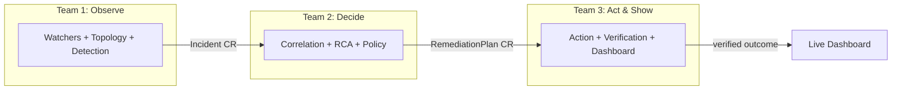

# Autonomous Kubernetes Self-Healing Platform — POC Proposal Summary

**For:** Team Lead / Architect Community review
**From:** [Your name]
**Date:** 2026-08-06
**Team size:** 7-8 engineers, split into 3 sub-teams
**Timeline:** 6-8 weeks to a live demo
**Full architecture reference:** `Observability-POC-SPARK-info.md` (this POC implements a scoped-down slice of Phase 1 of that document)

---

## 1. What we're building

A working demonstration of an **autonomous Kubernetes self-healing loop**: the platform watches a cluster, detects a real failure (crash loop, OOM, bad rollout), figures out what's wrong, decides on a safe fix under policy control, executes it, and verifies the app actually recovered — with every step visible on a dashboard in real time.

This is the **Observe → Decide → Act → Verify** loop described in the full architecture doc, condensed to a scope 7-8 people can actually finish in 6-8 weeks.

## 2. Why this scope (and not the full document)

The full architecture document specifies a production-grade platform on the scale of a commercial AIOps product — NATS JetStream, ClickHouse, multi-cluster control planes, an AI/RAG agent, a plugin system, node/network/storage healing. The document's own roadmap (§33) rates that work "Very High" to "Extreme" complexity and phases it across 5 stages.

For this POC we are deliberately building **only the core of Phase 1**, with these simplifications:

| Full doc | This POC |
|---|---|
| NATS JetStream + ClickHouse + Redis + vector DB | Kubernetes API itself (CRDs) as the store and event bus |
| AI Agent + RAG + knowledge base | Out of scope (stretch: one LLM call for a human-readable summary only) |
| Multi-cluster control plane | Single cluster (kind) |
| Plugin system (gRPC/WASM), node/network/storage healing | Out of scope |
| OIDC, OPA/Rego policy | Simple Go policy rules against a `SelfHealingPolicy` CR |
| Logs + traces pipeline | Kubernetes Events + basic metrics only |

This keeps the demo honest: everything we show is real and running, not mocked.

## 3. Team structure

Three parallel sub-teams (~2-3 people each), integrated through two shared Kubernetes Custom Resources agreed on in week 1. This avoids one team blocking another — each team can build and test against hand-written sample CRs before real integration exists.

| Team | Owns | Produces | Consumes |
|---|---|---|---|
| **1 — Observe** | Discovery, topology, anomaly detection | `Incident` CR | Kubernetes API |
| **2 — Decide** | Correlation, root-cause ranking, policy | `RemediationPlan` CR | `Incident` CR |
| **3 — Act & Show** | Action execution, verification, dashboard/API | Resolved/rolled-back state, live UI | `RemediationPlan` CR |

Detailed per-team briefs (scope, work items, week-by-week plan) are in separate documents:
- `01-Team-Observe-Brief.md`
- `02-Team-Decide-Brief.md`
- `03-Team-Act-Brief.md`

## 4. The shared contract (built jointly, week 1)

Before any team starts independent work, all three teams agree on two CRDs (based on the domain model already in the architecture doc, §38.1):

- **`Incident`** — what Team 1 detected (affected workload, evidence, severity).
- **`RemediationPlan`** — what Team 2 decided to do about it (action, risk tier, approval requirement).

This single joint session is the highest-leverage hour of the whole project — it's what lets three teams build in parallel without waiting on each other.

## 5. Timeline

| Week | Milestone |
|---|---|
| 1 | Joint CRD design, repo scaffold, demo scenarios agreed, kind cluster standardized |
| 2-4 | Parallel build — each team against hand-written test CRs |
| 5 | Pairwise real integration (Team1→Team2, then Team2→Team3) |
| 6 | Full-loop integration in shared cluster, bug-bash |
| 7 | Dashboard polish, demo rehearsal, write-up |
| 8 | Buffer / demo day |

## 6. Demo (what the architect community will see)

1. We deliberately break a running app in the cluster (bad image, memory limit too low, or a bad rollout).
2. Within seconds, the dashboard shows an Incident appear, get correlated, get a root cause, and get a remediation plan.
3. The platform executes the fix (pod restart / rollback / scale) automatically under policy control.
4. The dashboard shows verification passing and the incident marked Resolved — closing the loop with zero manual intervention.

## 7. What we get out of this (beyond the demo)

- A real, working reference implementation of a Kubernetes operator pattern (controller-runtime, CRDs, reconciliation) that other internal teams can build on.
- Reusable building blocks: a generic anomaly-detection scaffold, a policy-gated decision engine, a verified-action executor — all patterns applicable well beyond self-healing.
- A concrete artifact for the architect community that is fully running, not just slides.

## 8. What we are explicitly NOT promising

- Not production-ready. No HA, no multi-cluster, no real auth, no data retention story.
- Not AI-driven remediation — decisions are deterministic and policy-gated by design (matches the safety principle in the source doc, §1.6 and §38.2).
- Not a replacement for existing monitoring/alerting tools.

## 9. Repository

Proposed name: **`selfheal-poc`** (private, internal to the company org). See `04-Repo-And-Naming.md` for alternatives and repo layout.

## 10. Ask

- Sign-off to proceed with this scoped 6-8 week plan.
- Confirmation of the 3-team split and people assigned to each.
- A kind/dev cluster (or namespace on a shared dev cluster) the teams can use for integration testing from week 5 onward.
