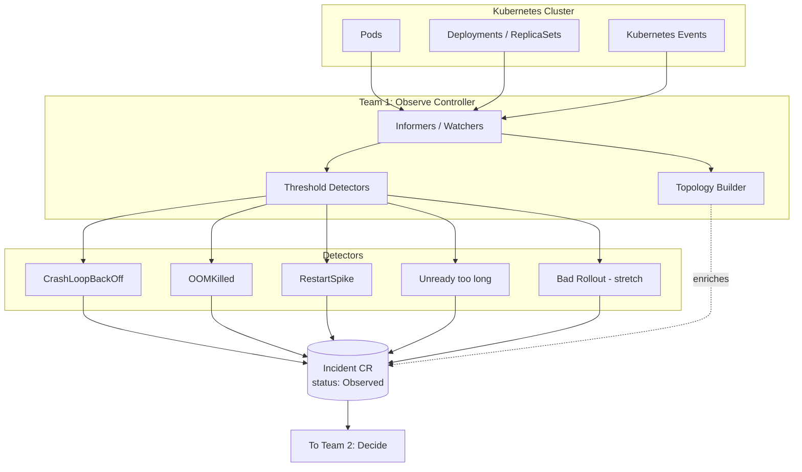
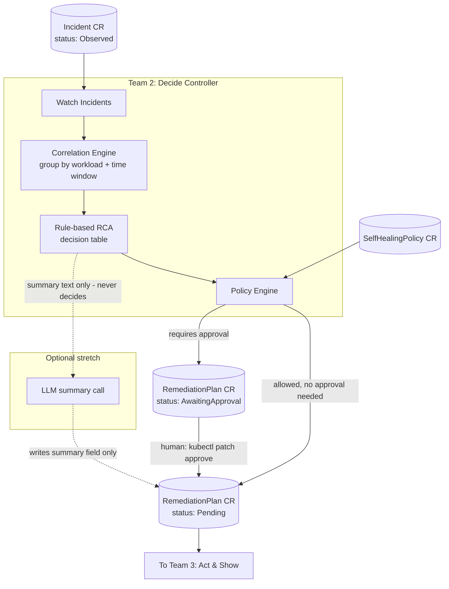
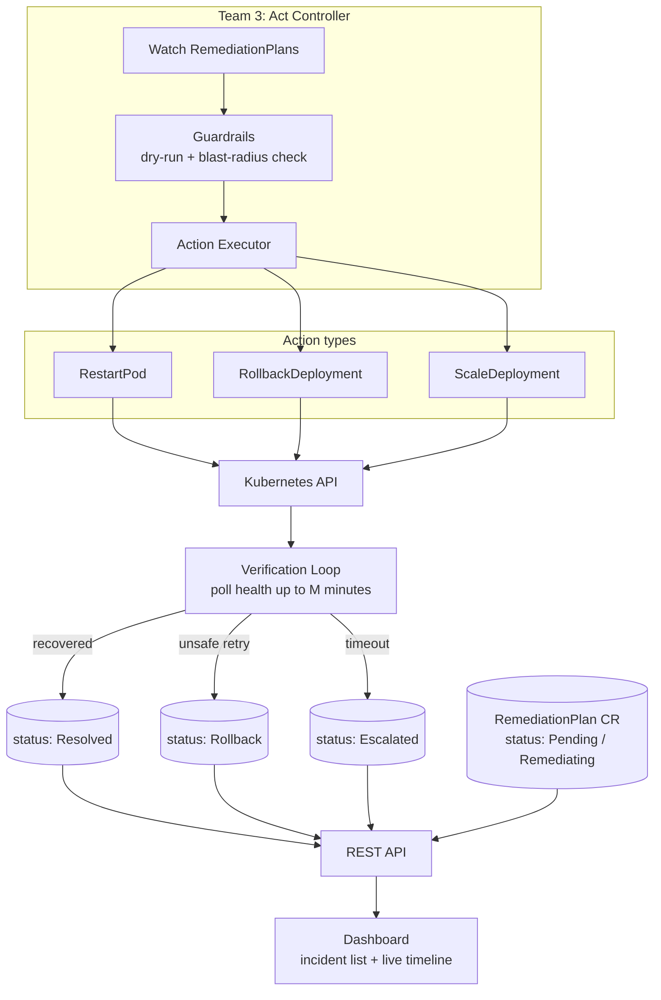
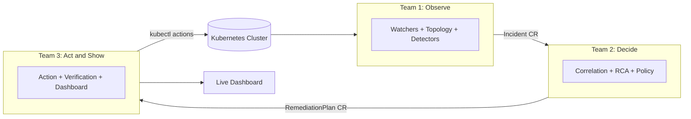

# Team POC Architecture Diagrams

Companion diagrams to `01-Team-Observe-Brief.md`, `02-Team-Decide-Brief.md`, `03-Team-Act-Brief.md`.

---

## Team 1 — Observe

---

## Team 2 — Decide

---

## Team 3 — Act & Show

---

## Combined view — how the three plug together

