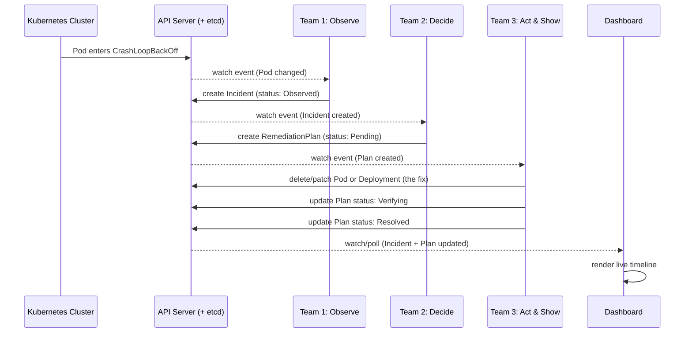
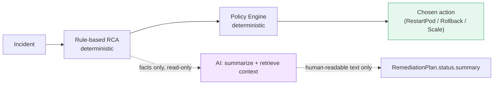
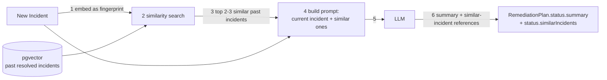

# Platform Mechanism and AI Integration

Companion to `00-Team-Lead-Summary.md`, the 3 team briefs, and `05-Team-Architecture-Diagrams.md`.
This doc covers two things: (1) the exact mechanism the 3 teams use to hand work to each other, and (2) where and how AI plugs into that mechanism, safely.

---

## Part 1 — How the platform actually works

Nothing in this platform calls another team's code directly. Every team only ever talks to **one thing**: the Kubernetes API Server (backed by `etcd`, its storage). Teams communicate only by watching and writing Kubernetes objects (built-in ones like Pod/Deployment, and custom ones we define: `Incident`, `RemediationPlan`).

### 1.1 The mechanism, step by step

1. **Watch** — each controller opens a long-lived connection to the API Server: "tell me the moment anything of type X changes." This is an *Informer* (client-go/controller-runtime). It is push-based, not polling.
2. **React** — when a change arrives, controller-runtime calls your `Reconcile()` function with a reference to the changed object. Your code re-reads current state and decides what to do.
3. **Write** — your code creates/updates an object via the API Server (e.g. `client.Create(ctx, incident)`). The API Server validates it, persists it to `etcd`, and — critically — notifies every other watcher of that type. This notification *is* the handoff between teams; no team ever calls another team's code.
4. **Repeat** — the next team's watch fires because of step 3, and the cycle continues down the chain.

### 1.2 Sequence diagram — one incident, start to finish



### 1.3 Why this design matters

- Teams only need to agree on **note shape** (the CRD schema), never on each other's internal code.
- Any team's controller can be restarted, redeployed, or rewritten without touching the other two.
- The same mechanism Kubernetes itself uses (watch/reconcile) is what we use between our own components — nothing custom or fragile bolted on.

---

## Part 2 — AI Integration

### 2.1 The one rule that governs all of it

**AI never decides or executes an action. AI only explains.** The actual choice of remediation action is made by a deterministic rule table + policy file in Team 2 (see `02-Team-Decide-Brief.md` §5). AI sits *next to* that decision, never inside it.



The dotted lines mean "informational only" — nothing on that path can change `Action`.

### 2.2 Which team owns AI work

**Team 2 (Decide) only.** Team 1 (detection) and Team 3's fix-execution logic stay AI-free by design:

| Team | Uses AI? | Why / why not |
|---|---|---|
| Team 1 — Observe | No | Detection must be fast, predictable, and explainable live in a demo. Thresholds beat an LLM here. |
| Team 2 — Decide | **Yes** | This is where "explain what's happening" adds real value, with zero safety risk since it never touches the action choice. |
| Team 3 — Act & Show | Execution: No. Dashboard: optional stretch only. | Fix execution must stay deterministic and auditable. A dashboard chat box is a possible visual stretch goal, not required. |

### 2.3 Two AI design patterns

**Pattern A — Plain LLM call.** Hand the LLM the current incident's facts (what broke, root cause, chosen action) and ask for a short plain-English summary. No memory, no lookup, one request/response.

**Pattern B — RAG (Retrieval-Augmented Generation) + Vector DB.** Before asking the LLM anything, first retrieve relevant background — similar past incidents — and hand that to the LLM as context, so its answer is grounded in real data instead of guessing.

- *Vector DB*: stores text as an embedding (a numeric "fingerprint of meaning"), so you can search by similar meaning instead of exact keyword match.
- For this POC: **use `pgvector`** (an extension on the Postgres you likely already have nearby), not a dedicated vector-DB service — that's enough for a handful of seeded past incidents.



### 2.4 Integration scope — what to actually build

| Tier | What | Effort | Build it? |
|---|---|---|---|
| **Tier 1** | Pattern A: plain LLM summary of the current incident, shown on the dashboard | A few hours | **Yes** — do this, cheap and safe |
| **Tier 2** | Pattern B: RAG over ~10 seeded past incidents via pgvector, surfaced as "similar past incidents" | 1-2 days | Do this **if time allows** after core loop works (week 6-7) |
| **Tier 3** | Dashboard chatbot, predictive healing, multi-agent reasoning | Weeks | **Skip.** Name it explicitly as future roadmap in the demo so it reads as deliberate scoping |

### 2.5 CRD changes needed to support this

Add to `RemediationPlan.status` (owned by Team 2, see `02-Team-Decide-Brief.md`):

```yaml
status:
  # ...existing fields (phase, approvedBy, approvedAt)...
  summary: ""              # Tier 1 — plain-English explanation, AI-written
  similarIncidents:        # Tier 2 — only if RAG is built
    - incidentRef: "incident-abc123"
      rootCause: "OOMKilled"
      resolution: "Scaled replicas from 2 to 4"
      similarityScore: 0.87
```

No other CRD changes are required — AI output is purely additive text on an object that already exists in the flow; it does not gate or block any existing field.

### 2.6 One sentence to say out loud

*"AI only ever writes explanation text onto a decision that a deterministic rule table already made — it can make the platform easier to understand, but it can never change what the platform actually does."*
